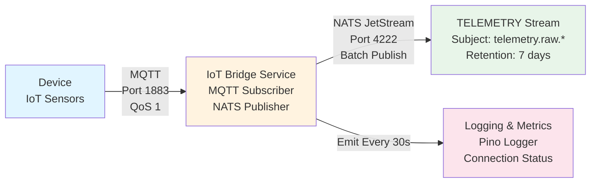
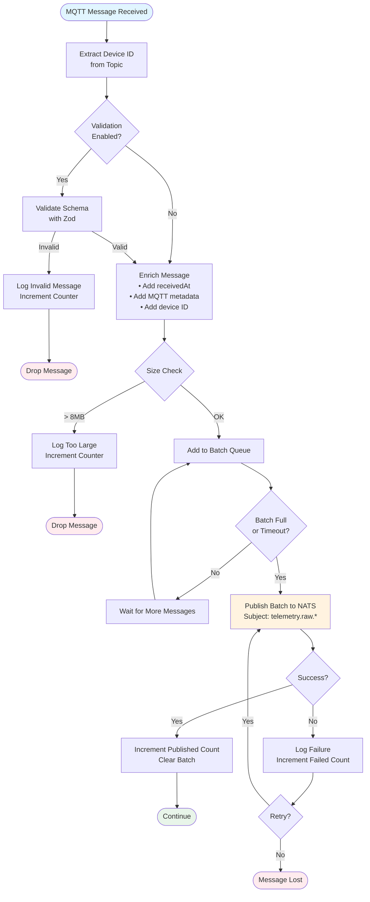
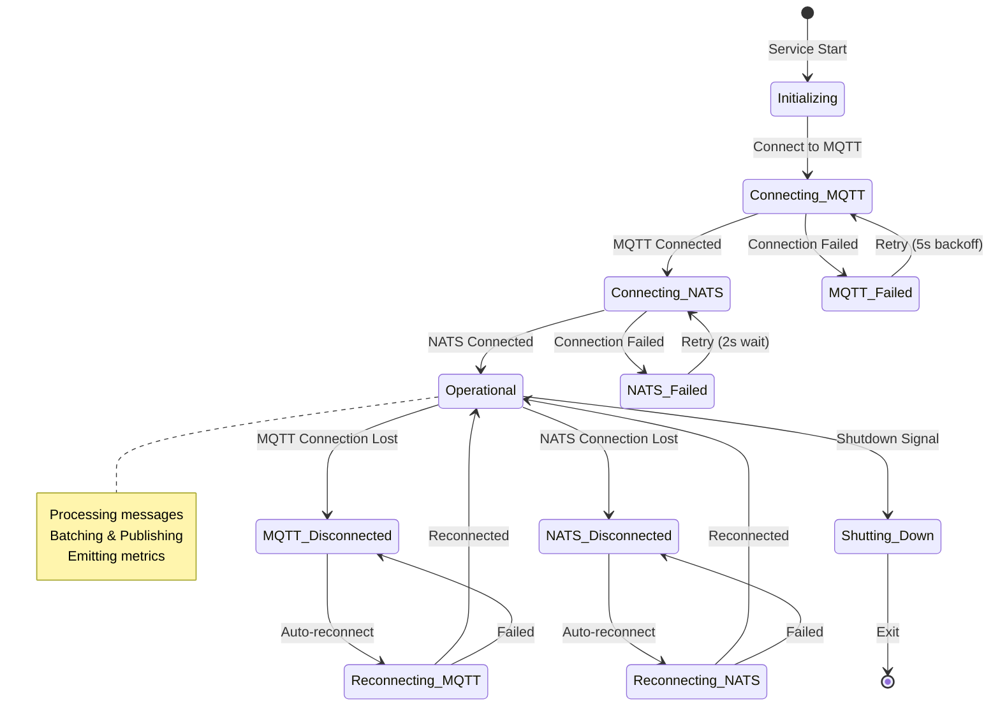
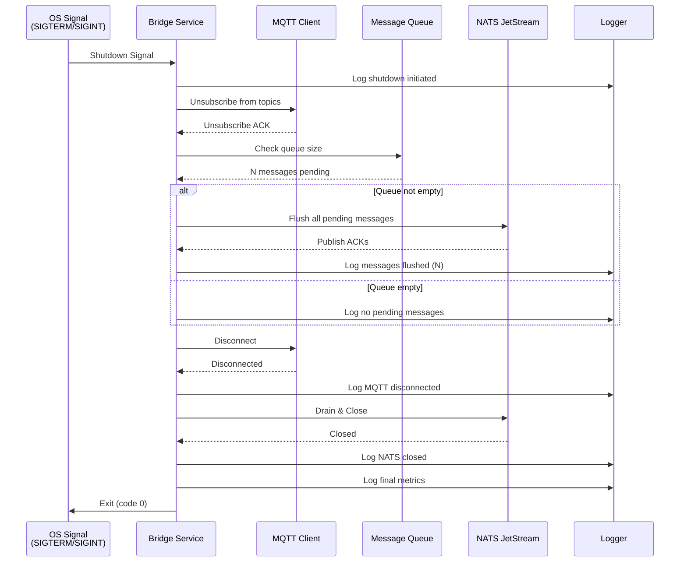

# IoT Bridge Service

**Status**: ✅ Operational
**Package**: `@argus/iot-bridge`
**Purpose**: Bridges MQTT telemetry messages from EMQX to NATS JetStream

---

## Overview

The IoT Bridge Service is a TypeScript-based microservice that:
- Subscribes to MQTT topics on EMQX broker
- Validates and enriches incoming device telemetry
- Publishes messages to NATS JetStream for downstream processing
- Supports message batching for performance
- Provides metrics and health monitoring

**Flow**: `Device → MQTT (EMQX) → Bridge → NATS JetStream → Workers`

---

## Architecture



**Data Flow:**
1. **Device** publishes telemetry to MQTT topic: `devices/{deviceId}/telemetry`
2. **Bridge** subscribes using shared subscription: `$share/bridge-group/devices/+/telemetry`
3. **Bridge** validates, enriches, and batches messages (default: 100 messages or 1s timeout)
4. **Bridge** publishes to NATS subject: `telemetry.raw.{deviceId}`
5. **Stream** durably stores messages for downstream worker consumption

---

## Features

### Message Processing
- **Topic Pattern**: `devices/{deviceId}/telemetry`
- **Validation**: Schema validation with Zod
- **Enrichment**: Adds device ID, timestamps, MQTT metadata
- **Batching**: Configurable batch size (default: 100 messages)
- **Error Handling**: Invalid messages logged, not dropped

### Performance
- **Batch Publishing**: Reduces NATS round-trips
- **Batch Timeout**: Auto-flush after 1 second
- **Max Message Size**: 8MB (configurable for chunked messages)
- **QoS Support**: MQTT QoS 0, 1, 2

### Observability
- **Structured Logging**: Pino with pretty printing in dev
- **Metrics**: Messages received/published/failed/invalid
- **Health Checks**: MQTT and NATS connection status
- **Graceful Shutdown**: Flushes queue before exit

---

## Configuration

### Environment Variables

Create `.env` file in `packages/iot-bridge/`:

```bash
# Service
SERVICE_NAME=iot-bridge
NODE_ENV=development

# MQTT Configuration
MQTT_BROKER_URL=mqtt://localhost:1883
MQTT_CLIENT_ID=argus-iot-bridge
MQTT_TOPICS=devices/+/telemetry
MQTT_QOS=1

# NATS Configuration
NATS_SERVERS=nats://localhost:4222
NATS_STREAM_NAME=TELEMETRY
NATS_SUBJECT_PREFIX=telemetry

# Processing
MAX_MESSAGE_SIZE=8388608
BATCH_SIZE=100
BATCH_TIMEOUT=1000
VALIDATE_MESSAGES=true

# Logging
LOG_LEVEL=info
LOG_PRETTY=true
```

### Configuration Schema

All configuration is validated using Zod. See [config.ts](../../packages/iot-bridge/src/config.ts) for details.

---

## Usage

### Development

```bash
cd packages/iot-bridge

# Install dependencies
pnpm install

# Run in development mode (auto-reload)
pnpm dev

# Build TypeScript
pnpm build

# Run production build
pnpm start
```

### Docker (Coming in Week 2)

The bridge service will be containerized and added to docker-compose.yml with the `iot` profile.

---

## NATS JetStream Integration

### Stream Creation

The bridge automatically creates the `TELEMETRY` stream if it doesn't exist:

```json
{
  "name": "TELEMETRY",
  "subjects": ["telemetry.>"],
  "max_msgs": 1000000,
  "max_bytes": 10737418240,
  "max_age": 604800000000000,
  "max_msg_size": 8388608,
  "duplicate_window": 120000000000
}
```

### Message Format

Messages published to NATS:

**Subject**: `telemetry.raw.{deviceId}`

**Headers**:
- `mqtt-topic`: Original MQTT topic
- `mqtt-qos`: MQTT QoS level
- `device-id`: Device UUID
- `received-at`: ISO 8601 timestamp

**Payload** (JSON):
```json
{
  "deviceId": "uuid-here",
  "timestamp": "2026-01-28T23:30:00Z",
  "temp": 22.5,
  "humidity": 65.2
}
```

---

## Message Validation

### Telemetry Schema

```typescript
{
  deviceId?: string (UUID),
  timestamp?: string,
  correlationId?: string,
  seq?: number,
  total?: number,
  data?: { [key: string]: unknown },
  // Additional properties allowed (passthrough)
}
```

Validation is optional and can be disabled with `VALIDATE_MESSAGES=false`.

### Message Processing Flow



---

## Metrics

Metrics are logged every 30 seconds:

```json
{
  "messagesReceived": 1523,
  "messagesPublished": 1520,
  "messagesFailed": 0,
  "messagesInvalid": 3,
  "messagesTooLarge": 0,
  "bytesReceived": 152300,
  "bytesPublished": 152000,
  "queueSize": 0,
  "mqttConnected": true,
  "natsConnected": true
}
```

---

## Error Handling

### Invalid Messages
- Logged with full context (topic, payload, error)
- Counted in `messagesInvalid` metric
- Not republished (prevents poison messages)

### Connection Failures



**Reconnection Behavior:**
- **MQTT**: Auto-reconnect with exponential backoff (5s period)
- **NATS**: Auto-reconnect with 2s wait, unlimited retries
- Service logs connection status changes
- Messages queued during disconnection (up to batch size limit)

### Graceful Shutdown



**Shutdown Steps:**
1. Stop accepting new MQTT messages (unsubscribe)
2. Flush message queue to NATS (wait for all pending publishes)
3. Disconnect MQTT client gracefully
4. Drain and close NATS connection (wait for in-flight requests)
5. Log final metrics and exit

---

## Testing

### Manual Test

1. Start IoT services:
   ```bash
   docker compose --profile iot up -d
   ```

2. Start bridge:
   ```bash
   cd packages/iot-bridge && pnpm dev
   ```

3. Publish test message (using MQTT CLI):
   ```bash
   mqtt pub -h localhost -p 1883 \
     -t "devices/550e8400-e29b-41d4-a716-446655440000/telemetry" \
     -m '{"temp":22.5,"humidity":65.2}'
   ```

4. Verify in NATS:
   ```bash
   nats stream view TELEMETRY
   ```

---

## Troubleshooting

### Bridge won't start
- Check MQTT broker is running: `docker ps | grep emqx`
- Check NATS is running: `docker ps | grep nats`
- Verify `.env` file exists with correct values

### Messages not arriving in NATS
- Check bridge logs for errors
- Verify MQTT topic matches pattern: `devices/+/telemetry`
- Check NATS stream exists: `nats stream ls`

### High memory usage
- Reduce `BATCH_SIZE` if messages are large
- Reduce `BATCH_TIMEOUT` to flush more frequently
- Check for connection issues causing queue buildup

---

## Files

```
packages/iot-bridge/
├── src/
│   ├── index.ts          # Entry point
│   ├── bridge.ts         # Main bridge service
│   ├── mqtt-client.ts    # MQTT wrapper
│   ├── nats-client.ts    # NATS JetStream wrapper
│   ├── config.ts         # Configuration management
│   ├── logger.ts         # Logging utility
│   └── validator.ts      # Message validation
├── .env                  # Environment configuration
├── .env.example          # Environment template
├── package.json          # Dependencies
└── tsconfig.json         # TypeScript config
```

---

## Next Steps (Week 2)

1. Add Prometheus metrics endpoint
2. Containerize service (Dockerfile)
3. Add to docker-compose.yml
4. Add unit tests (Vitest)
5. Add integration tests
6. Add mTLS support for MQTT

---

## Related Documentation

- [IoT_Platform_Architecture_Design.md](../docs/architecture/IoT_Platform_Architecture_Design.md)
- [Week 1 Progress](../docs/WEEK1_PROGRESS.md)
- [EMQX Documentation](https://www.emqx.io/docs/en/latest/)
- [NATS JetStream Documentation](https://docs.nats.io/nats-concepts/jetstream)
