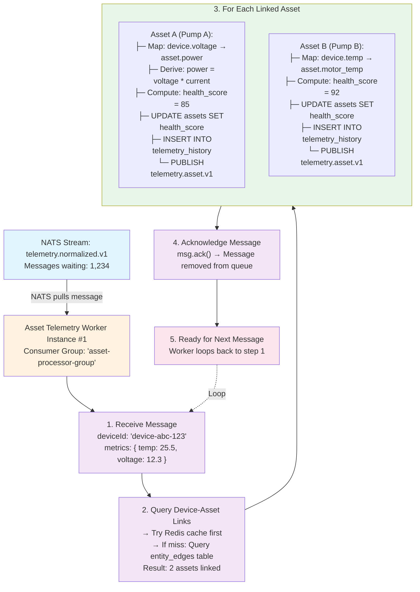

# Asset Telemetry Worker - Detailed Operation

## Overview

The **Asset Telemetry Worker** is responsible for transforming device-level telemetry into business-level asset telemetry. It picks up work from the NATS message stream and processes it asynchronously.

---

## Work Source: NATS JetStream

### Where the Worker Gets Work

```
NATS JetStream Stream: telemetry.normalized.v1
  ↓
Consumer Group: "asset-processor-group"
  ↓
Worker Instances: asset-telemetry-worker (3 replicas)
```

**Key Points**:
- **Stream**: `telemetry.normalized.v1` (durable, persisted messages)
- **Consumer Group**: All worker instances belong to the same consumer group
- **Load Balancing**: NATS automatically distributes messages across workers in the group
- **At-Least-Once Delivery**: Messages are redelivered if not acknowledged within timeout

---

## Step-by-Step Processing Flow

### Step 1: Worker Subscribes to NATS Stream

```typescript
// Worker initialization (pseudo-code)
const natsConnection = await connect({
  servers: ['nats://nats-1:4222', 'nats://nats-2:4222', 'nats://nats-3:4222']
});

const jetStream = natsConnection.jetstream();

// Create durable consumer (consumer group)
const consumer = await jetStream.consumers.get('telemetry.normalized.v1', {
  durable_name: 'asset-processor-group',
  deliver_policy: DeliverPolicy.All,
  ack_policy: AckPolicy.Explicit,
  max_deliver: 3, // Retry 3 times before sending to DLQ
  ack_wait: 30000, // 30 second timeout
});

// Start consuming messages
const messages = await consumer.consume();
for await (const msg of messages) {
  await processMessage(msg);
}
```

### Step 2: Receive Normalized Telemetry Message

**Message Format** (from `telemetry.normalized.v1`):
```json
{
  "messageId": "uuid-12345",
  "deviceId": "device-abc-123",
  "organizationId": "org-xyz-789",
  "timestamp": "2026-01-28T14:30:00Z",
  "receivedAt": "2026-01-28T14:30:01.234Z",
  "metrics": {
    "temperature": 25.5,
    "voltage": 12.3,
    "current": 2.5,
    "pressure": 101.3
  },
  "deviceMetadata": {
    "deviceType": "RTU-4000",
    "serialNumber": "SN-001",
    "firmwareVersion": "2.3.1"
  }
}
```

### Step 3: Query Device-Asset Links

The worker needs to know which assets are monitored by this device.

**Cache-First Strategy**:

```typescript
async function getDeviceAssetLinks(deviceId: string, orgId: string) {
  // 1. Try Redis cache first (hot path - 95% hit rate)
  const cacheKey = `device_asset_links:${deviceId}`;
  const cached = await redis.get(cacheKey);

  if (cached) {
    return JSON.parse(cached);
  }

  // 2. Cache miss - Query database
  const links = await db.query(`
    SELECT
      ee.id AS link_id,
      ee.target_entity_id AS asset_id,
      ee.metadata->>'port' AS port,
      ee.metadata->>'role' AS role,
      ee.metadata->'metrics_mapping' AS metrics_mapping,
      a.name AS asset_name,
      a.asset_type_id,
      at.telemetry_schema
    FROM entity_edges ee
    JOIN assets a ON a.id = ee.target_entity_id
    JOIN asset_types at ON at.id = a.asset_type_id
    WHERE ee.source_entity_id = $1
      AND ee.source_entity_type = 'Device'
      AND ee.target_entity_type = 'Asset'
      AND ee.relationship_type = 'MONITORED_BY'
      AND ee.tenant_id = $2
      AND (ee.valid_from IS NULL OR ee.valid_from <= NOW())
      AND (ee.valid_until IS NULL OR ee.valid_until > NOW())
  `, [deviceId, orgId]);

  // 3. Cache for 5 minutes (TTL: 300 seconds)
  if (links.length > 0) {
    await redis.setex(cacheKey, 300, JSON.stringify(links));
  }

  return links;
}
```

**Example Query Result**:
```json
[
  {
    "link_id": "link-uuid-1",
    "asset_id": "asset-pump-a",
    "port": null,
    "role": "primary",
    "metrics_mapping": {
      "device.voltage": "asset.power_input",
      "device.current": "asset.power_current",
      "device.temperature": "asset.motor_temperature"
    },
    "asset_name": "Pump A",
    "asset_type_id": "type-pump",
    "telemetry_schema": {
      "derived_metrics": [
        {
          "name": "power_consumption",
          "formula": "power_input * power_current",
          "unit": "watts"
        }
      ]
    }
  },
  {
    "link_id": "link-uuid-2",
    "asset_id": "asset-pump-b",
    "port": 1,
    "role": "secondary",
    "metrics_mapping": {
      "device.temperature": "asset.motor_temperature"
    },
    "asset_name": "Pump B",
    "asset_type_id": "type-pump",
    "telemetry_schema": null
  }
]
```

### Step 4: Process Each Linked Asset

For each asset linked to this device:

```typescript
async function processMessage(msg: NatsMessage) {
  const telemetry = JSON.parse(msg.data.toString());
  const { deviceId, organizationId, timestamp, metrics } = telemetry;

  // Get all assets monitored by this device
  const links = await getDeviceAssetLinks(deviceId, organizationId);

  if (links.length === 0) {
    // No assets linked - skip asset processing, just ack
    msg.ack();
    return;
  }

  // Process each linked asset
  for (const link of links) {
    await processAssetTelemetry(telemetry, link);
  }

  // Acknowledge message after successful processing
  msg.ack();
}
```

### Step 5: Apply Metric Transformations

**5a. Map Device Metrics to Asset Metrics**

Using the `metrics_mapping` from the link:

```typescript
async function processAssetTelemetry(telemetry: any, link: any) {
  const { assetId, metricsMapping, telemetrySchema, port } = link;
  const deviceMetrics = telemetry.metrics;

  const assetMetrics: Record<string, number> = {};

  // Map device metrics to asset metrics
  for (const [deviceKey, assetKey] of Object.entries(metricsMapping)) {
    // deviceKey: "device.voltage" → extract "voltage"
    const deviceMetric = deviceKey.split('.')[1];
    const assetMetric = assetKey.split('.')[1];

    if (deviceMetrics[deviceMetric] !== undefined) {
      assetMetrics[assetMetric] = deviceMetrics[deviceMetric];
    }
  }

  // For RTU devices with ports, filter only metrics for this port
  if (port !== null) {
    // Device payload might have: { "port_1_temp": 25.5, "port_2_temp": 30.2 }
    // Extract only port_1_* metrics for this asset
    const portPrefix = `port_${port}_`;
    for (const [key, value] of Object.entries(deviceMetrics)) {
      if (key.startsWith(portPrefix)) {
        const metricName = key.replace(portPrefix, '');
        assetMetrics[metricName] = value as number;
      }
    }
  }

  // ... continue with derived metrics
}
```

**5b. Compute Derived Metrics**

Using formulas from `asset_types.telemetry_schema`:

```typescript
// Compute derived metrics (e.g., power_consumption = voltage * current)
if (telemetrySchema?.derived_metrics) {
  for (const derivedMetric of telemetrySchema.derived_metrics) {
    const { name, formula } = derivedMetric;

    // Simple formula evaluation (in production, use a safe expression parser)
    // formula: "power_input * power_current"
    const value = evaluateFormula(formula, assetMetrics);

    if (value !== null) {
      assetMetrics[name] = value;
    }
  }
}
```

**5c. Compute Health Score**

Health score is a business metric aggregating multiple factors:

```typescript
// Compute health score (0-100)
const healthScore = computeHealthScore(assetMetrics, telemetrySchema);

function computeHealthScore(metrics: any, schema: any): number {
  // Example algorithm (customizable per asset type):
  let score = 100;

  // Deduct points based on threshold breaches
  if (metrics.motor_temperature > 80) {
    score -= 30; // High temperature penalty
  } else if (metrics.motor_temperature > 70) {
    score -= 10;
  }

  if (metrics.vibration > 5.0) {
    score -= 20; // High vibration penalty
  }

  if (metrics.power_consumption < 10) {
    score -= 40; // Very low power = likely offline
  }

  return Math.max(0, Math.min(100, score));
}
```

### Step 6: Write Asset Telemetry to Database

**6a. Update Asset Table** (denormalized health score for UI performance)

```typescript
// Update assets.health_score (denormalized for fast queries)
await db.query(`
  UPDATE assets
  SET
    health_score = $1,
    health_score_updated_at = $2,
    health_score_computed_by = $3,
    updated_at = $2
  WHERE id = $4
`, [healthScore, timestamp, 'asset-worker-v1', assetId]);
```

**6b. Insert Asset Telemetry to Time-Series Table**

```typescript
// Insert all asset metrics into telemetry_history
const insertValues = Object.entries(assetMetrics).map(([metricKey, value]) => ({
  entity_id: assetId,
  entity_type: 'Asset',
  metric_key: metricKey,
  value: value,
  timestamp: timestamp,
  received_at: new Date(),
  source_device_id: telemetry.deviceId,
  quality: 'good'
}));

// Batch insert (1000 rows per transaction for performance)
await db.batchInsert('telemetry_history', insertValues);
```

### Step 7: Publish Asset Telemetry Event

Publish to `telemetry.asset.v1` stream for downstream consumers (Event Engine, etc.):

```typescript
// Publish to NATS for downstream processing
await jetStream.publish('telemetry.asset.v1', JSON.stringify({
  messageId: uuidv4(),
  assetId: assetId,
  deviceId: telemetry.deviceId,
  organizationId: telemetry.organizationId,
  timestamp: timestamp,
  metrics: assetMetrics,
  healthScore: healthScore,
  previousHealthScore: previousHealthScore, // Track changes
  processedAt: new Date().toISOString(),
  processorVersion: 'asset-worker-v1'
}));
```

### Step 8: Acknowledge Message

```typescript
// Only ack after successful processing
msg.ack();

// If error occurred, message is NOT acked:
// - NATS will redeliver after ack_wait timeout (30 seconds)
// - After max_deliver attempts (3), message goes to DLQ
```

---

## Complete Flow Diagram



---

## Horizontal Scaling

**Multiple Worker Instances**:

```
NATS Stream: telemetry.normalized.v1
       ↓          ↓          ↓
  Worker #1   Worker #2   Worker #3
  (Pod 1)     (Pod 2)     (Pod 3)
```

- All workers subscribe to the same consumer group
- NATS distributes messages evenly (round-robin or by load)
- If Worker #2 crashes, NATS redelivers its pending messages to Workers #1 or #3
- Can scale up/down dynamically based on queue depth

---

## Error Handling

### Scenario 1: Database Write Fails

```typescript
try {
  await db.query('UPDATE assets SET health_score = ...');
} catch (error) {
  logger.error('Failed to update asset', { assetId, error });

  // Do NOT ack message
  // NATS will redeliver after timeout
  throw error; // Propagate error to worker loop
}
```

### Scenario 2: Max Retries Exceeded

After 3 failed delivery attempts (max_deliver):

```typescript
// NATS automatically moves message to Dead Letter Queue (DLQ)
// DLQ stream: telemetry.dlq

// Message includes original payload + error metadata
{
  "originalStream": "telemetry.normalized.v1",
  "deliveryCount": 3,
  "lastError": "Database connection timeout",
  "payload": { ... original message ... }
}
```

**DLQ Handling**:
- Separate worker monitors DLQ stream
- Alerts sent to ops team
- Manual replay after fixing root cause

### Scenario 3: No Assets Linked

```typescript
const links = await getDeviceAssetLinks(deviceId, orgId);

if (links.length === 0) {
  // Device exists but no assets linked
  // This is valid - just ack and move on
  logger.debug('No assets linked to device', { deviceId });
  msg.ack();
  return;
}
```

---

## Performance Optimizations

### 1. Batching Database Writes

Instead of 1 INSERT per metric:

```typescript
// Bad: 10 metrics = 10 INSERT statements
for (const [key, value] of Object.entries(assetMetrics)) {
  await db.query('INSERT INTO telemetry_history ...');
}

// Good: 10 metrics = 1 batch INSERT
await db.batchInsert('telemetry_history', allMetrics); // Single transaction
```

### 2. Redis Cache for Device-Asset Links

- **Hit Rate**: 95% (links rarely change)
- **TTL**: 5 minutes (balance freshness vs DB load)
- **Invalidation**: When link created/deleted, purge cache key

### 3. Connection Pooling

```typescript
// Reuse connections across messages
const dbPool = new Pool({ max: 20 }); // 20 connections per worker
const redisClient = redis.createClient(); // Single Redis connection
const natsConnection = await connect(); // Single NATS connection
```

---

## Monitoring & Metrics

**Key Metrics** (Prometheus format):

```
# Messages processed per second
asset_worker_messages_processed_total{worker="asset-1"} 950

# Processing latency (milliseconds)
asset_worker_processing_duration_ms{quantile="0.5"} 45
asset_worker_processing_duration_ms{quantile="0.95"} 120
asset_worker_processing_duration_ms{quantile="0.99"} 250

# Cache hit rate
asset_worker_cache_hit_rate{cache="device_links"} 0.96

# Errors
asset_worker_errors_total{type="db_write_failed"} 5
asset_worker_errors_total{type="cache_miss_timeout"} 2

# Queue depth (from NATS)
nats_stream_messages_pending{stream="telemetry.normalized.v1"} 1234
```

---

## Summary

**Work Source**: NATS JetStream stream `telemetry.normalized.v1`

**How It Picks Up Work**:
1. Worker subscribes to NATS consumer group
2. NATS automatically distributes messages to available workers
3. Worker receives normalized device telemetry message
4. Worker queries device-asset links (cache-first)
5. For each linked asset:
   - Maps device metrics to asset metrics
   - Computes derived metrics (formulas)
   - Computes health score
   - Writes to database
   - Publishes asset telemetry event
6. Worker acknowledges message (only after success)
7. NATS delivers next message

**Scalability**: Can run 3+ worker instances, each processing ~10K msg/sec = 30K total.

**Reliability**: At-least-once delivery, automatic retries, DLQ for failures, idempotent writes.
