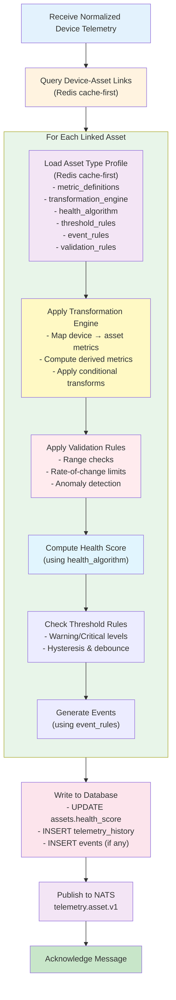

# Asset Type Profile Architecture

## Overview

Just as **Device Type Profiles** enable configuration-driven device telemetry processing, **Asset Type Profiles** enable configuration-driven asset telemetry processing. This ensures the Asset Telemetry Worker can handle new asset types without code deployment.

**Parallel Design Philosophy**:
- **Device Profiles**: Define how to PARSE device messages → normalized telemetry
- **Asset Profiles**: Define how to TRANSFORM device telemetry → business-level asset metrics

---

## Problem Statement

### Current Gap

**Device Types** have comprehensive configuration:
```sql
device_types:
  - processing_mode (endpoint/gateway/rtu)
  - message_schema (validation rules)
  - extraction_rules (JSONPath for data extraction)
  - demux_strategy (how to split messages)
  - transformation_rules (how to transform data)
```

**Asset Types** have incomplete configuration:
```sql
asset_types:
  - telemetry_schema (JSONB - poorly defined)
  - ❌ No metric definitions
  - ❌ No transformation rules
  - ❌ No health score algorithm
  - ❌ No threshold rules
  - ❌ No event generation rules
```

**Result**: Asset processing logic is HARDCODED in workers, requiring code deployment for new asset types.

---

## 1. Enhanced Asset Types Schema

### 1.1 Add Configuration Columns to `asset_types`

```sql
-- Add comprehensive asset profile configuration
ALTER TABLE asset_types
  -- Metric Definitions
  ADD COLUMN metric_definitions JSONB,
    -- Defines what metrics this asset type tracks

  -- Transformation Rules
  ADD COLUMN transformation_engine JSONB,
    -- How to map device metrics → asset metrics
    -- Formulas for derived metrics

  -- Health Score Configuration
  ADD COLUMN health_algorithm JSONB,
    -- Algorithm to compute health score (0-100)
    -- Thresholds, weights, scoring rules

  -- Threshold Rules
  ADD COLUMN threshold_rules JSONB,
    -- Warning/Critical thresholds per metric
    -- Hysteresis, debounce settings

  -- Event Generation Rules
  ADD COLUMN event_rules JSONB,
    -- What events to generate based on conditions
    -- Event severity, message templates

  -- Aggregation Rules (for composite assets)
  ADD COLUMN aggregation_rules JSONB,
    -- How to roll up child asset metrics to parent

  -- Data Quality Rules
  ADD COLUMN validation_rules JSONB,
    -- Data quality checks, outlier detection
    -- Range validation, rate-of-change limits

  -- Profile Metadata
  ADD COLUMN profile_version TEXT DEFAULT '1.0.0',
  ADD COLUMN profile_updated_at TIMESTAMPTZ DEFAULT NOW(),
  ADD COLUMN profile_updated_by UUID REFERENCES users(id);

-- Index for profile version tracking
CREATE INDEX idx_asset_types_profile_version
  ON asset_types(profile_version, profile_updated_at);
```

---

## 2. Asset Type Profile Structure

### 2.1 Metric Definitions

Defines what metrics this asset type tracks:

```json
{
  "metric_definitions": {
    "metrics": [
      {
        "key": "motor_temperature",
        "display_name": "Motor Temperature",
        "unit": "celsius",
        "data_type": "numeric",
        "precision": 1,
        "range": { "min": -50, "max": 150 },
        "description": "Temperature of the motor housing"
      },
      {
        "key": "vibration_level",
        "display_name": "Vibration Level",
        "unit": "mm/s",
        "data_type": "numeric",
        "precision": 2,
        "range": { "min": 0, "max": 100 },
        "description": "RMS vibration velocity"
      },
      {
        "key": "power_consumption",
        "display_name": "Power Consumption",
        "unit": "watts",
        "data_type": "numeric",
        "precision": 0,
        "range": { "min": 0, "max": 10000 },
        "is_derived": true,
        "description": "Calculated power consumption"
      },
      {
        "key": "operating_status",
        "display_name": "Operating Status",
        "data_type": "enum",
        "enum_values": ["running", "stopped", "fault", "maintenance"],
        "description": "Current operational state"
      }
    ]
  }
}
```

### 2.2 Transformation Engine

How to transform device metrics into asset metrics:

```json
{
  "transformation_engine": {
    "version": "1.0",
    "engine": "jsonata",

    "mappings": [
      {
        "source": "device_metrics.temp",
        "target": "motor_temperature",
        "transform": "$number(source)",
        "fallback": null
      },
      {
        "source": "device_metrics.vibration",
        "target": "vibration_level",
        "transform": "$number(source) / 1000",
        "comment": "Convert from µm/s to mm/s"
      }
    ],

    "derived_metrics": [
      {
        "target": "power_consumption",
        "formula": "voltage * current * power_factor",
        "dependencies": ["voltage", "current", "power_factor"],
        "comment": "Three-phase power calculation"
      },
      {
        "target": "efficiency",
        "formula": "(output_power / power_consumption) * 100",
        "dependencies": ["output_power", "power_consumption"],
        "unit": "percent"
      },
      {
        "target": "operating_status",
        "formula": "$lookup({ 0: 'stopped', 1: 'running', 2: 'fault' }, status_code)",
        "dependencies": ["status_code"]
      }
    ],

    "conditional_transforms": [
      {
        "condition": "asset.metadata.unit_system = 'imperial'",
        "apply": [
          {
            "target": "motor_temperature",
            "formula": "(motor_temperature * 9/5) + 32",
            "comment": "Convert Celsius to Fahrenheit"
          }
        ]
      }
    ]
  }
}
```

### 2.3 Health Algorithm

Configuration-driven health score computation:

```json
{
  "health_algorithm": {
    "version": "1.0",
    "algorithm_type": "weighted_deductions",
    "base_score": 100,

    "rules": [
      {
        "metric": "motor_temperature",
        "type": "threshold_deduction",
        "thresholds": [
          { "above": 90, "deduct": 40, "reason": "Critical temperature" },
          { "above": 75, "deduct": 20, "reason": "High temperature" },
          { "above": 60, "deduct": 5, "reason": "Elevated temperature" }
        ]
      },
      {
        "metric": "vibration_level",
        "type": "threshold_deduction",
        "thresholds": [
          { "above": 10.0, "deduct": 50, "reason": "Severe vibration" },
          { "above": 7.0, "deduct": 25, "reason": "High vibration" },
          { "above": 4.5, "deduct": 10, "reason": "Moderate vibration" }
        ]
      },
      {
        "metric": "power_consumption",
        "type": "range_deduction",
        "expected_range": { "min": 500, "max": 2000 },
        "deduct": 30,
        "reason": "Abnormal power consumption"
      },
      {
        "metric": "operating_status",
        "type": "value_match",
        "matches": [
          { "value": "fault", "set_score": 0, "reason": "System fault" },
          { "value": "stopped", "deduct": 20, "reason": "Not operational" }
        ]
      }
    ],

    "composite_rules": [
      {
        "name": "thermal_runaway_detection",
        "condition": "motor_temperature > 85 AND vibration_level > 8.0",
        "set_score": 5,
        "reason": "Thermal runaway risk"
      }
    ],

    "time_weighted_rules": [
      {
        "metric": "motor_temperature",
        "condition": "motor_temperature > 80",
        "duration_seconds": 300,
        "deduct": 15,
        "reason": "Sustained high temperature"
      }
    ]
  }
}
```

### 2.4 Threshold Rules

Define warning/critical thresholds:

```json
{
  "threshold_rules": {
    "version": "1.0",

    "thresholds": [
      {
        "metric": "motor_temperature",
        "warning": { "above": 70 },
        "critical": { "above": 85 },
        "hysteresis": 5,
        "debounce_seconds": 60,
        "message_template": "Motor temperature ${value}°C exceeds ${level} threshold (${threshold}°C)"
      },
      {
        "metric": "vibration_level",
        "warning": { "above": 4.5 },
        "critical": { "above": 7.0 },
        "hysteresis": 0.5,
        "debounce_seconds": 30
      },
      {
        "metric": "power_consumption",
        "warning": { "below": 100, "above": 3000 },
        "critical": { "below": 50, "above": 4000 },
        "hysteresis": 50,
        "debounce_seconds": 120,
        "comment": "Detect both over-consumption and under-consumption"
      },
      {
        "metric": "health_score",
        "warning": { "below": 70 },
        "critical": { "below": 40 },
        "hysteresis": 5,
        "debounce_seconds": 300
      }
    ],

    "rate_of_change_thresholds": [
      {
        "metric": "motor_temperature",
        "warning": { "increase_per_minute": 5 },
        "critical": { "increase_per_minute": 10 },
        "window_seconds": 60,
        "message_template": "Rapid temperature increase: ${rate}°C/min"
      }
    ]
  }
}
```

### 2.5 Event Generation Rules

Define what events to generate:

```json
{
  "event_rules": {
    "version": "1.0",

    "rules": [
      {
        "name": "high_temperature_alert",
        "condition": "motor_temperature > 85",
        "event_type": "asset.alert.temperature.critical",
        "severity": "critical",
        "priority": 1,
        "message": "Critical temperature: ${motor_temperature}°C",
        "actions": [
          "send_notification",
          "create_maintenance_ticket"
        ],
        "cooldown_seconds": 900
      },
      {
        "name": "abnormal_vibration",
        "condition": "vibration_level > 7.0",
        "event_type": "asset.alert.vibration.high",
        "severity": "warning",
        "priority": 2,
        "message": "High vibration detected: ${vibration_level} mm/s"
      },
      {
        "name": "status_change",
        "condition": "$prevValue(operating_status) != operating_status",
        "event_type": "asset.status.changed",
        "severity": "info",
        "message": "Status changed from ${$prevValue(operating_status)} to ${operating_status}"
      },
      {
        "name": "health_degradation",
        "condition": "health_score < $prevValue(health_score) - 20",
        "event_type": "asset.health.degraded",
        "severity": "warning",
        "message": "Health score dropped from ${$prevValue(health_score)} to ${health_score}"
      },
      {
        "name": "maintenance_due",
        "condition": "operating_hours > metadata.maintenance_interval_hours",
        "event_type": "asset.maintenance.due",
        "severity": "info",
        "priority": 3,
        "message": "Maintenance due: ${operating_hours} hours elapsed"
      }
    ]
  }
}
```

### 2.6 Aggregation Rules (Composite Assets)

For parent assets aggregating child metrics:

```json
{
  "aggregation_rules": {
    "version": "1.0",

    "parent_metrics": [
      {
        "metric": "total_power_consumption",
        "aggregation": "sum",
        "source_metric": "power_consumption",
        "from_children": true
      },
      {
        "metric": "average_temperature",
        "aggregation": "avg",
        "source_metric": "motor_temperature",
        "from_children": true
      },
      {
        "metric": "max_vibration",
        "aggregation": "max",
        "source_metric": "vibration_level",
        "from_children": true
      },
      {
        "metric": "overall_health",
        "aggregation": "weighted_avg",
        "source_metric": "health_score",
        "from_children": true,
        "weights": "child.metadata.capacity"
      },
      {
        "metric": "operational_children_count",
        "aggregation": "count",
        "condition": "child.operating_status = 'running'",
        "from_children": true
      }
    ],

    "propagation_rules": [
      {
        "trigger": "any_child.health_score < 40",
        "set_parent_health": "min(parent.health_score, 60)",
        "reason": "Critical child asset"
      }
    ]
  }
}
```

### 2.7 Validation Rules

Data quality and anomaly detection:

```json
{
  "validation_rules": {
    "version": "1.0",

    "quality_checks": [
      {
        "metric": "motor_temperature",
        "checks": [
          {
            "type": "range",
            "min": -50,
            "max": 150,
            "action": "reject",
            "reason": "Temperature out of sensor range"
          },
          {
            "type": "rate_of_change",
            "max_change_per_second": 2,
            "action": "flag",
            "reason": "Unrealistic temperature change"
          },
          {
            "type": "stuck_value",
            "duration_seconds": 600,
            "action": "flag",
            "reason": "Temperature not changing (sensor stuck?)"
          }
        ]
      },
      {
        "metric": "vibration_level",
        "checks": [
          {
            "type": "range",
            "min": 0,
            "max": 100,
            "action": "reject"
          },
          {
            "type": "spike_detection",
            "threshold": 3,
            "statistical_method": "z_score",
            "window_size": 20,
            "action": "flag"
          }
        ]
      }
    ],

    "cross_metric_validation": [
      {
        "name": "power_temperature_correlation",
        "condition": "power_consumption > 2000 AND motor_temperature < 40",
        "action": "flag",
        "reason": "High power but low temperature - possible sensor issue"
      }
    ]
  }
}
```

---

## 3. Asset Telemetry Worker with Profiles

### 3.1 Enhanced Worker Flow



### 3.2 Worker Implementation (Pseudo-code)

```typescript
async function processAssetTelemetry(
  deviceTelemetry: DeviceTelemetry,
  link: DeviceAssetLink
) {
  const { assetId, assetTypeId } = link;

  // 1. Load Asset Type Profile (cache-first)
  const assetProfile = await loadAssetProfile(assetTypeId);

  // 2. Apply Transformation Engine
  const assetMetrics = await transformMetrics(
    deviceTelemetry.metrics,
    assetProfile.transformation_engine,
    link.metrics_mapping // Device-specific overrides
  );

  // 3. Apply Validation Rules
  const validatedMetrics = await validateMetrics(
    assetMetrics,
    assetProfile.validation_rules
  );

  if (validatedMetrics.rejected.length > 0) {
    logger.warn('Metrics rejected', { rejected: validatedMetrics.rejected });
  }

  // 4. Compute Health Score (using configured algorithm)
  const healthScore = await computeHealthScore(
    validatedMetrics.accepted,
    assetProfile.health_algorithm,
    { assetId, previousHealthScore }
  );

  // 5. Check Threshold Rules
  const thresholdViolations = await checkThresholds(
    validatedMetrics.accepted,
    assetProfile.threshold_rules,
    { assetId }
  );

  // 6. Generate Events (using event rules)
  const events = await generateEvents(
    {
      metrics: validatedMetrics.accepted,
      healthScore,
      thresholdViolations,
    },
    assetProfile.event_rules,
    { assetId, deviceId: deviceTelemetry.deviceId }
  );

  // 7. Write to Database
  await db.transaction(async (tx) => {
    // Update health score (denormalized)
    await tx.query(`
      UPDATE assets
      SET
        health_score = $1,
        health_score_updated_at = $2,
        health_score_computed_by = $3
      WHERE id = $4
    `, [healthScore, timestamp, 'asset-worker-v1', assetId]);

    // Insert telemetry history
    await tx.batchInsert('telemetry_history',
      Object.entries(validatedMetrics.accepted).map(([key, value]) => ({
        entity_id: assetId,
        entity_type: 'Asset',
        metric_key: key,
        value: value,
        timestamp: deviceTelemetry.timestamp,
        quality: validatedMetrics.quality[key],
        source_device_id: deviceTelemetry.deviceId,
      }))
    );

    // Insert events
    if (events.length > 0) {
      await tx.batchInsert('events', events);
    }
  });

  // 8. Publish to NATS
  await jetStream.publish('telemetry.asset.v1', JSON.stringify({
    messageId: uuidv4(),
    assetId,
    assetTypeId,
    deviceId: deviceTelemetry.deviceId,
    timestamp: deviceTelemetry.timestamp,
    metrics: validatedMetrics.accepted,
    healthScore,
    events: events.map(e => e.event_type),
    processedAt: new Date().toISOString(),
  }));
}
```

### 3.3 Profile Cache Management

```typescript
class AssetProfileCache {
  private redis: Redis;
  private localCache: LRUCache<string, AssetProfile>;

  async loadAssetProfile(assetTypeId: string): Promise<AssetProfile> {
    // 1. Check local in-memory cache (LRU)
    const cached = this.localCache.get(assetTypeId);
    if (cached) {
      return cached;
    }

    // 2. Check Redis cache
    const redisKey = `asset_profile:${assetTypeId}`;
    const redisValue = await this.redis.get(redisKey);

    if (redisValue) {
      const profile = JSON.parse(redisValue);
      this.localCache.set(assetTypeId, profile);
      return profile;
    }

    // 3. Load from database
    const profile = await db.query(`
      SELECT
        id,
        name,
        metric_definitions,
        transformation_engine,
        health_algorithm,
        threshold_rules,
        event_rules,
        aggregation_rules,
        validation_rules,
        profile_version
      FROM asset_types
      WHERE id = $1
    `, [assetTypeId]);

    // 4. Cache for 5 minutes
    await this.redis.setex(redisKey, 300, JSON.stringify(profile));
    this.localCache.set(assetTypeId, profile);

    return profile;
  }

  // Invalidate cache when profile updated
  async invalidateProfile(assetTypeId: string): Promise<void> {
    this.localCache.delete(assetTypeId);
    await this.redis.del(`asset_profile:${assetTypeId}`);

    // Publish invalidation message to all workers
    await this.redis.publish('asset_profile:invalidate', assetTypeId);
  }

  // Hot reload: Listen for invalidation messages
  async startInvalidationListener(): Promise<void> {
    await this.redis.subscribe('asset_profile:invalidate', (assetTypeId) => {
      logger.info('Hot-reloading asset profile', { assetTypeId });
      this.localCache.delete(assetTypeId);
    });
  }
}
```

---

## 4. Example Asset Type Profiles

### 4.1 Centrifugal Pump

```json
{
  "name": "Centrifugal Pump",
  "category": "industrial_equipment",

  "metric_definitions": {
    "metrics": [
      { "key": "motor_temperature", "unit": "celsius", "data_type": "numeric" },
      { "key": "bearing_temperature", "unit": "celsius", "data_type": "numeric" },
      { "key": "vibration_level", "unit": "mm/s", "data_type": "numeric" },
      { "key": "flow_rate", "unit": "m3/h", "data_type": "numeric" },
      { "key": "discharge_pressure", "unit": "bar", "data_type": "numeric" },
      { "key": "suction_pressure", "unit": "bar", "data_type": "numeric" },
      { "key": "power_consumption", "unit": "watts", "data_type": "numeric", "is_derived": true },
      { "key": "efficiency", "unit": "percent", "data_type": "numeric", "is_derived": true },
      { "key": "operating_status", "data_type": "enum", "enum_values": ["running", "stopped", "fault"] }
    ]
  },

  "transformation_engine": {
    "mappings": [
      { "source": "device_metrics.temp", "target": "motor_temperature" },
      { "source": "device_metrics.bearing_temp", "target": "bearing_temperature" },
      { "source": "device_metrics.vib", "target": "vibration_level" },
      { "source": "device_metrics.flow", "target": "flow_rate" }
    ],
    "derived_metrics": [
      {
        "target": "power_consumption",
        "formula": "voltage * current * $sqrt(3) * power_factor"
      },
      {
        "target": "efficiency",
        "formula": "(discharge_pressure - suction_pressure) * flow_rate / (power_consumption * 0.0036) * 100"
      }
    ]
  },

  "health_algorithm": {
    "algorithm_type": "weighted_deductions",
    "base_score": 100,
    "rules": [
      { "metric": "motor_temperature", "thresholds": [
        { "above": 90, "deduct": 40 },
        { "above": 75, "deduct": 15 }
      ]},
      { "metric": "vibration_level", "thresholds": [
        { "above": 10.0, "deduct": 50 },
        { "above": 7.0, "deduct": 20 }
      ]},
      { "metric": "efficiency", "thresholds": [
        { "below": 50, "deduct": 30 },
        { "below": 70, "deduct": 10 }
      ]}
    ]
  },

  "threshold_rules": {
    "thresholds": [
      { "metric": "motor_temperature", "warning": 70, "critical": 85 },
      { "metric": "vibration_level", "warning": 4.5, "critical": 7.0 },
      { "metric": "bearing_temperature", "warning": 75, "critical": 90 }
    ]
  },

  "event_rules": {
    "rules": [
      {
        "name": "cavitation_detected",
        "condition": "vibration_level > 10 AND suction_pressure < 0.5",
        "event_type": "asset.alert.cavitation",
        "severity": "critical"
      },
      {
        "name": "low_efficiency",
        "condition": "efficiency < 60",
        "event_type": "asset.alert.efficiency.low",
        "severity": "warning"
      }
    ]
  }
}
```

### 4.2 HVAC Air Handler

```json
{
  "name": "HVAC Air Handler",
  "category": "hvac",

  "metric_definitions": {
    "metrics": [
      { "key": "supply_air_temp", "unit": "celsius", "data_type": "numeric" },
      { "key": "return_air_temp", "unit": "celsius", "data_type": "numeric" },
      { "key": "supply_air_humidity", "unit": "percent", "data_type": "numeric" },
      { "key": "supply_air_flow", "unit": "m3/h", "data_type": "numeric" },
      { "key": "filter_pressure_drop", "unit": "pa", "data_type": "numeric" },
      { "key": "fan_speed", "unit": "rpm", "data_type": "numeric" },
      { "key": "power_consumption", "unit": "watts", "data_type": "numeric" },
      { "key": "cooling_capacity", "unit": "kw", "data_type": "numeric", "is_derived": true },
      { "key": "operating_mode", "data_type": "enum", "enum_values": ["cooling", "heating", "ventilation", "off"] }
    ]
  },

  "transformation_engine": {
    "derived_metrics": [
      {
        "target": "cooling_capacity",
        "formula": "supply_air_flow * 1.2 * 1.005 * (return_air_temp - supply_air_temp) / 3600",
        "comment": "Sensible cooling capacity in kW"
      }
    ]
  },

  "health_algorithm": {
    "algorithm_type": "weighted_deductions",
    "rules": [
      { "metric": "filter_pressure_drop", "thresholds": [
        { "above": 250, "deduct": 30, "reason": "Filter clogged" },
        { "above": 150, "deduct": 10, "reason": "Filter needs replacement" }
      ]},
      { "metric": "supply_air_flow", "type": "range_deduction",
        "expected_range": { "min": 2000, "max": 5000 },
        "deduct": 20
      }
    ]
  },

  "event_rules": {
    "rules": [
      {
        "name": "filter_maintenance_due",
        "condition": "filter_pressure_drop > 200",
        "event_type": "asset.maintenance.filter_replacement",
        "severity": "info"
      },
      {
        "name": "temperature_setpoint_deviation",
        "condition": "$abs(supply_air_temp - metadata.setpoint_temp) > 5",
        "event_type": "asset.alert.temperature_deviation",
        "severity": "warning"
      }
    ]
  }
}
```

---

## 5. Profile Management UI & API

### 5.1 API Endpoints

```typescript
// List asset type profiles
GET /api/v1/asset-types?include_profiles=true

// Get single profile
GET /api/v1/asset-types/:id/profile

// Update profile
PATCH /api/v1/asset-types/:id/profile
Request Body:
{
  "transformation_engine": { ... },
  "health_algorithm": { ... },
  "threshold_rules": { ... }
}

// Test profile (dry-run)
POST /api/v1/asset-types/:id/profile/test
Request Body:
{
  "test_metrics": {
    "motor_temperature": 85,
    "vibration_level": 8.5,
    "power_consumption": 1500
  }
}
Response:
{
  "transformed_metrics": { ... },
  "health_score": 45,
  "threshold_violations": [...],
  "events_generated": [...],
  "validation_results": [...]
}

// Profile version history
GET /api/v1/asset-types/:id/profile/versions

// Rollback to previous version
POST /api/v1/asset-types/:id/profile/rollback
Request: { "version": "1.2.0" }
```

### 5.2 Profile Editor UI

**UI Components**:
1. **Visual Formula Builder** - Drag-drop metric nodes, operators
2. **Threshold Configuration** - Visual slider with hysteresis bands
3. **Health Algorithm Designer** - Visual rule builder with live preview
4. **Event Rule Editor** - Condition builder with autocomplete
5. **Test Panel** - Input test data, see real-time processing results

---

## 6. Migration Strategy

### 6.1 Phase 1: Schema Migration

```sql
-- Add new columns (nullable initially)
ALTER TABLE asset_types
  ADD COLUMN metric_definitions JSONB,
  ADD COLUMN transformation_engine JSONB,
  ADD COLUMN health_algorithm JSONB,
  ADD COLUMN threshold_rules JSONB,
  ADD COLUMN event_rules JSONB,
  ADD COLUMN aggregation_rules JSONB,
  ADD COLUMN validation_rules JSONB,
  ADD COLUMN profile_version TEXT DEFAULT '1.0.0',
  ADD COLUMN profile_updated_at TIMESTAMPTZ DEFAULT NOW();
```

### 6.2 Phase 2: Migrate Existing Hardcoded Logic

```typescript
// Extract hardcoded pump health logic → JSON profile
const pumpHealthAlgorithm = {
  algorithm_type: "weighted_deductions",
  base_score: 100,
  rules: [
    // ... converted from code to config
  ]
};

await db.query(`
  UPDATE asset_types
  SET health_algorithm = $1
  WHERE name = 'Centrifugal Pump'
`, [pumpHealthAlgorithm]);
```

### 6.3 Phase 3: Worker Update

```typescript
// Workers check if profile exists, fallback to hardcoded logic
const profile = await loadAssetProfile(assetTypeId);

if (profile.health_algorithm) {
  // Use configuration-driven algorithm
  healthScore = await computeHealthScoreFromConfig(metrics, profile.health_algorithm);
} else {
  // Fallback to legacy hardcoded logic
  healthScore = computeHealthScoreLegacy(assetType, metrics);
  logger.warn('Asset type using legacy health algorithm', { assetTypeId });
}
```

---

## 7. Benefits

### 7.1 Zero-Deployment Onboarding

**Before** (hardcoded):
```typescript
// Add new asset type → Modify worker code → Deploy → Test
if (assetType === 'Chiller') {
  healthScore = computeChillerHealth(metrics); // New function
}
```

**After** (configuration-driven):
```json
// Add new asset type → Configure profile in UI → Save → Done
POST /api/v1/asset-types
{
  "name": "Chiller",
  "health_algorithm": { ... },
  "transformation_engine": { ... }
}
// Workers pick up config immediately (hot reload)
```

### 7.2 Business User Control

- Plant managers can adjust thresholds without engineering
- Safety teams can modify health algorithms based on regulations
- Operations can add custom metrics via formulas
- A/B test different health scoring algorithms

### 7.3 Consistency

- Same transformation engine used by devices and assets
- Uniform validation rules across all asset types
- Centralized event generation logic
- Version-controlled profile changes

---

## 8. Summary

| Aspect | Device Profiles | Asset Profiles |
|--------|----------------|----------------|
| **Purpose** | Parse device messages | Transform to business metrics |
| **Input** | Raw MQTT payload | Normalized device telemetry |
| **Output** | Normalized telemetry | Asset metrics + health + events |
| **Configuration** | `device_types.processing_mode` | `asset_types.health_algorithm` |
| **Transformation** | `extraction_rules` | `transformation_engine` |
| **Routing** | `demux_strategy` | `aggregation_rules` |
| **Worker** | Demultiplexer, Normalization | Asset Telemetry Worker |

**Both systems share**:
- Configuration-driven processing
- Hot reload via cache invalidation
- Test/validate API
- Version control
- Zero-deployment onboarding

This completes the symmetry: **Devices have profiles, Assets have profiles**.
