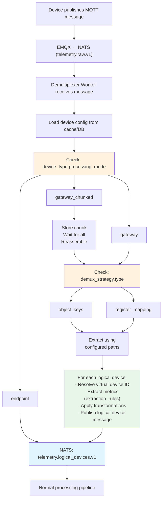

# Dynamic Device Management & Routing Architecture

**Date:** 2026-01-28
**Problem:** How to add new device types and routing rules without code deployment?
**Solution:** Metadata-driven, configuration-based device processing

---

## Problem Statement

**Current Challenge**:
- New device type arrives (e.g., LoRaWAN gateway)
- Has unique message format
- Requires specific processing logic
- **Don't want to redeploy workers** every time a new device is added

**Requirements**:
1. Identify device type and routing strategy at runtime
2. Parse arbitrary payload formats without code changes
3. Route messages to correct processing path based on configuration
4. Transform/extract data using configurable rules
5. Add new devices via admin UI (configuration only)

---

## Solution Architecture

### Core Concept: **Device Type Profiles**

All device behavior is defined in **device_types** table with JSON configuration:

```
Device Type Profile (stored in DB)
  ├─ Message Format (JSON schema)
  ├─ Processing Mode (endpoint | gateway | chunked)
  ├─ Extraction Rules (JSONPath/JMESPath expressions)
  ├─ Transformation Rules (formulas, mappings)
  └─ Routing Strategy (how to demux/route)
```

Workers read configuration from database/cache and adapt behavior dynamically.

---

## 1. Enhanced Device Types Schema

### 1.1 Add Configuration to `device_types` Table

```sql
-- Add comprehensive configuration columns
ALTER TABLE device_types
  ADD COLUMN processing_mode TEXT NOT NULL DEFAULT 'endpoint'
    CHECK (processing_mode IN ('endpoint', 'gateway', 'gateway_chunked', 'rtu_multiport')),

  ADD COLUMN message_schema JSONB,
    -- JSON Schema or Zod schema definition for validation

  ADD COLUMN extraction_rules JSONB,
    -- How to extract data from payload (JSONPath expressions)

  ADD COLUMN demux_strategy JSONB,
    -- How to split gateway messages into logical devices

  ADD COLUMN chunking_config JSONB,
    -- For chunked messages: how to detect chunks, correlation, reassembly

  ADD COLUMN protocol_adapter TEXT DEFAULT 'json',
    -- Parser to use: 'json' | 'protobuf' | 'modbus' | 'xml' | 'custom'

  ADD COLUMN transformation_rules JSONB,
    -- Post-extraction transformations (unit conversions, formulas)

  ADD COLUMN validation_rules JSONB,
    -- Business validation rules (thresholds, range checks)

  ADD COLUMN metadata JSONB DEFAULT '{}';
    -- Additional device-type specific config

-- Index for fast lookups
CREATE INDEX idx_device_types_mode ON device_types(processing_mode);
```

---

## 2. Device Type Profile Examples

### 2.1 Simple Endpoint Device (Temperature Sensor)

```json
{
  "deviceTypeId": "type-temp-sensor",
  "name": "Temperature Sensor",
  "processing_mode": "endpoint",
  "protocol_adapter": "json",
  "message_schema": {
    "type": "object",
    "required": ["temperature", "humidity"],
    "properties": {
      "temperature": { "type": "number", "minimum": -50, "maximum": 150 },
      "humidity": { "type": "number", "minimum": 0, "maximum": 100 }
    }
  },
  "extraction_rules": {
    "temperature": "$.data.temp",
    "humidity": "$.data.hum",
    "battery": "$.status.battery"
  },
  "transformation_rules": [
    {
      "metric": "temperature",
      "formula": "value * 1.8 + 32",
      "condition": "unit == 'celsius'",
      "output_unit": "fahrenheit"
    }
  ]
}
```

### 2.2 Location Hub (Gateway with 50 Tags)

```json
{
  "deviceTypeId": "type-location-hub",
  "name": "UWB Location Hub",
  "processing_mode": "gateway",
  "protocol_adapter": "json",
  "message_schema": {
    "type": "object",
    "required": ["tags"],
    "properties": {
      "tags": {
        "type": "object",
        "patternProperties": {
          "^tag_[0-9]+$": {
            "type": "object",
            "properties": {
              "x": { "type": "number" },
              "y": { "type": "number" },
              "z": { "type": "number" }
            }
          }
        }
      }
    }
  },
  "demux_strategy": {
    "type": "object_keys",
    "logical_device_path": "$.tags",
    "key_pattern": "tag_*",
    "data_per_device": {
      "position_x": "$.x",
      "position_y": "$.y",
      "position_z": "$.z",
      "rssi": "$.rssi",
      "battery": "$.battery"
    }
  },
  "extraction_rules": {
    "iterate_over": "$.tags",
    "logical_identifier": "$key",
    "metrics": {
      "position_x": "$.value.x",
      "position_y": "$.value.y",
      "position_z": "$.value.z"
    }
  }
}
```

### 2.3 BLE Gateway (Chunked, 2000 Beacons)

```json
{
  "deviceTypeId": "type-ble-gateway",
  "name": "BLE Gateway",
  "processing_mode": "gateway_chunked",
  "protocol_adapter": "json",
  "chunking_config": {
    "correlation_id_path": "$.correlationId",
    "sequence_number_path": "$.chunkInfo.sequenceNumber",
    "total_chunks_path": "$.chunkInfo.totalChunks",
    "chunk_timeout_seconds": 300,
    "reassembly_strategy": "merge_objects"
  },
  "demux_strategy": {
    "type": "object_keys",
    "logical_device_path": "$.logicalDevices",
    "key_pattern": "beacon_*",
    "data_per_device": {
      "rssi": "$.rssi",
      "temperature": "$.temp",
      "humidity": "$.hum",
      "battery": "$.battery"
    }
  }
}
```

### 2.4 RTU Multi-Port

```json
{
  "deviceTypeId": "type-rtu-4000",
  "name": "RTU-4000 (4 ports)",
  "processing_mode": "rtu_multiport",
  "protocol_adapter": "json",
  "demux_strategy": {
    "type": "object_keys",
    "logical_device_path": "$.ports",
    "key_pattern": "port_*",
    "data_per_device": {
      "pressure": "$.pressure",
      "flow_rate": "$.flow",
      "valve_position": "$.valve"
    }
  },
  "extraction_rules": {
    "iterate_over": "$.ports",
    "logical_identifier": "$key",
    "metrics": {
      "pressure": "$.value.pressure",
      "flow_rate": "$.value.flow",
      "valve_position": "$.value.valve"
    }
  }
}
```

### 2.5 Modbus Gateway (Custom Protocol)

```json
{
  "deviceTypeId": "type-modbus-gateway",
  "name": "Modbus TCP Gateway",
  "processing_mode": "gateway",
  "protocol_adapter": "modbus",
  "message_schema": {
    "type": "object",
    "properties": {
      "registers": {
        "type": "array",
        "items": {
          "type": "object",
          "properties": {
            "address": { "type": "integer" },
            "value": { "type": "integer" }
          }
        }
      }
    }
  },
  "demux_strategy": {
    "type": "register_mapping",
    "register_map": {
      "slave_1": { "start": 0, "end": 10 },
      "slave_2": { "start": 11, "end": 20 },
      "slave_3": { "start": 21, "end": 30 }
    },
    "data_extraction": {
      "temperature": { "register": 0, "scale": 0.1 },
      "pressure": { "register": 1, "scale": 0.01 },
      "flow": { "register": 2, "scale": 1.0 }
    }
  }
}
```

---

## 3. Dynamic Worker Architecture

### 3.1 Demultiplexer Worker (Metadata-Driven)

**Key Change**: Worker loads device type config from cache/DB and executes it

```typescript
// Demultiplexer Worker - Configuration-Based Processing

async function processDemultiplexer(msg: NatsMessage) {
  const rawPayload = JSON.parse(msg.data.toString());
  const { deviceId, organizationId } = rawPayload;

  // 1. Load device configuration
  const device = await getDeviceWithType(deviceId);
  const deviceType = device.deviceType; // Cached from device_types table

  // 2. Route based on processing_mode (from config, not code!)
  switch (deviceType.processing_mode) {
    case 'endpoint':
      await processEndpointDevice(rawPayload, device, deviceType);
      break;

    case 'gateway':
      await processGatewayDevice(rawPayload, device, deviceType);
      break;

    case 'gateway_chunked':
      await processChunkedGateway(rawPayload, device, deviceType);
      break;

    case 'rtu_multiport':
      await processRTUDevice(rawPayload, device, deviceType);
      break;

    default:
      throw new Error(`Unknown processing mode: ${deviceType.processing_mode}`);
  }

  msg.ack();
}

// Load device + type configuration (cached)
async function getDeviceWithType(deviceId: string) {
  const cacheKey = `device_config:${deviceId}`;
  const cached = await redis.get(cacheKey);
  if (cached) return JSON.parse(cached);

  const result = await db.query(`
    SELECT
      d.*,
      dt.processing_mode,
      dt.message_schema,
      dt.extraction_rules,
      dt.demux_strategy,
      dt.chunking_config,
      dt.protocol_adapter,
      dt.transformation_rules
    FROM devices d
    JOIN device_types dt ON dt.id = d.device_type_id
    WHERE d.id = $1
  `, [deviceId]);

  const device = result.rows[0];

  // Cache for 10 minutes
  await redis.setex(cacheKey, 600, JSON.stringify(device));

  return device;
}
```

### 3.2 Gateway Device Processing (Generic)

```typescript
async function processGatewayDevice(
  payload: any,
  device: any,
  deviceType: any
) {
  const { demux_strategy, extraction_rules } = deviceType;

  // Use configured demux strategy
  switch (demux_strategy.type) {
    case 'object_keys':
      await demuxByObjectKeys(payload, device, demux_strategy, extraction_rules);
      break;

    case 'array_items':
      await demuxByArrayItems(payload, device, demux_strategy, extraction_rules);
      break;

    case 'register_mapping':
      await demuxByRegisterMapping(payload, device, demux_strategy, extraction_rules);
      break;

    default:
      throw new Error(`Unknown demux strategy: ${demux_strategy.type}`);
  }
}

// Extract logical devices from object keys (Location Hub, RTU)
async function demuxByObjectKeys(
  payload: any,
  device: any,
  strategy: any,
  extractionRules: any
) {
  const { logical_device_path, key_pattern, data_per_device } = strategy;

  // Extract logical devices object using JSONPath
  const logicalDevicesObject = JSONPath.query(payload, logical_device_path)[0];

  if (!logicalDevicesObject) {
    logger.warn('No logical devices found', { deviceId: device.id, path: logical_device_path });
    return;
  }

  // Create transaction
  const correlationId = payload.correlationId || uuidv4();
  const logicalDeviceKeys = Object.keys(logicalDevicesObject);

  await createTransaction(device.organization_id, device.id, correlationId, logicalDeviceKeys.length);

  // Process each logical device
  for (const [logicalId, rawData] of Object.entries(logicalDevicesObject)) {
    // Match key pattern (if specified)
    if (key_pattern && !minimatch(logicalId, key_pattern)) {
      continue;
    }

    // Extract metrics using configured paths
    const metrics = {};
    for (const [metricName, metricPath] of Object.entries(data_per_device)) {
      const value = JSONPath.query(rawData, metricPath)[0];
      if (value !== undefined) {
        metrics[metricName] = value;
      }
    }

    // Resolve virtual device
    const virtualDeviceId = await resolveVirtualDevice(device.id, logicalId);

    if (!virtualDeviceId) {
      logger.warn('Virtual device not found', { gatewayId: device.id, logicalId });
      continue;
    }

    // Publish logical device message
    await nats.publish('telemetry.logical_devices.v1', JSON.stringify({
      deviceId: virtualDeviceId,
      logicalIdentifier: logicalId,
      gatewayDeviceId: device.id,
      correlationId: correlationId,
      timestamp: payload.timestamp,
      metrics: metrics,
      organizationId: device.organization_id
    }));
  }

  logger.info('Gateway demuxed', {
    gatewayId: device.id,
    logicalDevices: logicalDeviceKeys.length,
    correlationId
  });
}
```

### 3.3 Chunked Gateway Processing (Generic)

```typescript
async function processChunkedGateway(
  payload: any,
  device: any,
  deviceType: any
) {
  const { chunking_config } = deviceType;

  // Extract chunk metadata using configured paths (no hardcoding!)
  const correlationId = JSONPath.query(payload, chunking_config.correlation_id_path)[0];
  const sequenceNumber = JSONPath.query(payload, chunking_config.sequence_number_path)[0];
  const totalChunks = JSONPath.query(payload, chunking_config.total_chunks_path)[0];

  if (!correlationId || sequenceNumber === undefined || !totalChunks) {
    logger.error('Invalid chunk metadata', { deviceId: device.id, payload });
    return;
  }

  // Store chunk
  await db.query(`
    INSERT INTO telemetry_chunks (
      organization_id, device_id, correlation_id, sequence_number, total_chunks, chunk_payload
    ) VALUES ($1, $2, $3, $4, $5, $6)
  `, [device.organization_id, device.id, correlationId, sequenceNumber, totalChunks, JSON.stringify(payload)]);

  // Check if all chunks received
  const chunksReceived = await db.query(`
    SELECT COUNT(*) as count
    FROM telemetry_chunks
    WHERE correlation_id = $1 AND processed = FALSE
  `, [correlationId]);

  if (chunksReceived.rows[0].count >= totalChunks) {
    // Reassemble
    await reassembleAndProcessChunks(correlationId, device, deviceType);
  }
}

async function reassembleAndProcessChunks(
  correlationId: string,
  device: any,
  deviceType: any
) {
  // Fetch all chunks
  const chunks = await db.query(`
    SELECT chunk_payload, sequence_number
    FROM telemetry_chunks
    WHERE correlation_id = $1
    ORDER BY sequence_number ASC
  `, [correlationId]);

  // Reassemble based on strategy
  const { chunking_config, demux_strategy } = deviceType;
  const reassemblyStrategy = chunking_config.reassembly_strategy || 'merge_objects';

  let reassembledPayload;

  switch (reassemblyStrategy) {
    case 'merge_objects':
      // Merge all logicalDevices objects from all chunks
      reassembledPayload = { logicalDevices: {} };
      for (const chunk of chunks.rows) {
        const chunkData = chunk.chunk_payload;
        const logicalDevices = JSONPath.query(chunkData, demux_strategy.logical_device_path)[0];
        Object.assign(reassembledPayload.logicalDevices, logicalDevices);
      }
      break;

    case 'array_concat':
      // Concatenate arrays
      reassembledPayload = { items: [] };
      for (const chunk of chunks.rows) {
        const chunkData = chunk.chunk_payload;
        const items = JSONPath.query(chunkData, demux_strategy.logical_device_path)[0];
        reassembledPayload.items.push(...items);
      }
      break;

    default:
      throw new Error(`Unknown reassembly strategy: ${reassemblyStrategy}`);
  }

  logger.info('Chunks reassembled', { correlationId, totalChunks: chunks.rows.length });

  // Process as normal gateway message
  await processGatewayDevice(reassembledPayload, device, deviceType);

  // Mark chunks as processed
  await db.query(`
    UPDATE telemetry_chunks SET processed = TRUE WHERE correlation_id = $1
  `, [correlationId]);
}
```

---

## 4. Protocol Adapters (Pluggable Parsers)

**Problem**: Different devices use different formats (JSON, Protobuf, Modbus, XML)

**Solution**: Protocol adapter registry

```typescript
// Protocol Adapter Interface
interface ProtocolAdapter {
  name: string;
  parse(rawPayload: Buffer | string): any;
  validate(payload: any, schema: any): boolean;
}

// Protocol Adapter Registry
const protocolAdapters = new Map<string, ProtocolAdapter>();

// Register built-in adapters
protocolAdapters.set('json', {
  name: 'json',
  parse: (raw) => JSON.parse(raw.toString()),
  validate: (payload, schema) => validateJsonSchema(payload, schema)
});

protocolAdapters.set('protobuf', {
  name: 'protobuf',
  parse: (raw) => decodeProtobuf(raw),
  validate: (payload, schema) => validateProtobufSchema(payload, schema)
});

protocolAdapters.set('modbus', {
  name: 'modbus',
  parse: (raw) => parseModbusRegisters(raw),
  validate: (payload, schema) => validateModbusSchema(payload, schema)
});

protocolAdapters.set('xml', {
  name: 'xml',
  parse: (raw) => xml2js.parseString(raw.toString()),
  validate: (payload, schema) => validateXmlSchema(payload, schema)
});

// Use adapter based on device type config
async function parsePayload(rawPayload: any, deviceType: any) {
  const adapterName = deviceType.protocol_adapter || 'json';
  const adapter = protocolAdapters.get(adapterName);

  if (!adapter) {
    throw new Error(`Protocol adapter not found: ${adapterName}`);
  }

  const parsed = adapter.parse(rawPayload);

  // Validate against schema (if provided)
  if (deviceType.message_schema) {
    const valid = adapter.validate(parsed, deviceType.message_schema);
    if (!valid) {
      throw new Error('Payload validation failed');
    }
  }

  return parsed;
}
```

---

## 5. Transformation Engine (JSONata/JMESPath)

**Use Case**: Apply transformations without code changes

```typescript
// Transformation engine using JSONata
import jsonata from 'jsonata';

async function applyTransformations(
  metrics: Record<string, any>,
  transformationRules: any[]
): Promise<Record<string, any>> {
  const transformed = { ...metrics };

  for (const rule of transformationRules) {
    const { metric, formula, condition, output_metric } = rule;

    // Check condition (if specified)
    if (condition) {
      const conditionExpr = jsonata(condition);
      const conditionResult = await conditionExpr.evaluate({ ...transformed, value: metrics[metric] });
      if (!conditionResult) continue;
    }

    // Apply formula
    const formulaExpr = jsonata(formula);
    const result = await formulaExpr.evaluate({ ...transformed, value: metrics[metric] });

    const targetMetric = output_metric || metric;
    transformed[targetMetric] = result;
  }

  return transformed;
}

// Example transformation rules (from device type config)
const transformationRules = [
  {
    "metric": "temperature",
    "formula": "value * 1.8 + 32",
    "condition": "unit = 'celsius'",
    "output_metric": "temperature_fahrenheit"
  },
  {
    "metric": "pressure",
    "formula": "value / 1000",
    "condition": "value > 1000",
    "output_metric": "pressure_bar"
  },
  {
    "metric": "distance",
    "formula": "$sqrt($power(x, 2) + $power(y, 2))",
    "output_metric": "distance_from_origin"
  }
];

// Apply transformations
const rawMetrics = { temperature: 25, unit: 'celsius', pressure: 101300, x: 3, y: 4 };
const transformed = await applyTransformations(rawMetrics, transformationRules);

// Result:
// {
//   temperature: 25,
//   temperature_fahrenheit: 77,
//   unit: 'celsius',
//   pressure: 101300,
//   pressure_bar: 101.3,
//   x: 3, y: 4,
//   distance_from_origin: 5
// }
```

---

## 6. Device Type Management UI

### 6.1 Admin Interface - Create Device Type

```typescript
// POST /api/v1/device-types
{
  "name": "New IoT Gateway XYZ",
  "category": "gateway",
  "processing_mode": "gateway",
  "protocol_adapter": "json",

  "message_schema": {
    "type": "object",
    "required": ["devices"],
    "properties": {
      "devices": {
        "type": "object"
      }
    }
  },

  "demux_strategy": {
    "type": "object_keys",
    "logical_device_path": "$.devices",
    "data_per_device": {
      "temperature": "$.temp",
      "humidity": "$.hum"
    }
  },

  "extraction_rules": {
    "iterate_over": "$.devices",
    "logical_identifier": "$key",
    "metrics": {
      "temperature": "$.value.temp",
      "humidity": "$.value.hum"
    }
  }
}

// Response:
{
  "deviceType": {
    "id": "type-gateway-xyz-001",
    "name": "New IoT Gateway XYZ",
    ...
  }
}
```

### 6.2 Test Device Type (Dry Run)

```typescript
// POST /api/v1/device-types/:id/test
{
  "samplePayload": {
    "devices": {
      "sensor_1": { "temp": 25.5, "hum": 60 },
      "sensor_2": { "temp": 22.3, "hum": 55 }
    }
  }
}

// Response (shows what would happen):
{
  "valid": true,
  "logicalDevicesDetected": 2,
  "logicalDevices": [
    {
      "logicalIdentifier": "sensor_1",
      "extractedMetrics": {
        "temperature": 25.5,
        "humidity": 60
      }
    },
    {
      "logicalIdentifier": "sensor_2",
      "extractedMetrics": {
        "temperature": 22.3,
        "humidity": 55
      }
    }
  ],
  "warnings": [],
  "errors": []
}
```

### 6.3 Clone Existing Device Type

```typescript
// POST /api/v1/device-types/:id/clone
{
  "newName": "Modified Gateway XYZ v2",
  "modifications": {
    "demux_strategy.data_per_device.battery": "$.bat"
  }
}

// Creates new device type based on existing, with modifications
```

---

## 7. Configuration Hot Reload

**Problem**: After creating/updating device type, workers need new config

**Solution**: Cache invalidation + pub/sub notification

```typescript
// When device type updated
async function updateDeviceType(deviceTypeId: string, updates: any) {
  // 1. Update database
  await db.query(`UPDATE device_types SET ... WHERE id = $1`, [deviceTypeId]);

  // 2. Invalidate cache for all devices of this type
  const devices = await db.query(`SELECT id FROM devices WHERE device_type_id = $1`, [deviceTypeId]);

  for (const device of devices.rows) {
    await redis.del(`device_config:${device.id}`);
  }

  // 3. Publish cache invalidation event
  await nats.publish('system.config.device_type.updated', JSON.stringify({
    deviceTypeId: deviceTypeId,
    timestamp: new Date().toISOString()
  }));

  logger.info('Device type updated and cache invalidated', { deviceTypeId });
}

// Workers subscribe to config updates
async function subscribeToConfigUpdates() {
  const sub = natsConnection.subscribe('system.config.device_type.updated');

  for await (const msg of sub) {
    const { deviceTypeId } = JSON.parse(msg.data.toString());

    logger.info('Device type config updated, clearing local cache', { deviceTypeId });

    // Clear in-memory cache (if any)
    localCache.clear(deviceTypeId);
  }
}
```

**Result**: Within seconds of updating config in UI, all workers use new logic (no deployment!)

---

## 8. Routing Decision Tree

**How a message is routed** (entirely configuration-driven):



**Key Point**: All branching based on **configuration**, not code!

---

## 9. Example: Adding New Device Type (No Code Changes)

### Scenario: New LoRaWAN Gateway arrives

**Step 1**: Admin creates device type via UI

```json
{
  "name": "LoRaWAN Gateway",
  "processing_mode": "gateway",
  "protocol_adapter": "json",
  "demux_strategy": {
    "type": "array_items",
    "logical_device_path": "$.devices",
    "logical_identifier_field": "devEUI",
    "data_per_device": {
      "temperature": "$.data.temperature",
      "battery": "$.data.battery",
      "rssi": "$.metadata.rssi"
    }
  }
}
```

**Step 2**: Test with sample payload

```json
{
  "devices": [
    { "devEUI": "00:11:22:33:44:55:66:77", "data": { "temperature": 23, "battery": 85 }, "metadata": { "rssi": -78 } },
    { "devEUI": "AA:BB:CC:DD:EE:FF:00:11", "data": { "temperature": 25, "battery": 90 }, "metadata": { "rssi": -65 } }
  ]
}
```

**Result**: System detects 2 logical devices, extracts metrics correctly

**Step 3**: Onboard physical gateway

```typescript
POST /api/v1/devices
{
  "name": "LoRa Gateway Building A",
  "deviceTypeId": "type-lorawan-gateway",
  "deviceRole": "gateway"
}
```

**Step 4**: Batch create virtual devices

```typescript
POST /api/v1/devices/batch-virtual
{
  "gatewayDeviceId": "device-lora-gw-001",
  "logicalDevices": [
    { "logicalIdentifier": "00:11:22:33:44:55:66:77", "name": "LoRa Sensor 1" },
    { "logicalIdentifier": "AA:BB:CC:DD:EE:FF:00:11", "name": "LoRa Sensor 2" }
  ]
}
```

**Step 5**: Gateway starts publishing

- Workers automatically use new device type config
- Messages correctly demuxed into 2 logical devices
- No code deployment required!

---

## 10. Benefits

### ✅ Zero Downtime Device Onboarding
- Add new device type via UI
- Workers pick up config within seconds
- No deployment, no restart

### ✅ Business User Self-Service
- Non-developers can add device types
- Test configuration before production
- Clone and modify existing types

### ✅ Flexible Protocol Support
- JSON, Protobuf, Modbus, XML, custom
- Protocol adapters pluggable
- Add new adapters via configuration

### ✅ Configuration Version Control
- Device type configs stored in DB
- Audit trail of changes (created_by, updated_at)
- Can rollback to previous version

### ✅ Reduced Code Complexity
- Generic processing logic
- No if/else per device type
- Workers are configuration interpreters

---

## 11. Advanced Features

### 11.1 Device Type Inheritance

```sql
-- Add parent_type_id for inheritance
ALTER TABLE device_types
  ADD COLUMN parent_type_id UUID REFERENCES device_types(id);

-- Child type inherits parent config, overrides specific fields
SELECT
  COALESCE(child.message_schema, parent.message_schema) as message_schema,
  COALESCE(child.demux_strategy, parent.demux_strategy) as demux_strategy
FROM device_types child
LEFT JOIN device_types parent ON parent.id = child.parent_type_id
WHERE child.id = $1;
```

### 11.2 Conditional Routing

```json
{
  "demux_strategy": {
    "type": "conditional",
    "rules": [
      {
        "condition": "$.messageType == 'batch'",
        "then": { "type": "object_keys", "path": "$.devices" }
      },
      {
        "condition": "$.messageType == 'single'",
        "then": { "type": "passthrough" }
      }
    ]
  }
}
```

### 11.3 Device Type Marketplace

- Community-contributed device type configs
- Import/export device type definitions (JSON)
- "Install" device type from marketplace

---

## 12. Migration Path

**Phase 1**: Implement metadata-driven workers
- Add device type configuration columns
- Build configuration-based demuxer
- Support existing devices (via default configs)

**Phase 2**: Build admin UI
- Device type CRUD
- Test/validate interface
- Configuration cloning

**Phase 3**: Migrate existing logic
- Convert hardcoded devices to config
- Validate all existing flows work
- Decommission hardcoded paths

**Phase 4**: Self-service enablement
- Documentation for device type creation
- Training for admins
- Monitoring/alerting for config issues

---

## Summary

**Problem Solved**:
- ✅ Add new device types without code deployment
- ✅ Dynamic routing based on configuration
- ✅ Pluggable protocol adapters
- ✅ Transformation rules without code
- ✅ Business users can onboard devices

**Key Innovations**:
1. **Device Type Profiles** - All behavior in DB config
2. **Configuration-Driven Workers** - Generic processing logic
3. **Protocol Adapter Registry** - Pluggable parsers
4. **JSONPath/JSONata** - Extract and transform without code
5. **Hot Reload** - Cache invalidation via pub/sub
6. **Test/Validate UI** - Preview before production

**Result**: Platform that adapts to new devices without redeployment, enabling self-service device onboarding.
