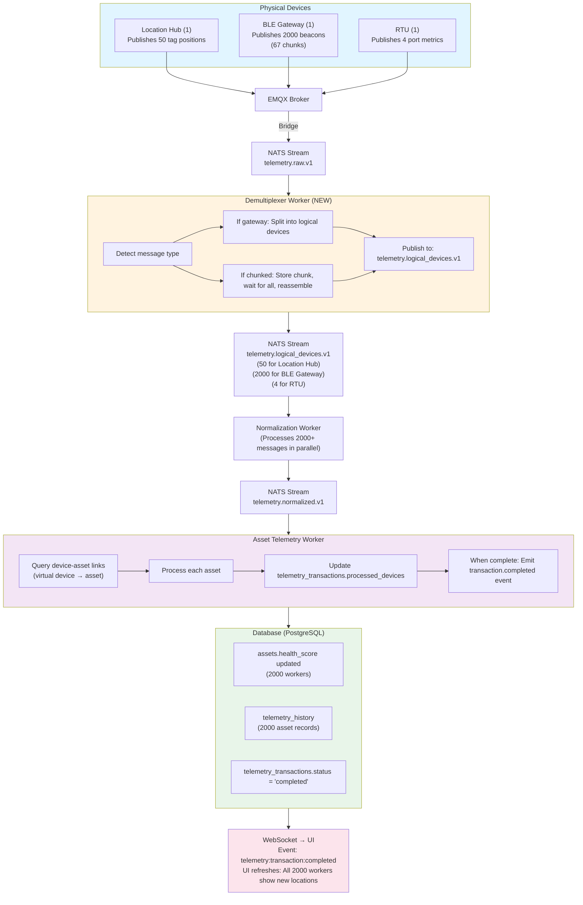

# Gateway & Complex Telemetry Architecture

**Date:** 2026-01-28
**Status:** Architecture Design - Complex Device Patterns

---

## Problem Statement

The current architecture assumes simple 1:1 device-to-telemetry patterns, but real IoT deployments have complex scenarios:

### Scenario 1: Location Hub (1 → 50 devices)
- **Physical Device**: 1 Location Hub
- **Publishes Data For**: 50 tracked devices/tags
- **Requirement**: Each of 50 devices shows individual telemetry, linked to their respective assets
- **Example**: Location Hub publishes: `{ "tag_001": {x: 10, y: 20}, "tag_002": {x: 15, y: 25}, ... (50 tags) }`

### Scenario 2: BLE Gateway (1 → 2000 beacons, chunked)
- **Physical Device**: 1 BLE Gateway
- **Publishes Data For**: 2000 BLE beacons
- **Chunking**: 30 beacons per MQTT message = 67 messages
- **Requirement**: All 2000 beacons must appear as **one atomic transaction** at application layer
- **Example**: Gateway publishes 67 separate messages with correlation ID, application must wait for all chunks before processing

### Scenario 3: RTU Multi-Port (1 → 4 pumps)
- **Physical Device**: 1 RTU with 4 ports
- **Controls/Monitors**: 4 separate pumps (each is an asset)
- **Requirement**: Port 1 telemetry → Pump A asset, Port 2 → Pump B, etc.
- **Example**: RTU publishes: `{ "port_1": {pressure: 101}, "port_2": {pressure: 98}, ... }`

---

## Solution Architecture

### Core Concepts

```
Physical Device (Gateway)
    ↓ publishes MQTT message with sub-device data
Logical Devices (Virtual Entities)
    ↓ each logical device has telemetry
Assets
    ↓ linked to logical devices (not physical gateway)
```

### Key Components

1. **Device Hierarchy** - Physical gateways → Logical devices
2. **Message Demultiplexer** - Split gateway messages into per-device messages
3. **Chunk Reassembly Service** - Combine multi-packet messages
4. **Transaction Coordinator** - Ensure atomic processing at asset level
5. **Gateway Registry** - Track which devices are gateways vs endpoints

---

## 1. Device Hierarchy Schema

### Existing vs New Approach

**Current** (Simple):
```
Device (deviceId) → Asset (1:1 or 1:N via entity_edges)
```

**New** (Gateway-aware):
```
Physical Gateway Device
    ├─ Logical Device 1 (tag_001) → Asset A
    ├─ Logical Device 2 (tag_002) → Asset B
    └─ Logical Device 50 (tag_050) → Asset Z
```

### Database Schema Changes

#### 1.1 Add `device_role` to devices table

```sql
-- Add device role enum
CREATE TYPE device_role_enum AS ENUM (
  'endpoint',    -- Standard IoT device (sends its own data)
  'gateway',     -- Gateway device (publishes data for other devices)
  'virtual'      -- Logical device (data comes via gateway, no direct connection)
);

-- Modify devices table
ALTER TABLE devices
  ADD COLUMN device_role device_role_enum NOT NULL DEFAULT 'endpoint',
  ADD COLUMN parent_device_id UUID REFERENCES devices(id) ON DELETE CASCADE,
  ADD COLUMN logical_identifier TEXT, -- For virtual devices: "tag_001", "beacon_1234", "port_1"
  ADD COLUMN gateway_metadata JSONB DEFAULT '{}'; -- Gateway-specific config

-- Indexes
CREATE INDEX idx_devices_role ON devices(device_role);
CREATE INDEX idx_devices_parent ON devices(parent_device_id);
CREATE INDEX idx_devices_logical_id ON devices(parent_device_id, logical_identifier);
```

**Example Data**:

```sql
-- Physical Location Hub
INSERT INTO devices VALUES (
  'device-loc-hub-001',
  'Location Hub 1',
  device_role = 'gateway',
  parent_device_id = NULL,
  gateway_metadata = {
    "protocol": "uwb",
    "max_tags": 100,
    "publish_interval_ms": 1000
  }
);

-- Virtual Tag Devices (children of gateway)
INSERT INTO devices VALUES (
  'device-tag-001',
  'Worker Tag 001',
  device_role = 'virtual',
  parent_device_id = 'device-loc-hub-001',
  logical_identifier = 'tag_001'
);

INSERT INTO devices VALUES (
  'device-tag-002',
  'Worker Tag 002',
  device_role = 'virtual',
  parent_device_id = 'device-loc-hub-001',
  logical_identifier = 'tag_002'
);
-- ... repeat for 50 tags
```

#### 1.2 Multi-Packet Message Tracking

```sql
-- Track chunked messages for reassembly
CREATE TABLE telemetry_chunks (
  id UUID PRIMARY KEY DEFAULT gen_random_uuid(),
  organization_id UUID NOT NULL REFERENCES organizations(id),
  device_id UUID NOT NULL REFERENCES devices(id),
  correlation_id TEXT NOT NULL, -- Groups chunks together
  sequence_number INTEGER NOT NULL, -- Chunk order
  total_chunks INTEGER NOT NULL, -- Expected total
  chunk_payload JSONB NOT NULL, -- This chunk's data
  received_at TIMESTAMPTZ NOT NULL DEFAULT NOW(),
  processed BOOLEAN DEFAULT FALSE
);

CREATE INDEX idx_telemetry_chunks_correlation ON telemetry_chunks(correlation_id, sequence_number);
CREATE INDEX idx_telemetry_chunks_pending ON telemetry_chunks(correlation_id, processed) WHERE processed = FALSE;

-- Retention: Delete after 5 minutes (if not processed, it's lost)
-- Cron job: DELETE FROM telemetry_chunks WHERE received_at < NOW() - INTERVAL '5 minutes'
```

#### 1.3 Transaction Grouping

```sql
-- Track transaction state for atomic asset updates
CREATE TABLE telemetry_transactions (
  id UUID PRIMARY KEY DEFAULT gen_random_uuid(),
  organization_id UUID NOT NULL REFERENCES organizations(id),
  gateway_device_id UUID NOT NULL REFERENCES devices(id),
  correlation_id TEXT NOT NULL UNIQUE, -- Same as message correlation_id
  total_logical_devices INTEGER NOT NULL, -- How many virtual devices in this transaction
  processed_devices INTEGER DEFAULT 0, -- How many processed so far
  status TEXT NOT NULL DEFAULT 'pending', -- 'pending' | 'processing' | 'completed' | 'failed'
  created_at TIMESTAMPTZ NOT NULL DEFAULT NOW(),
  completed_at TIMESTAMPTZ
);

CREATE INDEX idx_telemetry_txn_correlation ON telemetry_transactions(correlation_id);
CREATE INDEX idx_telemetry_txn_pending ON telemetry_transactions(status) WHERE status = 'pending';
```

---

## 2. Message Format Standards

### 2.1 Gateway Message Format (Location Hub)

**MQTT Topic**: `v1/telemetry/{orgId}/{gatewayDeviceId}`

**Payload** (single message with all 50 tags):

```json
{
  "messageType": "gateway_telemetry",
  "gatewayDeviceId": "device-loc-hub-001",
  "timestamp": "2026-01-28T14:30:00Z",
  "correlationId": "txn-12345",
  "logicalDevices": {
    "tag_001": {
      "position": { "x": 10.5, "y": 20.3, "z": 1.2 },
      "rssi": -45,
      "battery": 85
    },
    "tag_002": {
      "position": { "x": 15.2, "y": 25.8, "z": 1.1 },
      "rssi": -50,
      "battery": 90
    },
    // ... 48 more tags
  }
}
```

### 2.2 Chunked Message Format (BLE Gateway)

**MQTT Topic**: `v1/telemetry/{orgId}/{gatewayDeviceId}`

**Payload** (one of 67 chunks):

```json
{
  "messageType": "chunked_gateway_telemetry",
  "gatewayDeviceId": "device-ble-gw-001",
  "timestamp": "2026-01-28T14:30:00Z",
  "correlationId": "txn-beacon-batch-67890",
  "chunkInfo": {
    "sequenceNumber": 1,
    "totalChunks": 67,
    "beaconsInChunk": 30
  },
  "logicalDevices": {
    "beacon_0001": {
      "rssi": -55,
      "temperature": 22.5,
      "humidity": 45,
      "battery": 78
    },
    "beacon_0002": {
      "rssi": -60,
      "temperature": 23.1,
      "humidity": 47,
      "battery": 82
    },
    // ... 28 more beacons (30 total in this chunk)
  }
}
```

**Chunk 2**:
```json
{
  "messageType": "chunked_gateway_telemetry",
  "correlationId": "txn-beacon-batch-67890", // SAME correlation ID
  "chunkInfo": {
    "sequenceNumber": 2, // Increments
    "totalChunks": 67,
    "beaconsInChunk": 30
  },
  "logicalDevices": {
    "beacon_0031": { /* ... */ },
    "beacon_0032": { /* ... */ },
    // ... next 30 beacons
  }
}
```

### 2.3 RTU Multi-Port Format

**MQTT Topic**: `v1/telemetry/{orgId}/{rtuDeviceId}`

**Payload**:

```json
{
  "messageType": "gateway_telemetry",
  "gatewayDeviceId": "device-rtu-001",
  "timestamp": "2026-01-28T14:30:00Z",
  "correlationId": "txn-rtu-54321",
  "logicalDevices": {
    "port_1": {
      "pressure": 101.3,
      "flow_rate": 15.2,
      "valve_position": 75
    },
    "port_2": {
      "pressure": 98.5,
      "flow_rate": 12.8,
      "valve_position": 60
    },
    "port_3": {
      "pressure": 105.1,
      "flow_rate": 18.3,
      "valve_position": 85
    },
    "port_4": {
      "pressure": 99.2,
      "flow_rate": 14.1,
      "valve_position": 70
    }
  }
}
```

---

## 3. Processing Pipeline (Revised)

### 3.1 New Worker: Demultiplexer

**Purpose**: Handle gateway messages and chunk reassembly

```
NATS Stream: telemetry.raw.v1
    ↓
Demultiplexer Worker (NEW)
    ├─ Detects message type
    ├─ If "gateway_telemetry": Split into per-device messages
    ├─ If "chunked_gateway_telemetry": Reassemble chunks
    └─ Publish to: telemetry.logical_devices.v1
    ↓
Normalization Worker (MODIFIED)
    └─ Process logical device telemetry
```

### 3.2 Demultiplexer Worker Logic

```typescript
// Worker: Demultiplexer
async function processDemultiplexer(msg: NatsMessage) {
  const rawPayload = JSON.parse(msg.data.toString());
  const { messageType } = rawPayload;

  switch (messageType) {
    case 'gateway_telemetry':
      await handleGatewayMessage(rawPayload);
      break;

    case 'chunked_gateway_telemetry':
      await handleChunkedMessage(rawPayload);
      break;

    case 'simple_telemetry':
    default:
      // Endpoint device (standard 1:1) - pass through
      await publishLogicalDevice(rawPayload.deviceId, rawPayload);
      break;
  }

  msg.ack();
}
```

#### 3.2.1 Handle Gateway Message (Location Hub / RTU)

```typescript
async function handleGatewayMessage(payload: any) {
  const { gatewayDeviceId, logicalDevices, correlationId, timestamp, organizationId } = payload;

  // Create transaction record
  await db.query(`
    INSERT INTO telemetry_transactions (
      organization_id,
      gateway_device_id,
      correlation_id,
      total_logical_devices,
      status
    ) VALUES ($1, $2, $3, $4, 'processing')
  `, [organizationId, gatewayDeviceId, correlationId, Object.keys(logicalDevices).length]);

  // Split into per-logical-device messages
  for (const [logicalId, metrics] of Object.entries(logicalDevices)) {
    // Resolve virtual device ID from logical identifier
    const virtualDeviceId = await resolveVirtualDevice(gatewayDeviceId, logicalId);

    if (!virtualDeviceId) {
      logger.warn('Virtual device not found', { gatewayDeviceId, logicalId });
      continue; // Skip unknown devices
    }

    // Publish individual message for this logical device
    await nats.publish('telemetry.logical_devices.v1', JSON.stringify({
      deviceId: virtualDeviceId,
      logicalIdentifier: logicalId,
      gatewayDeviceId: gatewayDeviceId,
      correlationId: correlationId,
      timestamp: timestamp,
      metrics: metrics,
      organizationId: organizationId
    }));
  }

  logger.info('Gateway message demultiplexed', {
    gatewayDeviceId,
    logicalDeviceCount: Object.keys(logicalDevices).length,
    correlationId
  });
}

// Resolve virtual device from gateway + logical ID
async function resolveVirtualDevice(gatewayId: string, logicalId: string): Promise<string | null> {
  // Check Redis cache first
  const cacheKey = `virtual_device:${gatewayId}:${logicalId}`;
  const cached = await redis.get(cacheKey);
  if (cached) return cached;

  // Query database
  const result = await db.query(`
    SELECT id
    FROM devices
    WHERE parent_device_id = $1
      AND logical_identifier = $2
      AND device_role = 'virtual'
  `, [gatewayId, logicalId]);

  if (result.rows.length === 0) return null;

  const deviceId = result.rows[0].id;

  // Cache for 1 hour
  await redis.setex(cacheKey, 3600, deviceId);

  return deviceId;
}
```

#### 3.2.2 Handle Chunked Message (BLE Gateway)

```typescript
async function handleChunkedMessage(payload: any) {
  const { gatewayDeviceId, correlationId, chunkInfo, logicalDevices, timestamp, organizationId } = payload;
  const { sequenceNumber, totalChunks } = chunkInfo;

  // Store chunk in database
  await db.query(`
    INSERT INTO telemetry_chunks (
      organization_id,
      device_id,
      correlation_id,
      sequence_number,
      total_chunks,
      chunk_payload
    ) VALUES ($1, $2, $3, $4, $5, $6)
  `, [organizationId, gatewayDeviceId, correlationId, sequenceNumber, totalChunks, JSON.stringify(logicalDevices)]);

  // Check if all chunks received
  const chunksReceived = await db.query(`
    SELECT COUNT(*) as count
    FROM telemetry_chunks
    WHERE correlation_id = $1
      AND processed = FALSE
  `, [correlationId]);

  if (chunksReceived.rows[0].count >= totalChunks) {
    // All chunks received - reassemble and process
    await reassembleAndProcess(correlationId, gatewayDeviceId, timestamp, organizationId, totalChunks);
  } else {
    logger.debug('Chunk received, waiting for more', {
      correlationId,
      sequenceNumber,
      received: chunksReceived.rows[0].count,
      total: totalChunks
    });
  }
}

async function reassembleAndProcess(
  correlationId: string,
  gatewayDeviceId: string,
  timestamp: string,
  organizationId: string,
  totalChunks: number
) {
  // Fetch all chunks ordered by sequence
  const chunks = await db.query(`
    SELECT chunk_payload, sequence_number
    FROM telemetry_chunks
    WHERE correlation_id = $1
    ORDER BY sequence_number ASC
  `, [correlationId]);

  if (chunks.rows.length !== totalChunks) {
    logger.error('Chunk mismatch', { correlationId, expected: totalChunks, received: chunks.rows.length });
    return;
  }

  // Merge all logical devices from all chunks
  const allLogicalDevices = {};
  for (const chunk of chunks.rows) {
    const chunkData = chunk.chunk_payload;
    Object.assign(allLogicalDevices, chunkData);
  }

  logger.info('Chunks reassembled', {
    correlationId,
    totalChunks,
    totalDevices: Object.keys(allLogicalDevices).length
  });

  // Create transaction record
  await db.query(`
    INSERT INTO telemetry_transactions (
      organization_id,
      gateway_device_id,
      correlation_id,
      total_logical_devices,
      status
    ) VALUES ($1, $2, $3, $4, 'processing')
  `, [organizationId, gatewayDeviceId, correlationId, Object.keys(allLogicalDevices).length]);

  // Process as gateway message (same as 3.2.1)
  for (const [logicalId, metrics] of Object.entries(allLogicalDevices)) {
    const virtualDeviceId = await resolveVirtualDevice(gatewayDeviceId, logicalId);

    if (!virtualDeviceId) continue;

    await nats.publish('telemetry.logical_devices.v1', JSON.stringify({
      deviceId: virtualDeviceId,
      logicalIdentifier: logicalId,
      gatewayDeviceId: gatewayDeviceId,
      correlationId: correlationId,
      timestamp: timestamp,
      metrics: metrics,
      organizationId: organizationId
    }));
  }

  // Mark chunks as processed
  await db.query(`
    UPDATE telemetry_chunks
    SET processed = TRUE
    WHERE correlation_id = $1
  `, [correlationId]);
}
```

---

## 4. Transaction Coordinator

**Purpose**: Ensure all logical devices in a transaction are processed before marking complete at asset level.

### 4.1 Transaction Tracking

After each logical device is processed by Asset Telemetry Worker:

```typescript
// At end of Asset Telemetry Worker processing
async function onLogicalDeviceProcessed(correlationId: string, deviceId: string) {
  // Increment processed count
  await db.query(`
    UPDATE telemetry_transactions
    SET
      processed_devices = processed_devices + 1,
      status = CASE
        WHEN processed_devices + 1 >= total_logical_devices THEN 'completed'
        ELSE 'processing'
      END,
      completed_at = CASE
        WHEN processed_devices + 1 >= total_logical_devices THEN NOW()
        ELSE completed_at
      END
    WHERE correlation_id = $1
  `, [correlationId]);

  // Check if transaction complete
  const txn = await db.query(`
    SELECT status, gateway_device_id, total_logical_devices
    FROM telemetry_transactions
    WHERE correlation_id = $1
  `, [correlationId]);

  if (txn.rows[0].status === 'completed') {
    // All logical devices processed - emit transaction complete event
    await nats.publish('telemetry.transaction.completed.v1', JSON.stringify({
      correlationId: correlationId,
      gatewayDeviceId: txn.rows[0].gateway_device_id,
      totalDevices: txn.rows[0].total_logical_devices,
      completedAt: new Date().toISOString()
    }));

    logger.info('Transaction completed', { correlationId });
  }
}
```

### 4.2 UI Transaction Display

**Problem**: User opens Asset detail page and sees partial data (10 of 50 tags updated)

**Solution**: UI subscribes to transaction completion events

```typescript
// Frontend React component
useEffect(() => {
  socket.on('telemetry:transaction:started', ({ correlationId, totalDevices }) => {
    // Show loading indicator: "Receiving data for 2000 beacons..."
    setTransactionState({
      inProgress: true,
      correlationId,
      totalDevices,
      processedDevices: 0
    });
  });

  socket.on('telemetry:transaction:progress', ({ correlationId, processedDevices, totalDevices }) => {
    // Update progress bar: "Processed 500 / 2000 beacons"
    setTransactionState(prev => ({
      ...prev,
      processedDevices
    }));
  });

  socket.on('telemetry:transaction:completed', ({ correlationId }) => {
    // Refresh asset data, hide loading indicator
    refetchAssetTelemetry();
    setTransactionState({ inProgress: false });
    showToast('Telemetry update complete');
  });
}, []);
```

---

## 5. Device Onboarding (Updated)

### 5.1 Onboard Gateway Device

```typescript
// POST /api/v1/devices
{
  "name": "Location Hub 1",
  "deviceTypeId": "type-location-hub",
  "deviceRole": "gateway",
  "gatewayMetadata": {
    "protocol": "uwb",
    "maxLogicalDevices": 100,
    "publishIntervalMs": 1000
  }
}

// Response includes gateway cert
{
  "device": { "id": "device-loc-hub-001", ... },
  "certificate": { ... }
}
```

### 5.2 Onboard Virtual Devices (Batch)

```typescript
// POST /api/v1/devices/batch-virtual
{
  "gatewayDeviceId": "device-loc-hub-001",
  "logicalDevices": [
    { "logicalIdentifier": "tag_001", "name": "Worker Tag 001" },
    { "logicalIdentifier": "tag_002", "name": "Worker Tag 002" },
    // ... 48 more
  ]
}

// Creates 50 virtual devices with parent_device_id = gateway
// Response:
{
  "created": 50,
  "devices": [
    { "id": "device-tag-001", "logicalIdentifier": "tag_001", "parentDeviceId": "device-loc-hub-001" },
    // ...
  ]
}
```

### 5.3 Link Virtual Devices to Assets

```typescript
// POST /api/v1/devices/:virtualDeviceId/assets/:assetId/link
// Same API as before, but now links virtual device to asset

// Example: Link Worker Tag 001 to Worker Person Asset
POST /api/v1/devices/device-tag-001/assets/asset-worker-john/link
{
  "role": "primary",
  "metricsMapping": {
    "device.position.x": "asset.location_x",
    "device.position.y": "asset.location_y",
    "device.position.z": "asset.location_z"
  }
}
```

---

## 6. Complete Flow Examples

### 6.1 Location Hub (50 Tags)

```
Step 1: Location Hub publishes MQTT message
  Topic: v1/telemetry/org-123/device-loc-hub-001
  Payload: { 50 tags with positions }

Step 2: EMQX → NATS (telemetry.raw.v1)

Step 3: Demultiplexer Worker
  - Detects messageType = "gateway_telemetry"
  - Creates telemetry_transaction (correlation_id, total=50)
  - Splits into 50 messages
  - Publishes 50 messages to telemetry.logical_devices.v1
    → { deviceId: "device-tag-001", metrics: {...} }
    → { deviceId: "device-tag-002", metrics: {...} }
    → ... (50 total)

Step 4: Normalization Worker (processes 50 messages in parallel)
  - Each worker instance picks up messages
  - Validates schema, enriches
  - Writes to telemetry_raw table
  - Publishes to telemetry.normalized.v1

Step 5: Asset Telemetry Worker (processes 50 messages in parallel)
  - For each tag device:
    → Query device-asset link (e.g., tag_001 → Worker John)
    → Map position to asset location
    → Update asset telemetry
    → Increment telemetry_transactions.processed_devices
  - After 50th device:
    → Transaction marked 'completed'
    → Emit telemetry.transaction.completed.v1

Step 6: UI Updates
  - WebSocket receives transaction:completed event
  - Refreshes asset list/map
  - All 50 workers appear in new positions atomically
```

**Timeline**:
- Gateway publishes: T+0ms
- Demux splits: T+10ms
- Normalization (parallel): T+50ms
- Asset processing (parallel): T+200ms
- Transaction complete: T+250ms
- UI update: T+300ms

**Result**: All 50 assets updated in <300ms as one atomic transaction

---

### 6.2 BLE Gateway (2000 Beacons, 67 Chunks)

```
Step 1: BLE Gateway publishes 67 MQTT messages
  Message 1: { correlationId: "txn-abc", chunk: 1/67, beacons: beacon_0001-0030 }
  Message 2: { correlationId: "txn-abc", chunk: 2/67, beacons: beacon_0031-0060 }
  ...
  Message 67: { correlationId: "txn-abc", chunk: 67/67, beacons: beacon_1971-2000 }

Step 2: EMQX → NATS (telemetry.raw.v1) - 67 messages

Step 3: Demultiplexer Worker
  - Message 1:
    → Detects messageType = "chunked_gateway_telemetry"
    → Stores in telemetry_chunks table
    → Checks: 1 of 67 chunks received → Wait
  - Message 2:
    → Stores chunk 2
    → Checks: 2 of 67 → Wait
  - ...
  - Message 67:
    → Stores chunk 67
    → Checks: 67 of 67 → All received!
    → Reassemble: Merge all chunks into single logical device map
    → Creates telemetry_transaction (total=2000)
    → Splits into 2000 messages
    → Publishes to telemetry.logical_devices.v1

Step 4-6: Same as Location Hub (but 2000 devices instead of 50)
```

**Timeline**:
- Gateway publishes 67 messages: T+0ms to T+670ms (10ms each)
- Chunk 67 received: T+670ms
- Reassembly: T+680ms
- Demux splits: T+750ms
- Normalization (parallel): T+1500ms
- Asset processing (parallel): T+3000ms
- Transaction complete: T+3200ms
- UI update: T+3300ms

**Result**: All 2000 beacons processed as one transaction in ~3.3 seconds

---

### 6.3 RTU (4 Ports → 4 Pumps)

```
Step 1: RTU publishes MQTT message
  Payload: { port_1: {...}, port_2: {...}, port_3: {...}, port_4: {...} }

Step 2: Demultiplexer Worker
  - Creates telemetry_transaction (total=4)
  - Splits into 4 messages:
    → { deviceId: "device-rtu-001-port1", metrics: {...} }
    → { deviceId: "device-rtu-001-port2", metrics: {...} }
    → { deviceId: "device-rtu-001-port3", metrics: {...} }
    → { deviceId: "device-rtu-001-port4", metrics: {...} }

Step 3: Asset Telemetry Worker
  - Port 1 device → Pump A asset
  - Port 2 device → Pump B asset
  - Port 3 device → Pump C asset
  - Port 4 device → Pump D asset

Step 4: Transaction complete
  - All 4 pumps updated atomically
  - UI shows all 4 pumps updated at once
```

**Timeline**: <200ms total (4 devices processed in parallel)

---

## 7. API Additions

### 7.1 Gateway Device Management

```typescript
// List logical devices under a gateway
GET /api/v1/devices/:gatewayId/logical-devices
Response:
{
  "gatewayDevice": { "id": "device-loc-hub-001", "name": "Location Hub 1" },
  "logicalDevices": [
    { "id": "device-tag-001", "logicalIdentifier": "tag_001", "name": "Worker Tag 001" },
    { "id": "device-tag-002", "logicalIdentifier": "tag_002", "name": "Worker Tag 002" },
    // ... 48 more
  ],
  "total": 50
}

// Create logical devices in batch
POST /api/v1/devices/batch-virtual
Request:
{
  "gatewayDeviceId": "device-loc-hub-001",
  "logicalDevices": [
    { "logicalIdentifier": "tag_001", "name": "Worker Tag 001" },
    { "logicalIdentifier": "tag_002", "name": "Worker Tag 002" }
  ]
}

// Delete logical device
DELETE /api/v1/devices/:logicalDeviceId
// Soft delete, but also removes from cache
```

### 7.2 Transaction Monitoring

```typescript
// Get active transactions (for monitoring/debugging)
GET /api/v1/telemetry/transactions?status=processing
Response:
{
  "transactions": [
    {
      "correlationId": "txn-abc-123",
      "gatewayDeviceId": "device-ble-gw-001",
      "totalDevices": 2000,
      "processedDevices": 1456,
      "status": "processing",
      "progress": 72.8,
      "createdAt": "2026-01-28T14:30:00Z",
      "estimatedCompletionAt": "2026-01-28T14:30:03Z"
    }
  ]
}

// Get transaction details
GET /api/v1/telemetry/transactions/:correlationId
Response:
{
  "transaction": {
    "correlationId": "txn-abc-123",
    "status": "completed",
    "totalDevices": 2000,
    "processedDevices": 2000,
    "createdAt": "2026-01-28T14:30:00Z",
    "completedAt": "2026-01-28T14:30:03.234Z",
    "durationMs": 3234
  },
  "chunks": [
    { "sequenceNumber": 1, "receivedAt": "2026-01-28T14:30:00.100Z" },
    { "sequenceNumber": 2, "receivedAt": "2026-01-28T14:30:00.110Z" },
    // ... 67 chunks
  ]
}
```

---

## 8. Performance Considerations

### 8.1 Chunk Timeout & Retries

**Problem**: What if chunk 45 of 67 never arrives?

**Solution**:
```typescript
// Cron job runs every 1 minute
async function cleanupStalledChunks() {
  // Find chunk groups where first chunk > 5 minutes old and not all received
  const stalled = await db.query(`
    SELECT DISTINCT correlation_id
    FROM telemetry_chunks
    WHERE received_at < NOW() - INTERVAL '5 minutes'
      AND processed = FALSE
    GROUP BY correlation_id
    HAVING COUNT(*) < MAX(total_chunks)
  `);

  for (const row of stalled.rows) {
    logger.error('Stalled chunk transaction', { correlationId: row.correlation_id });

    // Move to DLQ
    await nats.publish('telemetry.dlq', JSON.stringify({
      reason: 'incomplete_chunks',
      correlationId: row.correlation_id,
      timestamp: new Date()
    }));

    // Delete chunks
    await db.query(`DELETE FROM telemetry_chunks WHERE correlation_id = $1`, [row.correlation_id]);
  }
}
```

### 8.2 Cache Warm-up

For 2000 beacons, we need to resolve 2000 virtual device IDs:

```typescript
// Batch cache warm-up when gateway onboarded
async function warmUpVirtualDeviceCache(gatewayId: string) {
  const devices = await db.query(`
    SELECT id, logical_identifier
    FROM devices
    WHERE parent_device_id = $1
      AND device_role = 'virtual'
  `, [gatewayId]);

  // Batch write to Redis (pipeline)
  const pipeline = redis.pipeline();
  for (const device of devices.rows) {
    const cacheKey = `virtual_device:${gatewayId}:${device.logical_identifier}`;
    pipeline.setex(cacheKey, 3600, device.id);
  }
  await pipeline.exec();

  logger.info('Virtual device cache warmed', { gatewayId, count: devices.rows.length });
}
```

### 8.3 Parallel Processing Limits

Processing 2000 devices in parallel could overwhelm database:

```typescript
// Process in batches of 100
async function processLogicalDevicesBatch(messages: NatsMessage[], batchSize = 100) {
  for (let i = 0; i < messages.length; i += batchSize) {
    const batch = messages.slice(i, i + batchSize);
    await Promise.all(batch.map(msg => processLogicalDevice(msg)));
    logger.debug('Batch processed', { batch: i / batchSize + 1, total: Math.ceil(messages.length / batchSize) });
  }
}
```

---

## 9. Updated Architecture Diagram



---

## 10. Summary

### Key Additions to Architecture

1. **Device Hierarchy**: Physical gateways → Virtual/logical devices → Assets
2. **Demultiplexer Worker**: New worker to handle gateway messages and chunk reassembly
3. **Chunk Tracking**: Database table to store and reassemble multi-packet messages
4. **Transaction Coordinator**: Ensures atomic processing of all logical devices
5. **Correlation IDs**: Track related messages across entire pipeline
6. **Virtual Device Resolution**: Cache-backed mapping from logical IDs to device IDs
7. **UI Transaction Events**: Real-time progress updates for large batches

### Performance at Scale

| Scenario | Physical Devices | Logical Devices | Messages/Publish | Processing Time |
|----------|------------------|-----------------|------------------|-----------------|
| Location Hub | 1 | 50 | 1 | <300ms |
| BLE Gateway | 1 | 2000 | 67 (chunked) | ~3.3s |
| RTU | 1 | 4 | 1 | <200ms |

### Atomic Guarantees

- All logical devices in a transaction are processed together
- Transaction marked complete only after all devices processed
- UI updates only after transaction complete
- No partial updates visible to user

---

**This architecture ensures:**
✅ Gateway devices can publish data for thousands of downstream devices
✅ Multi-packet messages are reassembled correctly
✅ All related telemetry appears atomically at the asset level
✅ UI shows consistent, complete data (never partial updates)
✅ Scales to 30K msg/sec with proper batching and parallelization
