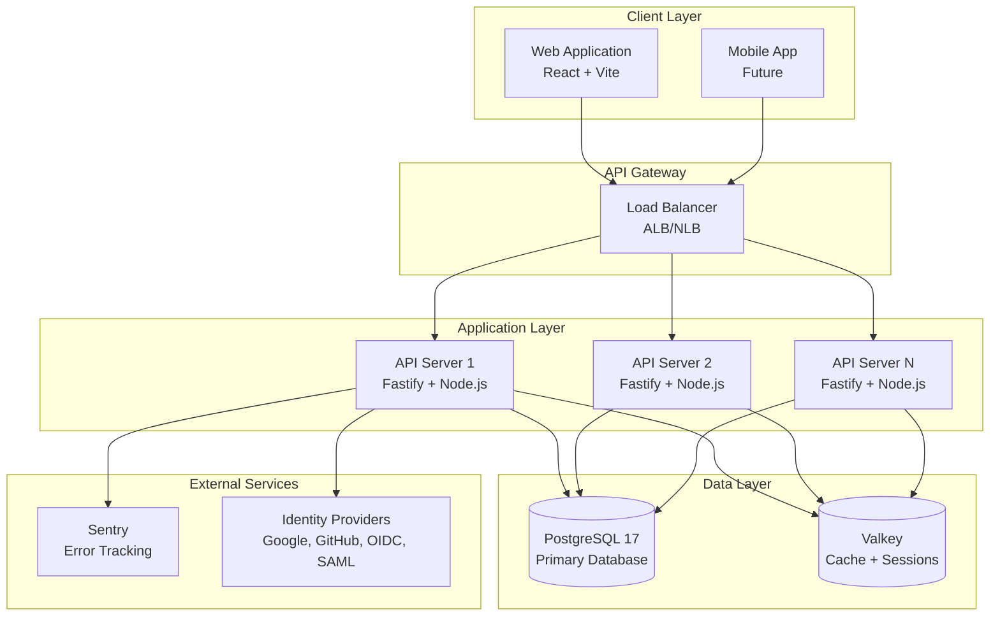
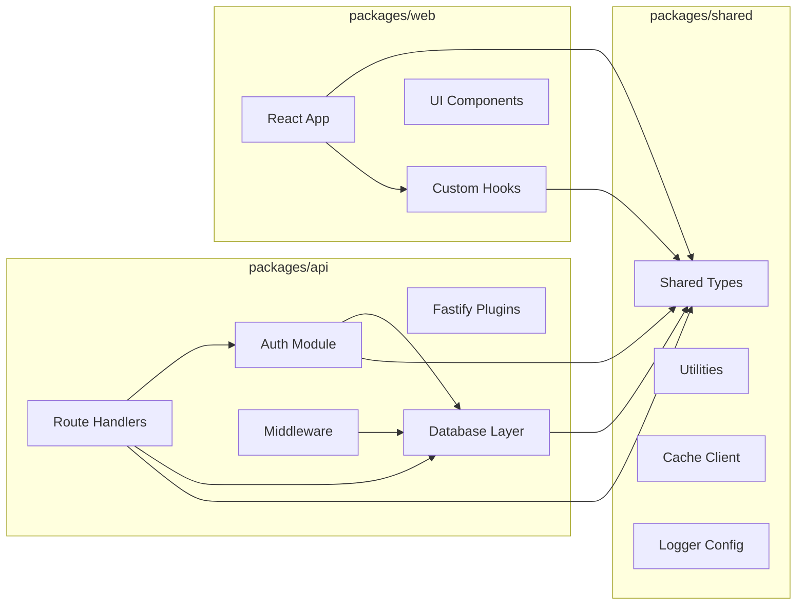
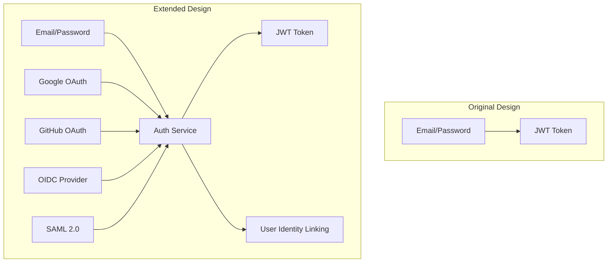

# Argus IQ - Implementation Architecture

> **Version:** 1.0.0
> **Last Updated:** January 2026
> **Status:** Sprint 1 Complete

## Overview

Argus IQ is a multi-tenant SaaS platform built with a modern TypeScript stack. This document provides a comprehensive overview of the system architecture, implementation phases, and technical decisions made during development.

## Table of Contents

- [System Overview](#system-overview)
- [Technology Stack](#technology-stack)
- [Architecture Principles](#architecture-principles)
- [Phase Documents](#phase-documents)
- [Component Overview](#component-overview)
- [Implementation Changes Log](#implementation-changes-log)

---

## System Overview



## Technology Stack

| Layer | Technology | Version | Purpose |
|-------|------------|---------|---------|
| **Runtime** | Node.js | 22.x | JavaScript runtime |
| **Language** | TypeScript | 5.x | Type-safe development |
| **API Framework** | Fastify | 5.x | High-performance HTTP server |
| **Database** | PostgreSQL | 17 | Primary data store |
| **ORM** | Drizzle ORM | 0.45.x | Type-safe database queries |
| **Cache** | Valkey | 8.x | Redis-compatible caching |
| **Validation** | Zod | 4.x | Runtime type validation |
| **Authentication** | Passport.js | 0.7.x | Multi-strategy authentication |
| **Package Manager** | pnpm | 9.x | Fast, disk-efficient package manager |
| **Monorepo** | pnpm workspaces | - | Multi-package management |

---

## Architecture Principles

### 1. Multi-Tenancy by Design
Every data access is scoped to an organization (tenant) using PostgreSQL Row-Level Security (RLS). This provides:
- Data isolation at the database level
- Protection against cross-tenant data leakage
- Simplified application code (no manual tenant filtering)

### 2. Security-First Approach
- All endpoints require authentication by default
- JWT tokens with short expiration (15 minutes)
- Refresh token rotation
- Rate limiting on all endpoints
- Input validation with Zod schemas

### 3. Horizontal Scalability
- Stateless API servers
- Session data in Valkey (Redis-compatible)
- Database connection pooling
- Health checks for load balancer integration

### 4. Developer Experience
- Full TypeScript across all packages
- Shared types between frontend and backend
- Comprehensive API documentation
- Local development with Docker Compose

---

## Phase Documents

### [Phase 1: Authentication & Multi-Organization](./phase-1-auth-multi-org.md)
Covers user authentication, organization management, role-based access control, and SSO integration.

**Key Components:**
- JWT authentication with refresh tokens
- Multi-organization support
- Role-based access control (RBAC)
- **[ADDED]** SSO integration (Google, GitHub, OIDC, SAML)

### [Phase 2: Database & Row-Level Security](./phase-2-database-rls.md)
Covers database schema design, multi-tenant data isolation, and migration strategies.

**Key Components:**
- PostgreSQL schema design
- Row-Level Security (RLS) policies
- Migration management with Drizzle
- Connection pooling

### [Phase 3: CI/CD & Deployment](./phase-3-cicd-deployment.md)
Covers continuous integration, deployment pipelines, and infrastructure automation.

**Key Components:**
- GitHub Actions workflows
- Docker containerization
- Environment promotion (dev → staging → production)
- Automated rollback strategies

---

## Component Overview



### Package Structure

```
argusiq-lite/
├── packages/
│   ├── api/                    # Backend API server
│   │   ├── src/
│   │   │   ├── auth/           # Authentication strategies
│   │   │   ├── db/             # Database schema & migrations
│   │   │   ├── middleware/     # Request middleware
│   │   │   ├── plugins/        # Fastify plugins
│   │   │   ├── routes/         # API route handlers
│   │   │   └── services/       # Business logic
│   │   └── Dockerfile
│   │
│   ├── shared/                 # Shared code
│   │   └── src/
│   │       ├── types/          # TypeScript types
│   │       ├── cache/          # Valkey client
│   │       └── logger/         # Pino configuration
│   │
│   └── web/                    # Frontend application
│       └── src/
│           ├── components/
│           ├── hooks/
│           └── pages/
│
├── docs/                       # Documentation
│   └── architecture/           # Architecture docs
│
├── scripts/                    # Build & utility scripts
│
└── .github/                    # CI/CD workflows
    └── workflows/
```

---

## Implementation Changes Log

This section documents significant changes made during implementation that deviated from or extended the original specification.

### Sprint 1 Changes

| Change | Category | Description | Rationale |
|--------|----------|-------------|-----------|
| **SSO Support Added** | Authentication | Added Passport.js strategies for Google, GitHub, OIDC, and SAML 2.0 | Enterprise requirement for single sign-on |
| **Identity Providers Table** | Database | New `identity_providers` table for storing SSO configurations per organization | Support multiple IdPs per tenant |
| **User Identities Table** | Database | New `user_identities` table linking users to external accounts | Enable account linking across providers |
| **RLS Context Middleware** | Security | Automatic PostgreSQL session variable setting for RLS | Simplify tenant isolation in queries |
| **PostgreSQL Port Change** | Infrastructure | Changed from 5432 to 5433 | Avoid conflicts with existing local PostgreSQL |
| **Migration Safety Workflow** | CI/CD | Added workflow to block destructive migrations | Prevent production data loss |

### Detailed Change: SSO Support

**Original Scope:** Basic JWT authentication with email/password
**Extended Scope:** Full SSO support with multiple identity providers



**Impact:**
- 2 new database tables
- 4 new authentication strategies
- New SSO routes (`/api/v1/sso/*`)
- Identity management endpoints

---

## Quick Links

- [Phase 1: Authentication & Multi-Organization](./phase-1-auth-multi-org.md)
- [Phase 2: Database & Row-Level Security](./phase-2-database-rls.md)
- [Phase 3: CI/CD & Deployment](./phase-3-cicd-deployment.md)

---

## Getting Started

### Prerequisites

- Node.js 22+
- pnpm 9+
- Docker & Docker Compose
- PostgreSQL client (optional, for direct DB access)

### Local Development

```bash
# Clone the repository
git clone <repository-url>
cd argusiq-lite

# Install dependencies
pnpm install

# Start infrastructure (PostgreSQL, Valkey)
docker compose up -d

# Copy environment file
cp .env.example .env

# Run database migrations
cd packages/api
pnpm db:push

# Apply RLS policies
docker exec argus-db psql -U argus -d argus \
  -f /path/to/0001_rls_policies.sql

# Start development server
pnpm dev
```

### Environment Variables

See [.env.example](../../.env.example) for all configuration options.

| Variable | Required | Description |
|----------|----------|-------------|
| `DATABASE_URL` | Yes | PostgreSQL connection string |
| `VALKEY_URL` | Yes | Valkey/Redis connection string |
| `JWT_SECRET` | Yes | Secret for JWT signing |
| `NODE_ENV` | No | Environment (development/production) |
| `SENTRY_DSN` | No | Sentry error tracking DSN |
