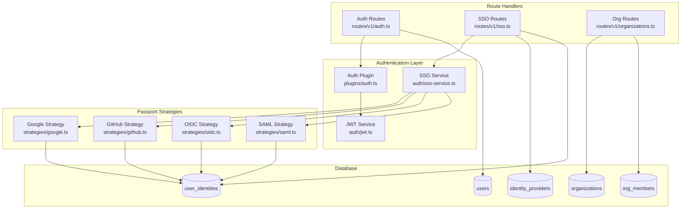
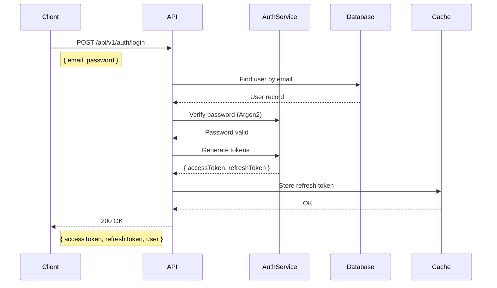
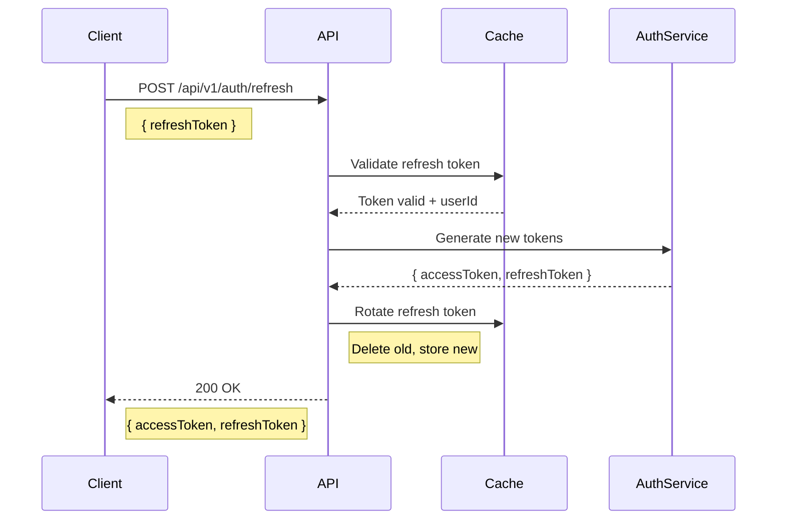
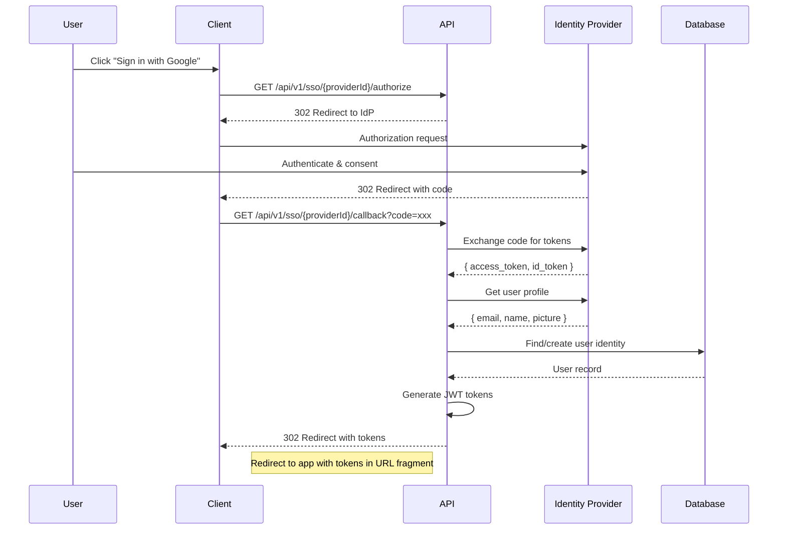
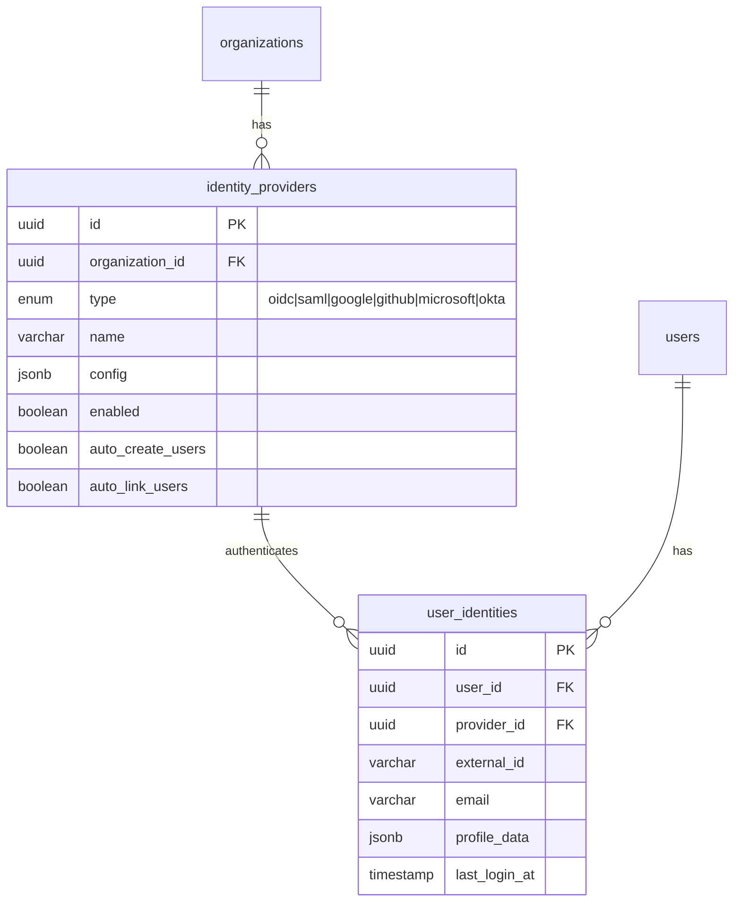
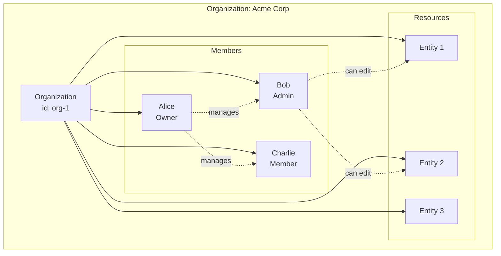
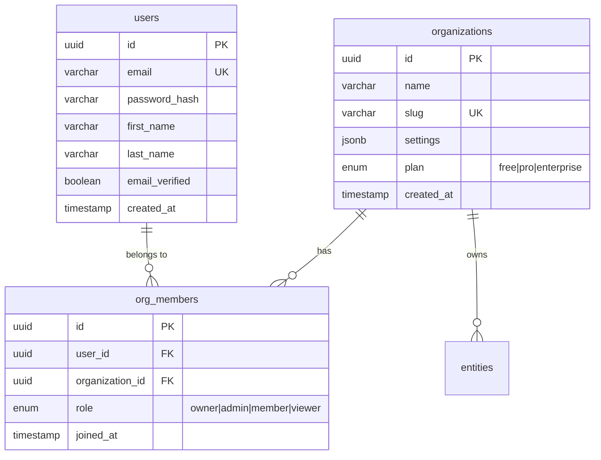
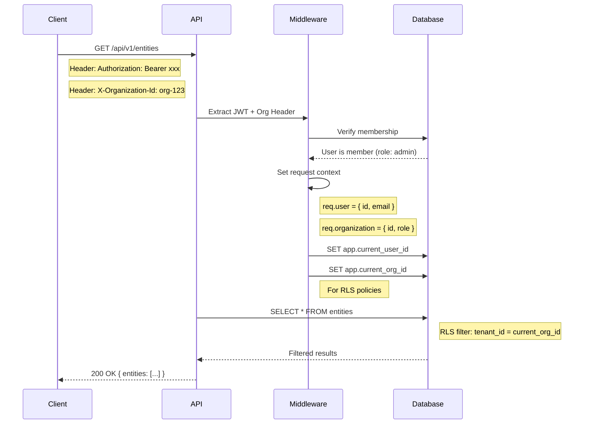
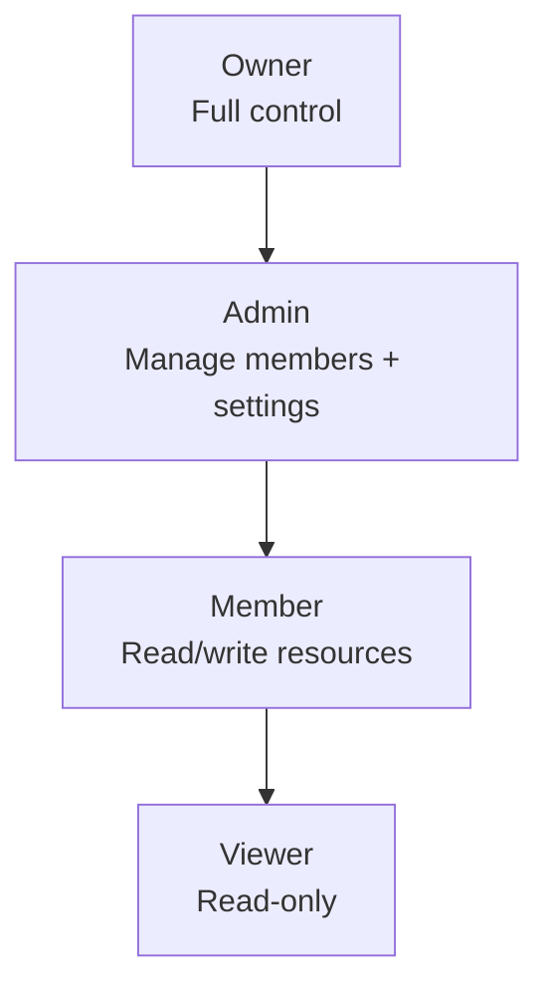

# Phase 1: Authentication & Multi-Organization

> **Status:** Complete
> **Sprint:** 1
> **Last Updated:** January 2026

## Overview

This phase implements the authentication system and multi-organization support for Argus IQ. The system supports both traditional email/password authentication and enterprise SSO through various identity providers.

## Table of Contents

- [Components](#components)
- [Authentication Flow](#authentication-flow)
- [SSO Integration](#sso-integration-implementation-change)
- [Multi-Organization Model](#multi-organization-model)
- [Role-Based Access Control](#role-based-access-control)
- [API Reference](#api-reference)
- [How-To Guides](#how-to-guides)

---

## Components

### Component Diagram



### Component Descriptions

| Component | File | Responsibility |
|-----------|------|----------------|
| **Auth Plugin** | `plugins/auth.ts` | Fastify plugin providing `authenticate` and `optionalAuth` decorators |
| **JWT Service** | `auth/jwt.ts` | Token generation, validation, and refresh |
| **SSO Service** | `auth/sso-service.ts` | Handles SSO callbacks, user creation, account linking |
| **Google Strategy** | `strategies/google.ts` | Google OAuth2 via Passport.js |
| **GitHub Strategy** | `strategies/github.ts` | GitHub OAuth2 via Passport.js |
| **OIDC Strategy** | `strategies/oidc.ts` | Generic OpenID Connect (Okta, Auth0, etc.) |
| **SAML Strategy** | `strategies/saml.ts` | SAML 2.0 for enterprise IdPs |

---

## Authentication Flow

### Email/Password Authentication



### Token Refresh Flow



### JWT Token Structure

```typescript
// Access Token Payload
interface AccessTokenPayload {
  sub: string;          // User ID
  email: string;
  orgId?: string;       // Current organization context
  role?: OrgRole;       // Role in current organization
  iat: number;          // Issued at
  exp: number;          // Expires (15 minutes)
}

// Refresh Token Payload
interface RefreshTokenPayload {
  sub: string;          // User ID
  jti: string;          // Unique token ID (for revocation)
  iat: number;
  exp: number;          // Expires (7 days)
}
```

---

## SSO Integration (Implementation Change)

> **Change Notice:** SSO support was added during implementation to meet enterprise requirements. This was not in the original specification.

### Supported Identity Providers

| Provider | Protocol | Use Case |
|----------|----------|----------|
| **Google** | OAuth 2.0 | Consumer and Google Workspace |
| **GitHub** | OAuth 2.0 | Developer teams |
| **OIDC** | OpenID Connect | Okta, Auth0, Azure AD, custom IdPs |
| **SAML** | SAML 2.0 | Enterprise IdPs (Okta, OneLogin, ADFS) |

### SSO Authentication Flow



### Identity Provider Configuration



### Provider Configuration Examples

#### Google OAuth

```typescript
// identity_providers.config for Google
const googleConfig: SocialConfig = {
  type: 'google',
  clientId: 'your-client-id.apps.googleusercontent.com',
  clientSecret: 'your-client-secret',
  scopes: ['openid', 'email', 'profile'],
};
```

#### OIDC (Okta)

```typescript
// identity_providers.config for OIDC
const oidcConfig: OidcConfig = {
  type: 'oidc',
  issuer: 'https://your-org.okta.com',
  clientId: 'your-client-id',
  clientSecret: 'your-client-secret',
  scopes: ['openid', 'email', 'profile'],
};
```

#### SAML 2.0

```typescript
// identity_providers.config for SAML
const samlConfig: SamlConfig = {
  type: 'saml',
  entryPoint: 'https://idp.example.com/sso/saml',
  issuer: 'argus-iq',
  cert: '-----BEGIN CERTIFICATE-----\n...',
  signatureAlgorithm: 'sha256',
};
```

---

## Multi-Organization Model

### Organization Hierarchy



### Data Model



### Organization Context Flow



---

## Role-Based Access Control

### Role Hierarchy



### Permission Matrix

| Permission | Owner | Admin | Member | Viewer |
|------------|-------|-------|--------|--------|
| View resources | Yes | Yes | Yes | Yes |
| Create resources | Yes | Yes | Yes | No |
| Edit resources | Yes | Yes | Yes | No |
| Delete resources | Yes | Yes | No | No |
| Manage members | Yes | Yes | No | No |
| Change member roles | Yes | Yes* | No | No |
| Organization settings | Yes | Yes | No | No |
| Delete organization | Yes | No | No | No |
| Configure SSO | Yes | Yes | No | No |
| View audit logs | Yes | Yes | No | No |

*Admins cannot promote to Owner or demote Owners

### Role Check Implementation

```typescript
// Example: Route with role check
app.delete(
  '/organizations/:orgId/members/:userId',
  {
    preHandler: [
      app.authenticate,
      requireRole(['owner', 'admin']),
    ],
  },
  async (request, reply) => {
    // Only owners and admins can remove members
    const { orgId, userId } = request.params;
    await removeMember(orgId, userId);
    return reply.status(204).send();
  }
);

// Role check middleware
function requireRole(allowedRoles: OrgRole[]) {
  return async (request: FastifyRequest, reply: FastifyReply) => {
    const userRole = request.organization?.role;
    if (!userRole || !allowedRoles.includes(userRole)) {
      throw new ForbiddenError('Insufficient permissions');
    }
  };
}
```

---

## API Reference

### Authentication Endpoints

| Method | Endpoint | Description |
|--------|----------|-------------|
| `POST` | `/api/v1/auth/register` | Create new account |
| `POST` | `/api/v1/auth/login` | Email/password login |
| `POST` | `/api/v1/auth/refresh` | Refresh access token |
| `POST` | `/api/v1/auth/logout` | Invalidate refresh token |
| `POST` | `/api/v1/auth/forgot-password` | Request password reset |
| `POST` | `/api/v1/auth/reset-password` | Set new password |
| `GET` | `/api/v1/auth/me` | Get current user |

### SSO Endpoints

| Method | Endpoint | Description |
|--------|----------|-------------|
| `GET` | `/api/v1/sso/providers` | List available SSO providers |
| `GET` | `/api/v1/sso/:providerId/authorize` | Initiate SSO flow |
| `GET` | `/api/v1/sso/:providerId/callback` | Handle IdP callback |
| `GET` | `/api/v1/sso/identities` | List linked identities |
| `DELETE` | `/api/v1/sso/identities/:id` | Unlink identity |

### Organization Endpoints

| Method | Endpoint | Description |
|--------|----------|-------------|
| `GET` | `/api/v1/organizations` | List user's organizations |
| `POST` | `/api/v1/organizations` | Create organization |
| `GET` | `/api/v1/organizations/:id` | Get organization details |
| `PATCH` | `/api/v1/organizations/:id` | Update organization |
| `DELETE` | `/api/v1/organizations/:id` | Delete organization |
| `GET` | `/api/v1/organizations/:id/members` | List members |
| `POST` | `/api/v1/organizations/:id/members` | Add member |
| `PATCH` | `/api/v1/organizations/:id/members/:userId` | Update member role |
| `DELETE` | `/api/v1/organizations/:id/members/:userId` | Remove member |

---

## How-To Guides

### How to Add a New SSO Provider (Organization Admin)

1. **Navigate to Organization Settings**
   ```
   Settings > Security > Identity Providers
   ```

2. **Click "Add Provider"**

3. **Select Provider Type**
   - Google (OAuth 2.0)
   - GitHub (OAuth 2.0)
   - OIDC (OpenID Connect)
   - SAML 2.0

4. **Configure Provider**

   For **Google**:
   - Go to [Google Cloud Console](https://console.cloud.google.com)
   - Create OAuth 2.0 credentials
   - Set authorized redirect URI: `https://your-domain.com/api/v1/sso/{providerId}/callback`
   - Copy Client ID and Client Secret

   For **OIDC (Okta)**:
   - Create new OIDC application in Okta Admin
   - Set Sign-in redirect URI: `https://your-domain.com/api/v1/sso/{providerId}/callback`
   - Copy Issuer URL, Client ID, and Client Secret

5. **Enable Auto-Provisioning** (Optional)
   - `Auto-create users`: Automatically create accounts for new SSO users
   - `Auto-link users`: Link SSO accounts to existing users by email

6. **Test the Integration**
   - Open an incognito window
   - Try signing in with the new provider
   - Verify user profile is correctly populated

### How to Implement Custom Authentication Logic

1. **Create a new strategy file**

```typescript
// packages/api/src/auth/strategies/custom.ts
import { Strategy } from 'passport-custom';
import type { SsoProfile } from '../sso-types.js';

export function createCustomStrategy(
  providerId: string,
  config: CustomConfig
): Strategy {
  return new Strategy(async (req, done) => {
    try {
      // Your custom authentication logic
      const token = req.headers['x-custom-token'];
      const profile = await validateCustomToken(token, config);

      const ssoProfile: SsoProfile = {
        providerId,
        externalId: profile.id,
        email: profile.email,
        emailVerified: true,
        displayName: profile.name,
        rawProfile: profile,
      };

      done(null, { profile: ssoProfile });
    } catch (error) {
      done(error as Error);
    }
  });
}
```

2. **Register the strategy**

```typescript
// In sso-service.ts
import { createCustomStrategy } from './strategies/custom.js';

function getStrategy(provider: IdentityProvider) {
  switch (provider.type) {
    case 'custom':
      return createCustomStrategy(provider.id, provider.config);
    // ... other cases
  }
}
```

3. **Add the provider type to the enum**

```typescript
// In db/schema/enums.ts
export const identityProviderTypeEnum = pgEnum('identity_provider_type', [
  'oidc',
  'saml',
  'google',
  'github',
  'microsoft',
  'okta',
  'custom', // Add this
]);
```

### How to Switch Organization Context

```typescript
// Frontend example
const switchOrganization = async (orgId: string) => {
  // Store the selected org
  localStorage.setItem('currentOrgId', orgId);

  // All subsequent API calls include the org header
  api.defaults.headers['X-Organization-Id'] = orgId;

  // Optionally get a new token with org context
  const response = await api.post('/auth/refresh', {
    refreshToken,
    organizationId: orgId,
  });

  // New token has org context embedded
  setAccessToken(response.data.accessToken);
};
```

---

## Troubleshooting

### Common Issues

| Issue | Cause | Solution |
|-------|-------|----------|
| SSO callback fails with "Invalid state" | Session expired or CSRF mismatch | Clear cookies and retry |
| "User not found in organization" | User hasn't been added to org | Admin needs to invite user first |
| Token refresh fails | Refresh token expired or revoked | Re-authenticate with full login |
| SAML assertion invalid | Clock skew or certificate mismatch | Check server time sync and cert |

### Debug Mode

Enable verbose authentication logging:

```bash
# In .env
LOG_LEVEL=debug
```

Check auth-related logs:

```bash
# Filter for auth logs
pnpm dev 2>&1 | grep -E "(auth|sso|jwt)"
```

---

[← Back to Architecture Overview](./README.md) | [Next: Phase 2 - Database & RLS →](./phase-2-database-rls.md)
