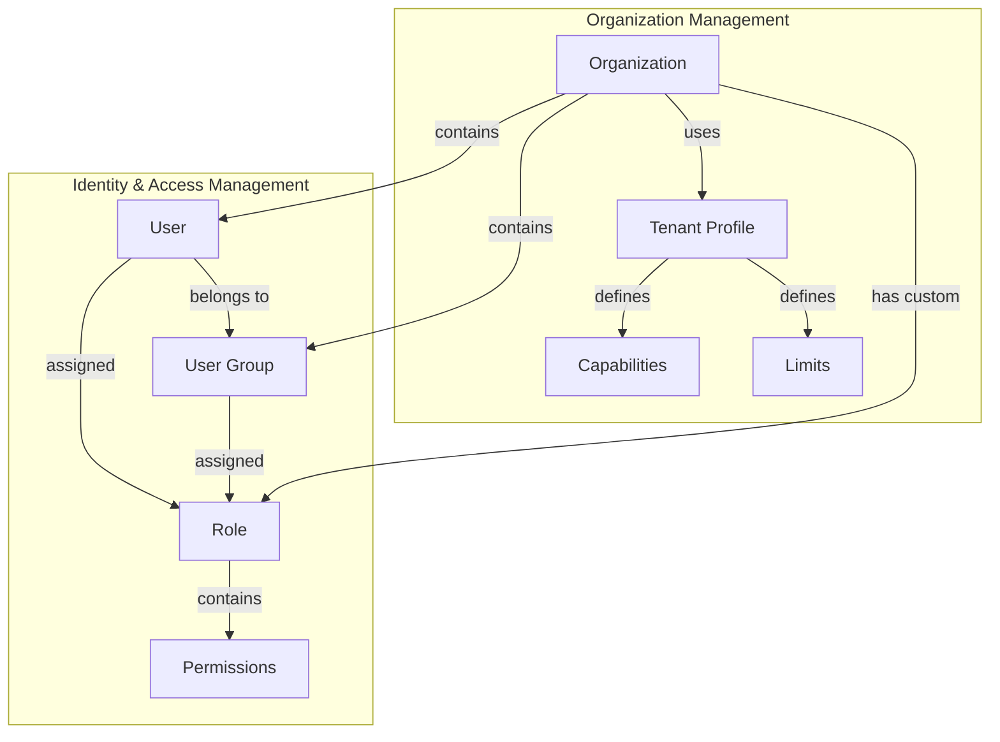
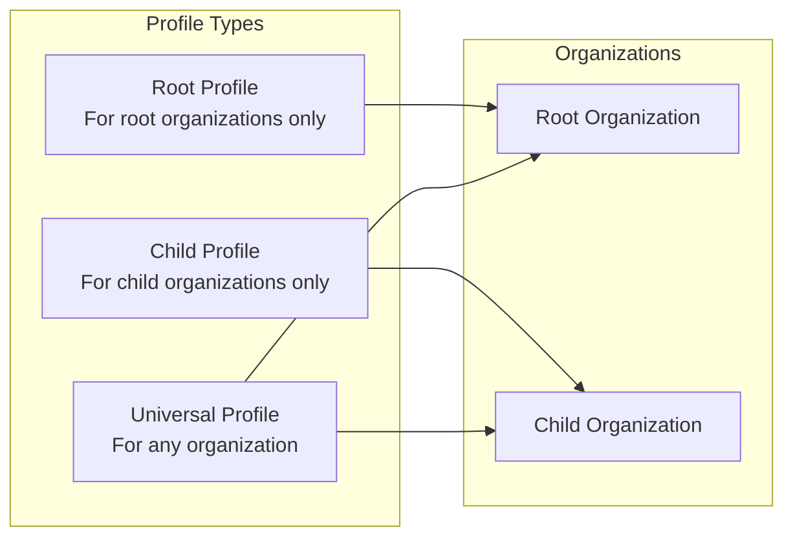
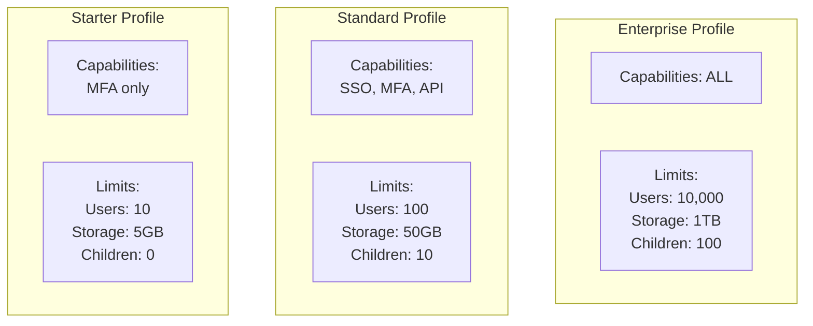
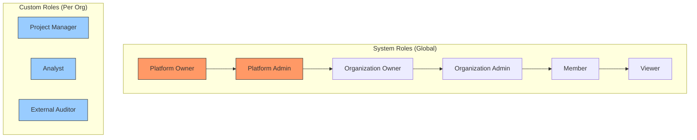
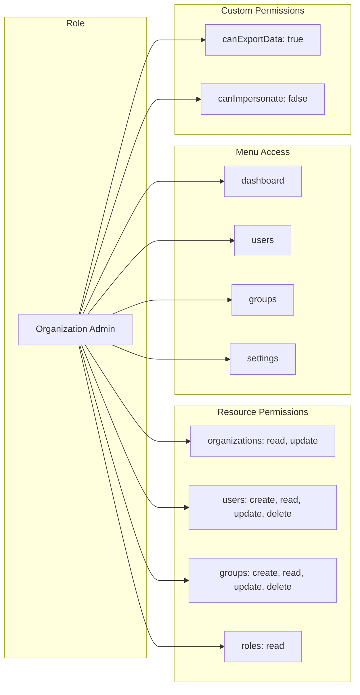
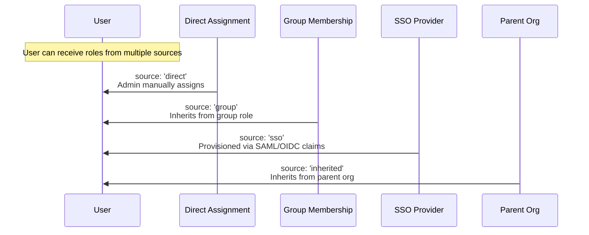
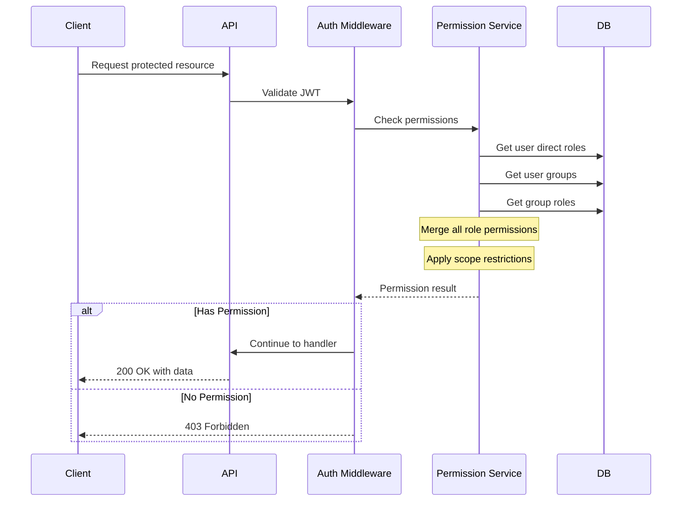
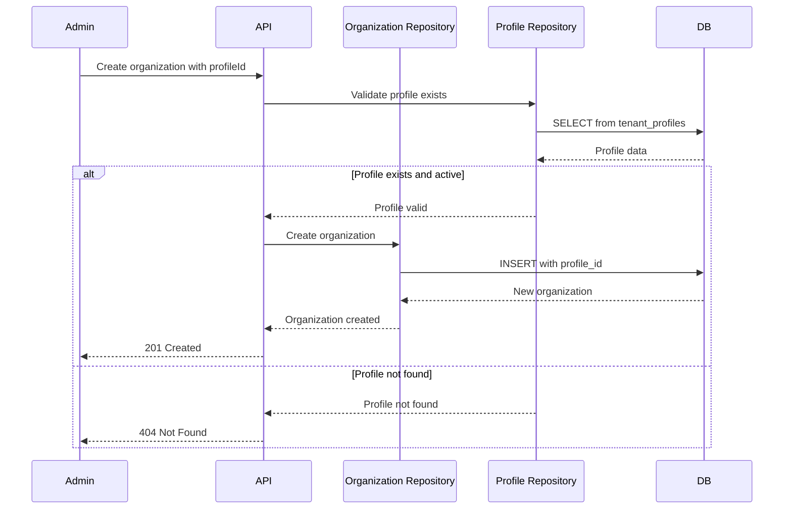
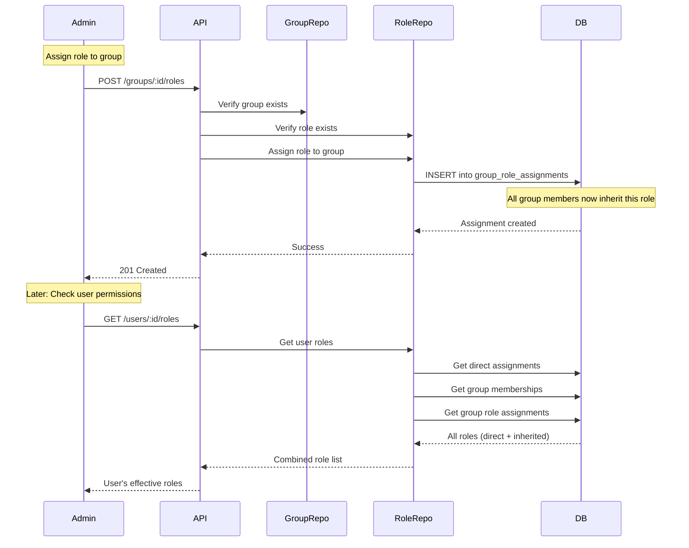

# Phase 1b: RBAC, Groups, and Tenant Profiles

> **Version:** 1.0.0
> **Last Updated:** January 2026
> **Status:** Foundation Complete

## Overview

This document describes the Role-Based Access Control (RBAC) system, user groups, and tenant profiles implemented as an extension to Phase 1. These features enable fine-grained permission management, user organization via groups, and configurable organization templates.

## Table of Contents

- [System Architecture](#system-architecture)
- [Tenant Profiles](#tenant-profiles)
- [User Groups](#user-groups)
- [Roles & Permissions](#roles--permissions)
- [API Endpoints](#api-endpoints)
- [Data Flow Diagrams](#data-flow-diagrams)
- [Implementation Details](#implementation-details)

---

## System Architecture



---

## Tenant Profiles

Tenant profiles are configuration templates that define capabilities and resource limits for organizations. They enable consistent configuration across similar organization types.

### Profile Types



### Capabilities Configuration

| Capability | Description | Default |
|------------|-------------|---------|
| `whiteLabeling` | Custom branding allowed | false |
| `ssoEnabled` | SSO authentication available | false |
| `mfaEnabled` | Multi-factor authentication available | true |
| `apiAccess` | API key access allowed | false |
| `aiFeatures` | AI-powered features available | false |
| `advancedAnalytics` | Advanced analytics dashboard | false |
| `customIntegrations` | Custom integration support | false |
| `canHaveChildren` | Can create child organizations | false |
| `maxChildDepth` | Maximum depth of child hierarchy | 0 |

### Limits Configuration

| Limit | Description | Type |
|-------|-------------|------|
| `maxUsers` | Maximum users in organization | number |
| `maxDevices` | Maximum devices | number |
| `maxAssets` | Maximum assets | number |
| `maxDashboards` | Maximum dashboards | number |
| `maxApiKeys` | Maximum API keys | number |
| `maxChildOrganizations` | Maximum child orgs | number |
| `dataRetentionDays` | Data retention period | number |
| `storageGb` | Storage quota in GB | number |

### Example Profiles



---

## User Groups

Groups allow organizing users within an organization and assigning roles at the group level.

### Group Structure

```mermaid
graph TB
    subgraph "Organization"
        ORG[Acme Corp]

        subgraph "Groups"
            G1[Engineering]
            G2[Sales]
            G3[Operations]
            G4[Project Alpha Team]
        end

        subgraph "Users"
            U1[alice@acme.com]
            U2[bob@acme.com]
            U3[carol@acme.com]
        end
    end

    ORG --> G1
    ORG --> G2
    ORG --> G3
    ORG --> G4

    G1 --> U1
    G1 --> U2
    G2 --> U2
    G2 --> U3
    G4 --> U1
    G4 --> U3
```

### Group Membership Model

```
user_groups (
    id,
    organization_id,  -- FK to organizations
    name,
    description,
    created_by,
    created_at,
    updated_at
)

user_group_memberships (
    user_id,          -- FK to users
    group_id,         -- FK to user_groups
    added_at,
    added_by          -- FK to users
)
```

---

## Roles & Permissions

### Role Hierarchy



### Role Scope

| Scope | Description | Use Case |
|-------|-------------|----------|
| `organization` | Role applies only within the assigned organization | Most roles |
| `children` | Role applies to organization and all direct children | Regional manager |
| `tree` | Role applies to entire organization tree | Global administrator |

### Permission Model



### Role Assignment Sources



---

## API Endpoints

### Tenant Profiles

| Method | Endpoint | Description |
|--------|----------|-------------|
| `GET` | `/api/v1/tenant-profiles` | List all profiles |
| `GET` | `/api/v1/tenant-profiles/:id` | Get profile by ID |
| `POST` | `/api/v1/tenant-profiles` | Create new profile |
| `PATCH` | `/api/v1/tenant-profiles/:id` | Update profile |
| `DELETE` | `/api/v1/tenant-profiles/:id` | Delete profile (non-system only) |

### Groups

| Method | Endpoint | Description |
|--------|----------|-------------|
| `GET` | `/api/v1/organizations/:orgId/groups` | List org groups |
| `GET` | `/api/v1/organizations/:orgId/groups/:id` | Get group details |
| `POST` | `/api/v1/organizations/:orgId/groups` | Create group |
| `PATCH` | `/api/v1/organizations/:orgId/groups/:id` | Update group |
| `DELETE` | `/api/v1/organizations/:orgId/groups/:id` | Delete group |
| `GET` | `/api/v1/organizations/:orgId/groups/:id/members` | List group members |
| `POST` | `/api/v1/organizations/:orgId/groups/:id/members` | Add member |
| `DELETE` | `/api/v1/organizations/:orgId/groups/:id/members/:userId` | Remove member |

### Roles

| Method | Endpoint | Description |
|--------|----------|-------------|
| `GET` | `/api/v1/roles/system` | List system roles |
| `GET` | `/api/v1/organizations/:orgId/roles` | List org roles |
| `GET` | `/api/v1/organizations/:orgId/roles/:id` | Get role details |
| `POST` | `/api/v1/organizations/:orgId/roles` | Create custom role |
| `PATCH` | `/api/v1/organizations/:orgId/roles/:id` | Update role |
| `DELETE` | `/api/v1/organizations/:orgId/roles/:id` | Delete role |

### Role Assignments

| Method | Endpoint | Description |
|--------|----------|-------------|
| `GET` | `/api/v1/organizations/:orgId/users/:userId/roles` | Get user's roles |
| `POST` | `/api/v1/organizations/:orgId/users/:userId/roles` | Assign role to user |
| `DELETE` | `/api/v1/organizations/:orgId/users/:userId/roles/:roleId` | Remove role from user |
| `POST` | `/api/v1/organizations/:orgId/groups/:groupId/roles` | Assign role to group |
| `DELETE` | `/api/v1/organizations/:orgId/groups/:groupId/roles/:roleId` | Remove role from group |

---

## Data Flow Diagrams

### Permission Resolution Flow



### Organization Profile Assignment Flow



### Group Role Inheritance Flow



---

## Implementation Details

### Database Schema

```
┌─────────────────────────────────────────────────────────────────┐
│                      tenant_profiles                            │
├─────────────────────────────────────────────────────────────────┤
│ id              UUID PRIMARY KEY                                │
│ name            VARCHAR(100) NOT NULL                           │
│ description     VARCHAR(500)                                    │
│ type            ENUM('root','child','universal')                │
│ is_system       BOOLEAN DEFAULT false                           │
│ capabilities    JSONB                                           │
│ limits          JSONB                                           │
│ is_active       BOOLEAN DEFAULT true                            │
│ created_at      TIMESTAMP WITH TIME ZONE                        │
│ updated_at      TIMESTAMP WITH TIME ZONE                        │
└─────────────────────────────────────────────────────────────────┘

┌─────────────────────────────────────────────────────────────────┐
│                        user_groups                              │
├─────────────────────────────────────────────────────────────────┤
│ id              UUID PRIMARY KEY                                │
│ organization_id UUID NOT NULL REFERENCES organizations          │
│ name            VARCHAR(100) NOT NULL                           │
│ description     VARCHAR(500)                                    │
│ created_by      UUID REFERENCES users                           │
│ created_at      TIMESTAMP WITH TIME ZONE                        │
│ updated_at      TIMESTAMP WITH TIME ZONE                        │
└─────────────────────────────────────────────────────────────────┘

┌─────────────────────────────────────────────────────────────────┐
│                   user_group_memberships                        │
├─────────────────────────────────────────────────────────────────┤
│ user_id         UUID NOT NULL REFERENCES users                  │
│ group_id        UUID NOT NULL REFERENCES user_groups            │
│ added_at        TIMESTAMP WITH TIME ZONE                        │
│ added_by        UUID REFERENCES users                           │
│ PRIMARY KEY (user_id, group_id)                                 │
└─────────────────────────────────────────────────────────────────┘

┌─────────────────────────────────────────────────────────────────┐
│                          roles                                  │
├─────────────────────────────────────────────────────────────────┤
│ id              UUID PRIMARY KEY                                │
│ name            VARCHAR(100) NOT NULL                           │
│ description     VARCHAR(500)                                    │
│ organization_id UUID REFERENCES organizations (NULL=system)     │
│ is_system       BOOLEAN DEFAULT false                           │
│ default_scope   ENUM('organization','children','tree')          │
│ permissions     JSONB                                           │
│ priority        VARCHAR(10) DEFAULT '0'                         │
│ created_at      TIMESTAMP WITH TIME ZONE                        │
│ updated_at      TIMESTAMP WITH TIME ZONE                        │
└─────────────────────────────────────────────────────────────────┘

┌─────────────────────────────────────────────────────────────────┐
│                   user_role_assignments                         │
├─────────────────────────────────────────────────────────────────┤
│ user_id         UUID NOT NULL REFERENCES users                  │
│ role_id         UUID NOT NULL REFERENCES roles                  │
│ organization_id UUID NOT NULL REFERENCES organizations          │
│ scope           ENUM('organization','children','tree')          │
│ source          ENUM('direct','group','sso','inherited')        │
│ assigned_at     TIMESTAMP WITH TIME ZONE                        │
│ assigned_by     UUID REFERENCES users                           │
│ expires_at      TIMESTAMP WITH TIME ZONE                        │
│ PRIMARY KEY (user_id, role_id, organization_id)                 │
└─────────────────────────────────────────────────────────────────┘

┌─────────────────────────────────────────────────────────────────┐
│                   group_role_assignments                        │
├─────────────────────────────────────────────────────────────────┤
│ group_id        UUID NOT NULL REFERENCES user_groups            │
│ role_id         UUID NOT NULL REFERENCES roles                  │
│ scope           ENUM('organization','children','tree')          │
│ assigned_at     TIMESTAMP WITH TIME ZONE                        │
│ assigned_by     UUID REFERENCES users                           │
│ PRIMARY KEY (group_id, role_id)                                 │
└─────────────────────────────────────────────────────────────────┘
```

### File Structure

```
packages/
├── api/
│   └── src/
│       ├── db/schema/
│       │   ├── tenant-profiles.ts      # Profile schema
│       │   ├── user-groups.ts          # Groups schema
│       │   └── roles.ts                # Roles & assignments schema
│       ├── repositories/
│       │   ├── tenant-profile.repository.ts
│       │   ├── group.repository.ts
│       │   └── role.repository.ts
│       └── routes/v1/
│           ├── tenant-profiles.ts
│           ├── groups.ts
│           └── roles.ts
│
└── shared/
    └── src/schemas/
        ├── tenant-profile.schema.ts    # Zod validation
        ├── group.schema.ts
        └── role.schema.ts
```

---

## Testing

Tests are located in `packages/api/src/db/schema/`:

- `tenant-profiles.test.ts` - 12 tests covering profile types, capabilities, limits
- `user-groups.test.ts` - 11 tests covering groups and memberships
- `roles.test.ts` - 25 tests covering roles, permissions, and assignments

Run tests:
```bash
cd packages/api
pnpm test
```

---

## Next Steps (Phase 2)

- Organization hierarchy tree view UI
- Organization details tabs
- Profile assignment UI
- Group management UI
- Role management UI with permission matrix editor
