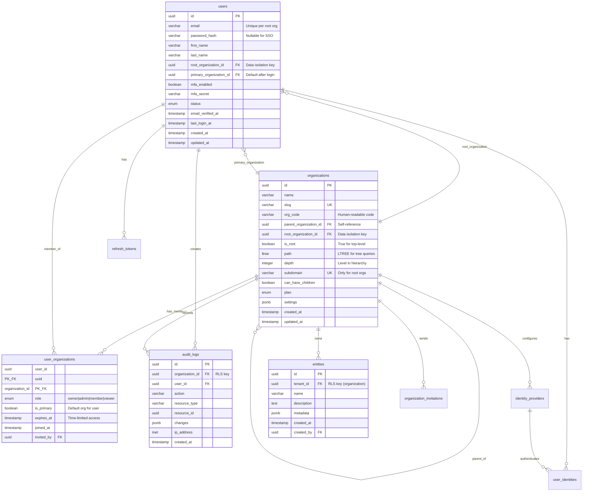

# Phase 2: Database & Row-Level Security

> **Status:** Complete
> **Sprint:** 1
> **Last Updated:** January 2026

## Overview

This phase implements the database layer with PostgreSQL, including schema design, multi-tenant data isolation using Row-Level Security (RLS), and migration management with Drizzle ORM.

## ADR Alignment

This implementation follows the architectural decisions documented in:
- **ADR-001**: Multi-Tenant Model with Unlimited Recursive Organization Trees (LTREE)
- **ADR-002**: Subdomain-Based Root Organization Identification

### Key Database Concepts

| Concept | Description |
|---------|-------------|
| **Root Organization Isolation** | All data filtered by `root_organization_id` for complete enterprise isolation |
| **LTREE Hierarchy** | PostgreSQL LTREE extension enables O(1) ancestor/descendant queries |
| **Email per Root Org** | `users.email` unique per `root_organization_id`, not globally |
| **Time-Limited Access** | `user_organizations.expires_at` supports contractor access patterns |

## Table of Contents

- [Components](#components)
- [Schema Design](#schema-design)
- [Row-Level Security](#row-level-security)
- [RLS Context Middleware](#rls-context-middleware-implementation-change)
- [Migration Management](#migration-management)
- [Connection Pooling](#connection-pooling)
- [How-To Guides](#how-to-guides)

---

## Components

### Component Diagram


### Component Descriptions

| Component | File | Responsibility |
|-----------|------|----------------|
| **Database Client** | `db/index.ts` | Drizzle connection, pooling, health checks |
| **RLS Context Middleware** | `middleware/rls-context.ts` | Sets PostgreSQL session variables per request |
| **RLS Context Helper** | `db/rls-context.ts` | Functions to set/clear RLS variables |
| **Schema Definitions** | `db/schema/*.ts` | Table definitions with Drizzle |
| **Relations** | `db/schema/relations.ts` | Table relationships for relational queries |
| **Migration Runner** | `db/migrate.ts` | Executes schema + RLS migrations |
| **RLS Policies SQL** | `db/migrations/0001_rls_policies.sql` | PostgreSQL RLS policy definitions |

---

## Schema Design

### Entity Relationship Diagram (ADR-Aligned)



### Table Categories

| Category | Tables | RLS Policy |
|----------|--------|------------|
| **Global** | `users` | User can only see/edit own record |
| **Organization** | `organizations`, `org_members` | Members can see their organizations |
| **Tenant-Scoped** | `entities`, `audit_logs`, `invitations` | Filtered by `tenant_id` |
| **Auth** | `refresh_tokens`, `user_identities`, `identity_providers` | User/org specific |

### Multi-Tenant Column Pattern

All tenant-scoped tables include:

```typescript
// Standard tenant columns
{
  id: uuid('id').primaryKey().defaultRandom(),
  tenantId: uuid('tenant_id')
    .notNull()
    .references(() => organizations.id, { onDelete: 'cascade' }),
  // ... other columns
  createdAt: timestamp('created_at').notNull().defaultNow(),
  createdBy: uuid('created_by').references(() => users.id),
}
```

---

## Row-Level Security

### RLS Architecture


### RLS Helper Functions (ADR-Aligned)

```sql
-- Get current user ID from session
CREATE OR REPLACE FUNCTION current_user_id() RETURNS uuid AS $$
  SELECT NULLIF(current_setting('app.current_user_id', true), '')::uuid;
$$ LANGUAGE SQL STABLE;

-- Get current organization ID from session
CREATE OR REPLACE FUNCTION current_org_id() RETURNS uuid AS $$
  SELECT NULLIF(current_setting('app.current_org_id', true), '')::uuid;
$$ LANGUAGE SQL STABLE;

-- Get current root organization ID from session (ADR-002)
CREATE OR REPLACE FUNCTION current_root_org_id() RETURNS uuid AS $$
  SELECT NULLIF(current_setting('app.current_root_org_id', true), '')::uuid;
$$ LANGUAGE SQL STABLE;

-- Check if organization matches current root org (ADR-002)
CREATE OR REPLACE FUNCTION is_same_root_org(check_root_org_id uuid) RETURNS boolean AS $$
  SELECT check_root_org_id = current_root_org_id();
$$ LANGUAGE SQL STABLE;

-- Check if current user is a member of an organization (with hierarchy support)
-- ADR-001: Supports LTREE path queries for inherited access
CREATE OR REPLACE FUNCTION is_org_member(org_id uuid) RETURNS boolean AS $$
  SELECT EXISTS (
    SELECT 1 FROM user_organizations uo
    JOIN organizations o ON o.id = uo.organization_id
    WHERE uo.user_id = current_user_id()
    AND o.root_organization_id = (SELECT root_organization_id FROM organizations WHERE id = org_id)
    AND (
      uo.organization_id = org_id
      OR (SELECT path FROM organizations WHERE id = org_id) <@ o.path
    )
    AND (uo.expires_at IS NULL OR uo.expires_at > NOW())
  );
$$ LANGUAGE SQL STABLE SECURITY DEFINER;

-- Check if current user is an admin of an organization
CREATE OR REPLACE FUNCTION is_org_admin(org_id uuid) RETURNS boolean AS $$
  SELECT EXISTS (
    SELECT 1 FROM user_organizations
    WHERE organization_id = org_id
      AND user_id = current_user_id()
      AND role IN ('owner', 'admin')
      AND (expires_at IS NULL OR expires_at > NOW())
  );
$$ LANGUAGE SQL STABLE SECURITY DEFINER;

-- Get all descendant organization IDs (ADR-001: LTREE queries)
CREATE OR REPLACE FUNCTION get_descendant_org_ids(org_id uuid) RETURNS SETOF uuid AS $$
  SELECT id FROM organizations
  WHERE path <@ (SELECT path FROM organizations WHERE id = org_id);
$$ LANGUAGE SQL STABLE;

-- Get all ancestor organization IDs (ADR-001: LTREE queries)
CREATE OR REPLACE FUNCTION get_ancestor_org_ids(org_id uuid) RETURNS SETOF uuid AS $$
  SELECT id FROM organizations
  WHERE (SELECT path FROM organizations WHERE id = org_id) <@ path;
$$ LANGUAGE SQL STABLE;

-- Check if user can access organization (direct or via hierarchy)
CREATE OR REPLACE FUNCTION user_can_access_org(check_org_id uuid) RETURNS boolean AS $$
  SELECT EXISTS (
    SELECT 1 FROM user_organizations uo
    JOIN organizations o ON o.id = uo.organization_id
    WHERE uo.user_id = current_user_id()
    AND (
      uo.organization_id = check_org_id
      OR (SELECT path FROM organizations WHERE id = check_org_id) <@ o.path
    )
    AND (uo.expires_at IS NULL OR uo.expires_at > NOW())
  );
$$ LANGUAGE SQL STABLE SECURITY DEFINER;
```

### RLS Policy Examples

#### Tenant-Scoped Table (entities)

```sql
-- Enable RLS
ALTER TABLE entities ENABLE ROW LEVEL SECURITY;
ALTER TABLE entities FORCE ROW LEVEL SECURITY;

-- SELECT: User must be member of the tenant organization
CREATE POLICY entities_select ON entities
  FOR SELECT
  USING (is_org_member(tenant_id));

-- INSERT: User must be member and org must match current context
CREATE POLICY entities_insert ON entities
  FOR INSERT
  WITH CHECK (
    is_org_member(tenant_id)
    AND tenant_id = current_org_id()
  );

-- UPDATE: User must be member of the tenant
CREATE POLICY entities_update ON entities
  FOR UPDATE
  USING (is_org_member(tenant_id))
  WITH CHECK (is_org_member(tenant_id));

-- DELETE: Only admins can delete
CREATE POLICY entities_delete ON entities
  FOR DELETE
  USING (is_org_admin(tenant_id));
```

#### User Table (global, self-only)

```sql
ALTER TABLE users ENABLE ROW LEVEL SECURITY;
ALTER TABLE users FORCE ROW LEVEL SECURITY;

-- Users can only see their own record
CREATE POLICY users_select ON users
  FOR SELECT
  USING (id = current_user_id());

-- Users can only update their own record
CREATE POLICY users_update ON users
  FOR UPDATE
  USING (id = current_user_id())
  WITH CHECK (id = current_user_id());
```

### RLS Policy Matrix

| Table | SELECT | INSERT | UPDATE | DELETE |
|-------|--------|--------|--------|--------|
| `users` | Own record | - | Own record | - |
| `organizations` | Member | - | Admin | Owner |
| `org_members` | Same org | Admin | Admin | Admin |
| `entities` | Member | Member | Member | Admin |
| `audit_logs` | Member | System | - | - |
| `identity_providers` | Member | Admin | Admin | Admin |
| `user_identities` | Own records | System | System | Own records |

---

## RLS Context Middleware (Implementation Change)

> **Change Notice:** The RLS context middleware was added to automatically set PostgreSQL session variables for every authenticated request. This simplifies application code by removing the need to manually pass tenant context to every query.

### Middleware Flow


### Implementation

```typescript
// middleware/rls-context.ts
import { FastifyInstance, FastifyRequest, FastifyReply } from 'fastify';
import fp from 'fastify-plugin';
import { setRlsContext, clearRlsContext } from '../db/rls-context.js';
import { db } from '../db/index.js';

export interface RlsContextOptions {
  autoSet?: boolean;
  excludeRoutes?: string[];
}

async function rlsContextPlugin(
  fastify: FastifyInstance,
  options: RlsContextOptions
): Promise<void> {
  const { autoSet = true, excludeRoutes = ['/health', '/ready'] } = options;

  if (!autoSet) return;

  // Set RLS context before handler
  fastify.addHook('preHandler', async (request: FastifyRequest) => {
    if (excludeRoutes.some(route => request.url.startsWith(route))) {
      return;
    }

    const user = request.user;
    if (user?.id) {
      await setRlsContext(db, user.id, user.organizationId ?? null);
      request.rlsContextSet = true;
    }
  });

  // Clear RLS context after response
  fastify.addHook('onResponse', async (request: FastifyRequest) => {
    if (request.rlsContextSet) {
      await clearRlsContext(db);
    }
  });
}

export default fp(rlsContextPlugin, {
  name: 'rls-context',
  fastify: '5.x',
});
```

### RLS Context Helper Functions

```typescript
// db/rls-context.ts
import { sql } from 'drizzle-orm';
import type { Database } from './index.js';

export async function setRlsContext(
  db: Database,
  userId: string | null,
  organizationId: string | null
): Promise<void> {
  await db.execute(
    sql`SELECT set_config('app.current_user_id', ${userId ?? ''}, true)`
  );
  await db.execute(
    sql`SELECT set_config('app.current_org_id', ${organizationId ?? ''}, true)`
  );
}

export async function clearRlsContext(db: Database): Promise<void> {
  await db.execute(sql`RESET app.current_user_id`);
  await db.execute(sql`RESET app.current_org_id`);
}

export async function withRlsContext<T>(
  db: Database,
  userId: string,
  organizationId: string,
  fn: () => Promise<T>
): Promise<T> {
  await setRlsContext(db, userId, organizationId);
  try {
    return await fn();
  } finally {
    await clearRlsContext(db);
  }
}
```

---

## Migration Management

### Migration Workflow


### Drizzle Commands

| Command | Purpose |
|---------|---------|
| `pnpm db:generate` | Generate migration from schema changes |
| `pnpm db:migrate` | Apply migrations (development) |
| `pnpm db:push` | Push schema directly (development only) |
| `pnpm db:studio` | Open Drizzle Studio GUI |
| `pnpm db:migrate:prod` | Apply migrations (production) |

### Migration File Structure

```
packages/api/src/db/migrations/
├── 0001_rls_policies.sql          # RLS policies and helper functions
├── 0002_multi_org_hierarchy.sql   # ADR-001/002: LTREE, hierarchy, root org isolation
└── meta/
    └── _journal.json              # Drizzle migration history
```

### Custom SQL Migration: 0002_multi_org_hierarchy.sql

This migration implements ADR-001 and ADR-002:

| Component | Purpose |
|-----------|---------|
| LTREE extension | Efficient tree queries for unlimited hierarchy depth |
| Hierarchy columns | `org_code`, `parent_organization_id`, `root_organization_id`, `path`, `depth` |
| User org context | `root_organization_id`, `primary_organization_id` on users |
| Check constraints | `chk_root_subdomain`, `chk_root_self_reference`, `chk_non_root_parent` |
| Triggers | `trg_organization_path` (auto-calculate path), `trg_single_primary_org` |
| Helper functions | Root org isolation, LTREE queries, hierarchy access checks |

### Safe Migration Patterns

| Operation | Unsafe | Safe Alternative |
|-----------|--------|------------------|
| Add column | `NOT NULL` without default | Add as `NULL`, backfill, then `SET NOT NULL` |
| Drop column | Immediate drop | Remove from code, deploy, then drop |
| Rename column | `RENAME COLUMN` | Add new, migrate data, remove old |
| Change type | `ALTER TYPE` | Add new column, migrate, drop old |
| Add index | `CREATE INDEX` | `CREATE INDEX CONCURRENTLY` |

### Migration Safety Check

The CI pipeline automatically blocks destructive migrations:


**Detected as destructive:**
- `DROP TABLE`
- `DROP COLUMN`
- `ALTER ... TYPE`
- `RENAME COLUMN/TABLE`
- `TRUNCATE`

---

## Connection Pooling

### Connection Architecture


### Pool Configuration

```typescript
// db/index.ts
const queryClient = postgres(databaseUrl, {
  max: 10,              // Maximum connections per server
  idle_timeout: 20,     // Close idle connections after 20s
  connect_timeout: 10,  // Fail if can't connect in 10s
  prepare: false,       // Disable prepared statements (pgbouncer compat)
});
```

### Health Check

```typescript
export async function checkDatabaseHealth(): Promise<{
  status: 'pass' | 'fail';
  latency_ms: number;
  message?: string;
}> {
  const start = performance.now();
  try {
    await queryClient`SELECT 1`;
    return {
      status: 'pass',
      latency_ms: Math.round(performance.now() - start),
    };
  } catch (error) {
    return {
      status: 'fail',
      latency_ms: Math.round(performance.now() - start),
      message: error instanceof Error ? error.message : 'Unknown error',
    };
  }
}
```

---

## How-To Guides

### How to Add a New Table

1. **Create schema file**

```typescript
// db/schema/projects.ts
import { pgTable, uuid, varchar, timestamp, text } from 'drizzle-orm/pg-core';
import { organizations } from './organizations.js';
import { users } from './users.js';

export const projects = pgTable('projects', {
  id: uuid('id').primaryKey().defaultRandom(),
  tenantId: uuid('tenant_id')
    .notNull()
    .references(() => organizations.id, { onDelete: 'cascade' }),
  name: varchar('name', { length: 100 }).notNull(),
  description: text('description'),
  createdAt: timestamp('created_at').notNull().defaultNow(),
  createdBy: uuid('created_by').references(() => users.id),
  updatedAt: timestamp('updated_at').notNull().defaultNow(),
});
```

2. **Export from index**

```typescript
// db/schema/index.ts
export * from './projects.js';
```

3. **Add relations** (optional)

```typescript
// db/schema/relations.ts
import { relations } from 'drizzle-orm';
import { projects } from './projects.js';
import { organizations } from './organizations.js';

export const projectsRelations = relations(projects, ({ one }) => ({
  organization: one(organizations, {
    fields: [projects.tenantId],
    references: [organizations.id],
  }),
}));
```

4. **Generate migration**

```bash
cd packages/api
pnpm build          # Compile TypeScript
pnpm db:generate    # Generate SQL migration
```

5. **Add RLS policies**

```sql
-- Add to migrations/0001_rls_policies.sql or new file

ALTER TABLE projects ENABLE ROW LEVEL SECURITY;
ALTER TABLE projects FORCE ROW LEVEL SECURITY;

CREATE POLICY projects_select ON projects
  FOR SELECT USING (is_org_member(tenant_id));

CREATE POLICY projects_insert ON projects
  FOR INSERT WITH CHECK (
    is_org_member(tenant_id)
    AND tenant_id = current_org_id()
  );

CREATE POLICY projects_update ON projects
  FOR UPDATE
  USING (is_org_member(tenant_id))
  WITH CHECK (is_org_member(tenant_id));

CREATE POLICY projects_delete ON projects
  FOR DELETE USING (is_org_admin(tenant_id));
```

6. **Apply migration**

```bash
pnpm db:push        # Development
# or
pnpm db:migrate     # Production-style
```

### How to Query with RLS

The RLS context is automatically set by middleware. Just query normally:

```typescript
// Route handler - RLS automatically applied
app.get('/projects', async (request, reply) => {
  // No need to filter by tenant_id - RLS does it automatically
  const projects = await db.select().from(projectsTable);
  return projects;
});

// This query automatically becomes:
// SELECT * FROM projects WHERE is_org_member(tenant_id)
```

### How to Bypass RLS (Admin Operations)

For system operations that need to bypass RLS:

```typescript
// Use a separate connection without RLS context
import { sql } from 'drizzle-orm';

async function systemOperation() {
  // Clear RLS context for this operation
  await db.execute(sql`SET LOCAL app.current_user_id = ''`);
  await db.execute(sql`SET LOCAL app.current_org_id = ''`);

  // Query runs without RLS filtering
  const allOrgs = await db.select().from(organizations);

  return allOrgs;
}
```

Or use a dedicated admin connection:

```typescript
// db/admin.ts
const adminClient = postgres(databaseUrl, {
  max: 2,
  // This connection bypasses RLS by not setting session vars
});

export const adminDb = drizzle(adminClient, { schema });
```

### How to Debug RLS Issues

1. **Check current context**

```sql
SELECT
  current_setting('app.current_user_id', true) as user_id,
  current_setting('app.current_org_id', true) as org_id;
```

2. **Test policy evaluation**

```sql
-- Test if user would have access
SELECT is_org_member('org-uuid-here');
SELECT is_org_admin('org-uuid-here');
```

3. **View policies on a table**

```sql
SELECT * FROM pg_policies WHERE tablename = 'entities';
```

4. **Temporarily disable RLS** (development only)

```sql
ALTER TABLE entities DISABLE ROW LEVEL SECURITY;
-- Run your query
ALTER TABLE entities ENABLE ROW LEVEL SECURITY;
```

---

## Performance Considerations

### Index Strategy

```sql
-- Always index tenant_id for RLS queries
CREATE INDEX idx_entities_tenant ON entities(tenant_id);

-- Composite indexes for common queries
CREATE INDEX idx_entities_tenant_created ON entities(tenant_id, created_at DESC);

-- Use CONCURRENTLY in production
CREATE INDEX CONCURRENTLY idx_entities_name ON entities(tenant_id, name);
```

### Query Optimization

```typescript
// Good: Let RLS filter, then add application filters
const results = await db
  .select()
  .from(entities)
  .where(eq(entities.status, 'active'))
  .limit(20);

// Bad: Fetching all then filtering in application
const all = await db.select().from(entities);
const filtered = all.filter(e => e.status === 'active').slice(0, 20);
```

### Monitoring RLS Performance

```sql
-- Check if RLS is causing slow queries
EXPLAIN ANALYZE
SELECT * FROM entities WHERE name LIKE '%search%';

-- Look for "Seq Scan" on large tables - may need indexes
```

---

[← Back to Architecture Overview](./README.md) | [← Phase 1: Auth](./phase-1-auth-multi-org.md) | [Next: Phase 3 - CI/CD →](./phase-3-cicd-deployment.md)
