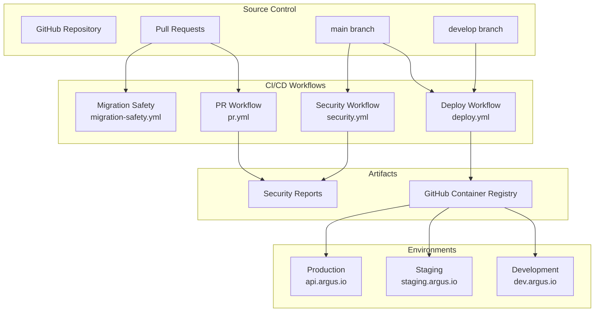
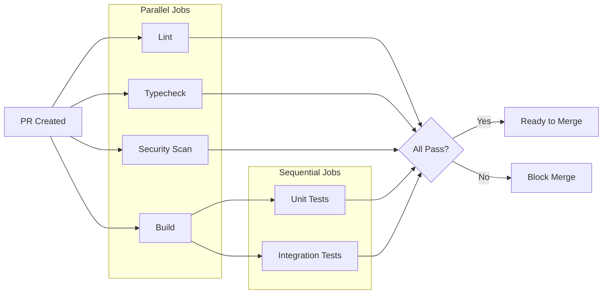
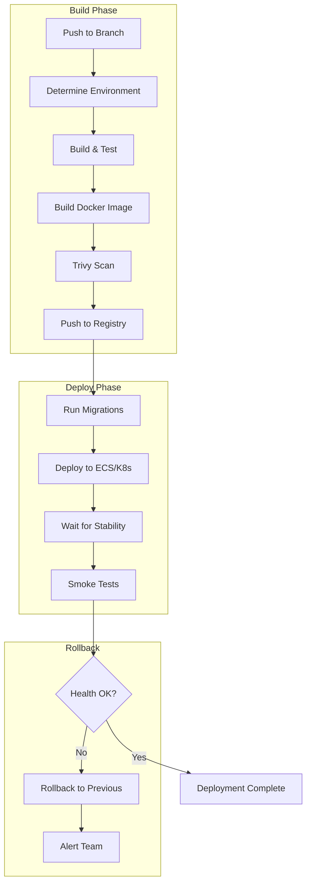
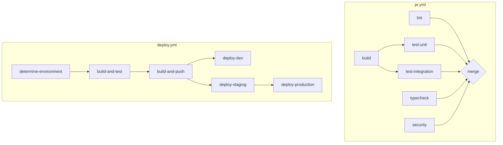
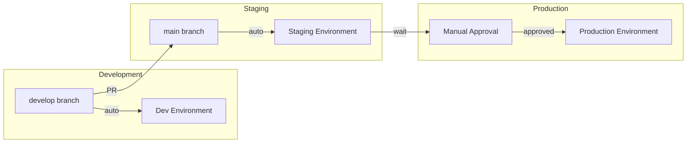
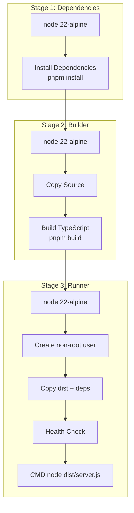
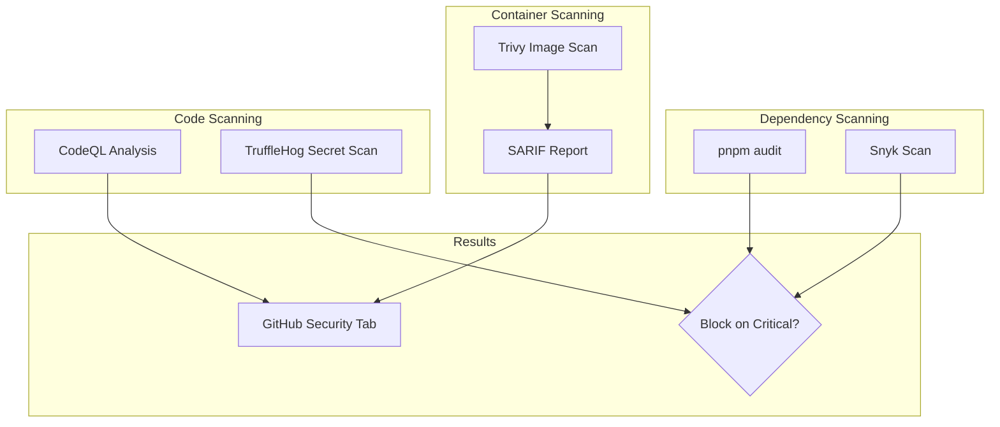
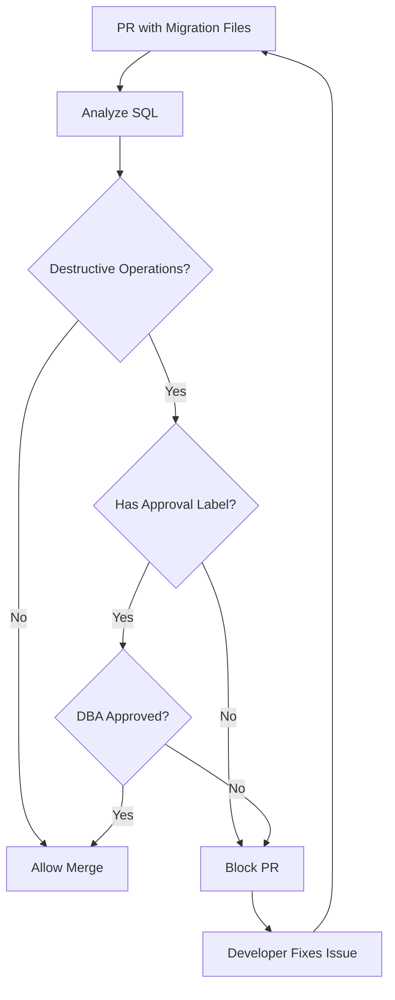
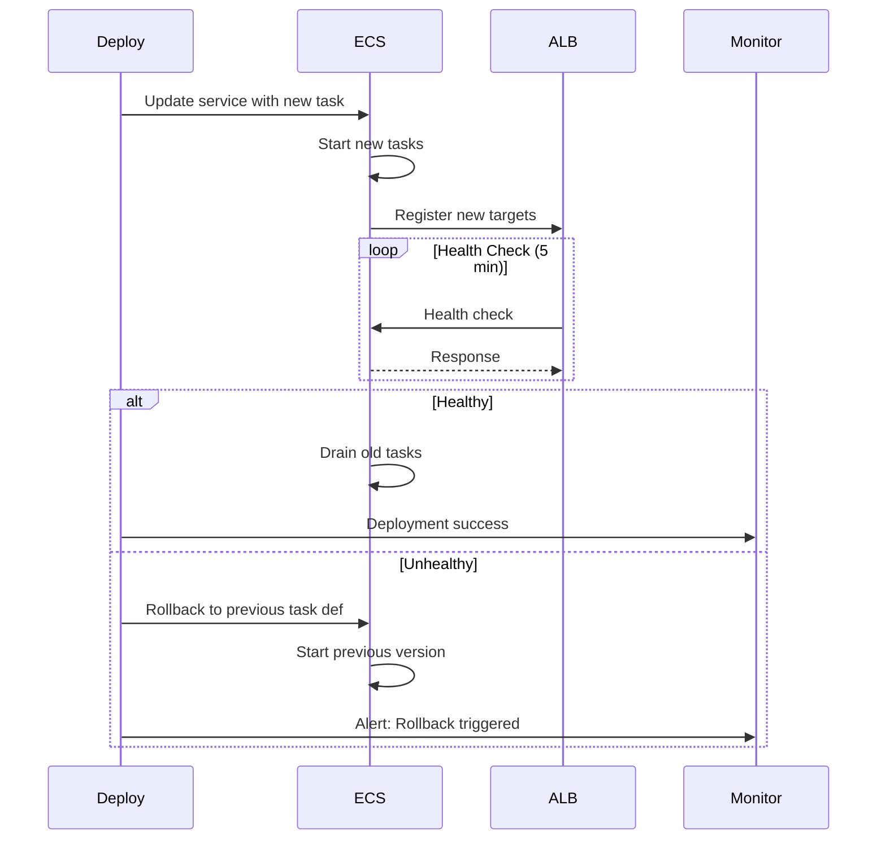
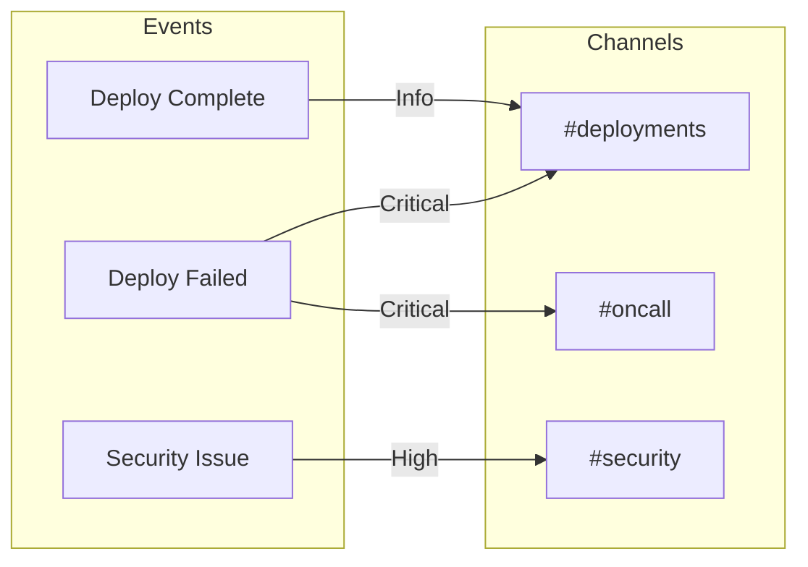

# Phase 3: CI/CD & Deployment

> **Status:** Complete
> **Sprint:** 1
> **Last Updated:** January 2026

## Overview

This phase implements the continuous integration and deployment pipelines, Docker containerization, and infrastructure automation. The system follows a GitOps approach with environment promotion from development through staging to production.

## Table of Contents

- [Components](#components)
- [Pipeline Architecture](#pipeline-architecture)
- [Environment Promotion](#environment-promotion)
- [Docker Configuration](#docker-configuration)
- [Security Scanning](#security-scanning)
- [Migration Safety](#migration-safety-implementation-change)
- [Rollback Strategy](#rollback-strategy)
- [Monitoring & Notifications](#monitoring--notifications)
- [How-To Guides](#how-to-guides)

---

## Components

### Component Diagram



### Workflow Files

| Workflow | Trigger | Purpose |
|----------|---------|---------|
| `pr.yml` | Pull requests | Lint, build, test, security scan |
| `deploy.yml` | Push to main/develop | Build image, deploy to environment |
| `security.yml` | Push + weekly schedule | Deep security scanning |
| `migration-safety.yml` | PR with migration changes | Block destructive migrations |
| `notify.yml` | Called by other workflows | Slack notifications |

---

## Pipeline Architecture

### Pull Request Pipeline



### Deployment Pipeline



### Job Dependencies



---

## Environment Promotion

### Promotion Flow



### Environment Configuration

| Environment | Branch | Auto-Deploy | Approval | Database | URL |
|-------------|--------|-------------|----------|----------|-----|
| **Development** | develop | Yes | No | dev-db | dev.argus.io |
| **Staging** | main | Yes | No | staging-db | staging.argus.io |
| **Production** | main | No | Required | prod-db | api.argus.io |

### GitHub Environment Setup

```yaml
# GitHub repository settings
environments:
  dev:
    protection_rules: []
    secrets:
      - AWS_ACCESS_KEY_ID
      - AWS_SECRET_ACCESS_KEY
    variables:
      - DEV_URL: https://dev.argus.io

  staging:
    protection_rules: []
    secrets:
      - AWS_ACCESS_KEY_ID
      - AWS_SECRET_ACCESS_KEY
    variables:
      - STAGING_URL: https://staging.argus.io

  production:
    protection_rules:
      - required_reviewers:
          - platform-team
        prevent_self_review: true
    secrets:
      - AWS_ACCESS_KEY_ID
      - AWS_SECRET_ACCESS_KEY
    variables:
      - PRODUCTION_URL: https://api.argus.io
```

---

## Docker Configuration

### Multi-Stage Dockerfile



### Dockerfile

```dockerfile
# packages/api/Dockerfile

# Stage 1: Dependencies
FROM node:22-alpine AS deps
RUN corepack enable && corepack prepare pnpm@9.15.0 --activate
WORKDIR /app
COPY pnpm-lock.yaml pnpm-workspace.yaml ./
COPY packages/api/package.json ./packages/api/
COPY packages/shared/package.json ./packages/shared/
RUN pnpm install --frozen-lockfile --prod

# Stage 2: Builder
FROM node:22-alpine AS builder
RUN corepack enable && corepack prepare pnpm@9.15.0 --activate
WORKDIR /app
COPY pnpm-lock.yaml pnpm-workspace.yaml ./
COPY packages/api/ ./packages/api/
COPY packages/shared/ ./packages/shared/
RUN pnpm install --frozen-lockfile
RUN pnpm --filter @argus/shared build
RUN pnpm --filter @argus/api build

# Stage 3: Runner
FROM node:22-alpine AS runner
RUN addgroup --system --gid 1001 argus && \
    adduser --system --uid 1001 argus
WORKDIR /app

COPY --from=deps /app/node_modules ./node_modules
COPY --from=deps /app/packages/api/node_modules ./packages/api/node_modules
COPY --from=deps /app/packages/shared/node_modules ./packages/shared/node_modules
COPY --from=builder /app/packages/api/dist ./packages/api/dist
COPY --from=builder /app/packages/shared/dist ./packages/shared/dist
COPY --from=builder /app/packages/api/src/db/migrations ./packages/api/src/db/migrations

USER argus
EXPOSE 3040
ENV NODE_ENV=production
HEALTHCHECK --interval=30s --timeout=3s --start-period=5s --retries=3 \
  CMD wget --no-verbose --tries=1 --spider http://localhost:3040/health/live || exit 1
CMD ["node", "packages/api/dist/server.js"]
```

### Build Optimization

| Technique | Benefit |
|-----------|---------|
| **Multi-stage builds** | Smaller final image (no dev deps) |
| **Layer caching** | Faster rebuilds |
| **pnpm** | Efficient dependency installation |
| **Alpine base** | Minimal attack surface |
| **Non-root user** | Security best practice |
| **Health check** | Container orchestration integration |

### Image Tagging Strategy

```yaml
# docker/metadata-action configuration
tags: |
  type=sha,prefix=          # abc1234
  type=ref,event=branch     # develop, main
  type=raw,value=latest,enable=${{ github.ref == 'refs/heads/main' }}
```

| Tag | Example | Use Case |
|-----|---------|----------|
| SHA | `abc1234` | Immutable reference to specific commit |
| Branch | `develop`, `main` | Latest from branch |
| `latest` | `latest` | Production-ready (main only) |

---

## Security Scanning

### Security Scan Pipeline



### Scan Configuration

```yaml
# security.yml jobs

dependency-scan:
  - pnpm audit --audit-level=high
  - snyk test --severity-threshold=high

container-scan:
  - trivy image --severity CRITICAL,HIGH

secret-scan:
  - trufflehog --only-verified

code-quality:
  - codeql-action/analyze
```

### Vulnerability Handling

| Severity | Action | Timeline |
|----------|--------|----------|
| **Critical** | Block deployment | Immediate fix required |
| **High** | Block deployment | Fix within 24 hours |
| **Medium** | Warning | Fix within 1 week |
| **Low** | Info | Track in backlog |

---

## Migration Safety (Implementation Change)

> **Change Notice:** Migration safety checks were added to prevent destructive database operations that could cause production outages during blue-green deployments.

### Safety Check Flow



### Detected Destructive Operations

| Operation | Severity | Detection Pattern |
|-----------|----------|-------------------|
| DROP TABLE | Critical | `/DROP\s+TABLE/gi` |
| DROP COLUMN | Critical | `/DROP\s+COLUMN/gi` |
| ALTER TYPE | High | `/ALTER\s+.*\s+TYPE/gi` |
| RENAME COLUMN | High | `/RENAME\s+COLUMN/gi` |
| RENAME TABLE | High | `/RENAME\s+TABLE/gi` |
| SET NOT NULL | Medium | `/SET\s+NOT\s+NULL/gi` |
| DROP CONSTRAINT | Medium | `/DROP\s+CONSTRAINT/gi` |
| TRUNCATE | Critical | `/TRUNCATE/gi` |

### Migration Analyzer Output

```
🚨 DESTRUCTIVE MIGRATION OPERATIONS DETECTED:

📄 packages/api/src/db/migrations/0003_remove_legacy.sql:
  🔴 Line 5: DROP COLUMN
     ALTER TABLE users DROP COLUMN legacy_field;
  🟠 Line 12: RENAME COLUMN
     ALTER TABLE entities RENAME COLUMN old_name TO new_name;

To proceed with a destructive migration, you must:
1. Add the 'migration-destructive-approved' label to this PR
2. Get approval from a DBA team member
3. Follow the expand/contract pattern in a separate PR
```

---

## Rollback Strategy

### Automatic Rollback Flow



### Rollback Triggers

| Trigger | Detection | Action |
|---------|-----------|--------|
| Health check fails | ECS/ALB health checks | Auto-rollback |
| Error rate > 5% | CloudWatch alarm | Manual review |
| P95 latency > 2s | CloudWatch alarm | Manual review |
| Smoke tests fail | CI workflow | Auto-rollback |

### Manual Rollback Procedure

```bash
#!/bin/bash
# scripts/rollback.sh

CLUSTER="argus-production-cluster"
SERVICE="api-service"

# Get previous task definition
CURRENT=$(aws ecs describe-services \
  --cluster $CLUSTER \
  --services $SERVICE \
  --query 'services[0].taskDefinition' \
  --output text)

# Extract family and revision
FAMILY=$(echo $CURRENT | cut -d'/' -f2 | cut -d':' -f1)
REVISION=$(echo $CURRENT | cut -d':' -f2)
PREVIOUS_REVISION=$((REVISION - 1))

echo "Rolling back from revision $REVISION to $PREVIOUS_REVISION"

# Update service
aws ecs update-service \
  --cluster $CLUSTER \
  --service $SERVICE \
  --task-definition "$FAMILY:$PREVIOUS_REVISION" \
  --force-new-deployment

# Wait for stability
aws ecs wait services-stable \
  --cluster $CLUSTER \
  --services $SERVICE
```

---

## Monitoring & Notifications

### Notification Flow



### Slack Message Format

```json
{
  "text": "✅ Deployment Successful",
  "blocks": [
    {
      "type": "header",
      "text": { "type": "plain_text", "text": "✅ Deployment Successful" }
    },
    {
      "type": "section",
      "fields": [
        { "type": "mrkdwn", "text": "*Environment:*\nproduction" },
        { "type": "mrkdwn", "text": "*Branch:*\nmain" },
        { "type": "mrkdwn", "text": "*Commit:*\n<link|abc1234>" },
        { "type": "mrkdwn", "text": "*Author:*\n@developer" }
      ]
    },
    {
      "type": "actions",
      "elements": [
        { "type": "button", "text": "View Workflow", "url": "..." }
      ]
    }
  ]
}
```

---

## How-To Guides

### How to Deploy a Hotfix

1. **Create hotfix branch from main**
   ```bash
   git checkout main
   git pull origin main
   git checkout -b hotfix/critical-bug
   ```

2. **Make minimal fix**
   ```bash
   # Edit files
   git add -p  # Stage only necessary changes
   git commit -m "fix: critical bug in auth flow"
   ```

3. **Create PR to main**
   ```bash
   git push -u origin hotfix/critical-bug
   gh pr create --base main --title "Hotfix: Critical auth bug"
   ```

4. **Request expedited review**
   - Add `priority:critical` label
   - Notify team in Slack

5. **Merge and monitor**
   ```bash
   gh pr merge --squash
   # Watch deployment in GitHub Actions
   ```

6. **Backport to develop** (if needed)
   ```bash
   git checkout develop
   git cherry-pick <commit-sha>
   git push
   ```

### How to Configure a New Environment

1. **Create GitHub Environment**
   - Go to Repository Settings > Environments
   - Click "New environment"
   - Name: `preview` (or your env name)
   - Add protection rules if needed

2. **Add environment secrets**
   ```bash
   gh secret set AWS_ACCESS_KEY_ID --env preview
   gh secret set AWS_SECRET_ACCESS_KEY --env preview
   ```

3. **Add environment variables**
   ```bash
   gh variable set PREVIEW_URL --env preview --body "https://preview.argus.io"
   ```

4. **Update deploy.yml**
   ```yaml
   deploy-preview:
     if: github.ref == 'refs/heads/preview'
     environment:
       name: preview
       url: ${{ vars.PREVIEW_URL }}
     # ... deployment steps
   ```

5. **Test deployment**
   ```bash
   git checkout -b preview
   git push -u origin preview
   # Watch GitHub Actions
   ```

### How to Add a New Security Scan

1. **Add to security.yml**
   ```yaml
   new-scan:
     name: New Security Scan
     runs-on: ubuntu-latest
     steps:
       - uses: actions/checkout@v4
       - name: Run new scanner
         run: npx new-scanner --config .scannerrc
   ```

2. **Configure scanner** (if needed)
   ```json
   // .scannerrc
   {
     "severity": "high",
     "exclude": ["node_modules", "dist"]
   }
   ```

3. **Test locally first**
   ```bash
   npx new-scanner --config .scannerrc
   ```

4. **Update PR requirements** (if blocking)
   - Go to Repository Settings > Branches
   - Edit main branch protection
   - Add new check to required status checks

### How to Debug Failed Deployments

1. **Check workflow logs**
   ```bash
   gh run view <run-id> --log
   # Or use GitHub web UI
   ```

2. **Check ECS service events**
   ```bash
   aws ecs describe-services \
     --cluster argus-production-cluster \
     --services api-service \
     --query 'services[0].events[0:5]'
   ```

3. **Check container logs**
   ```bash
   aws logs tail /ecs/argus-api --follow
   ```

4. **Check health endpoint**
   ```bash
   curl -v https://api.argus.io/health/ready
   ```

5. **Common issues**

   | Issue | Cause | Solution |
   |-------|-------|----------|
   | Task keeps restarting | Health check failing | Check app logs, verify health endpoint |
   | Can't pull image | Registry auth | Verify ECR login, check IAM role |
   | DB connection failed | Credentials | Check Secrets Manager, security groups |
   | Out of memory | Container limits | Increase task memory in task definition |

---

## Configuration Reference

### Required Secrets

| Secret | Environment | Description |
|--------|-------------|-------------|
| `AWS_ACCESS_KEY_ID` | All | AWS IAM access key |
| `AWS_SECRET_ACCESS_KEY` | All | AWS IAM secret key |
| `SLACK_BOT_TOKEN` | All | Slack notifications |
| `SNYK_TOKEN` | All | Snyk vulnerability scanning |

### Required Variables

| Variable | Environment | Description |
|----------|-------------|-------------|
| `DEV_URL` | dev | Development URL |
| `STAGING_URL` | staging | Staging URL |
| `PRODUCTION_URL` | production | Production URL |
| `SLACK_DEPLOY_CHANNEL` | All | Slack channel for notifications |
| `DBA_APPROVERS` | All | Comma-separated list of DBA GitHub usernames |

### Branch Protection Rules

```yaml
# main branch
protection:
  required_status_checks:
    strict: true
    contexts:
      - lint
      - build
      - test-unit
      - test-integration
      - security
      - typecheck
  required_reviews: 1
  dismiss_stale_reviews: true
  require_code_owner_reviews: true
  enforce_admins: true
```

---

[← Back to Architecture Overview](./README.md) | [← Phase 2: Database & RLS](./phase-2-database-rls.md)
