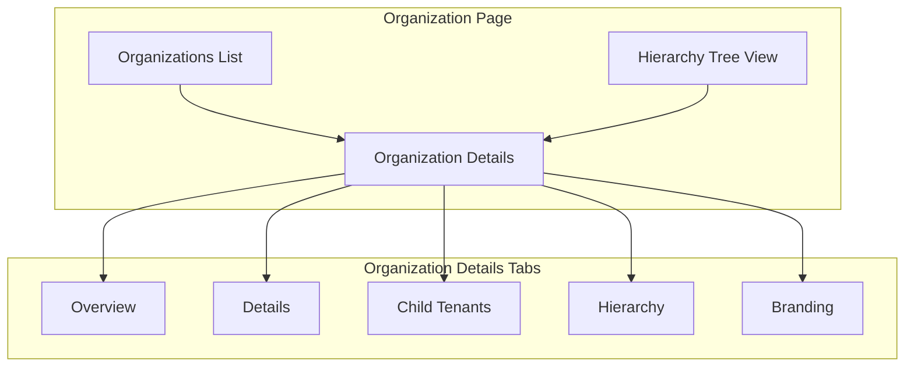
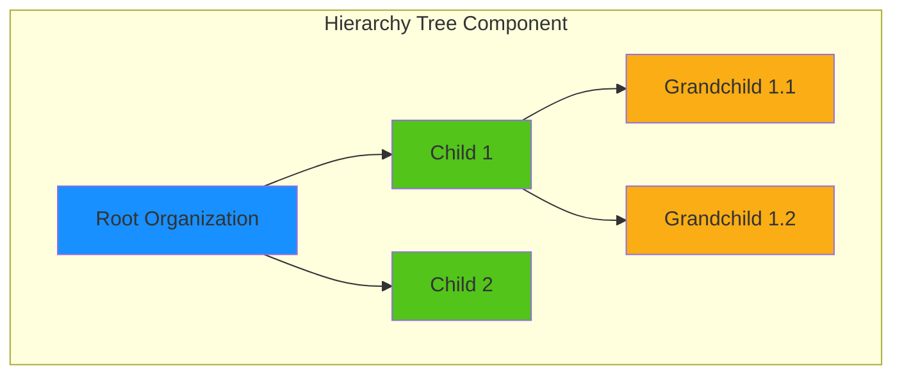
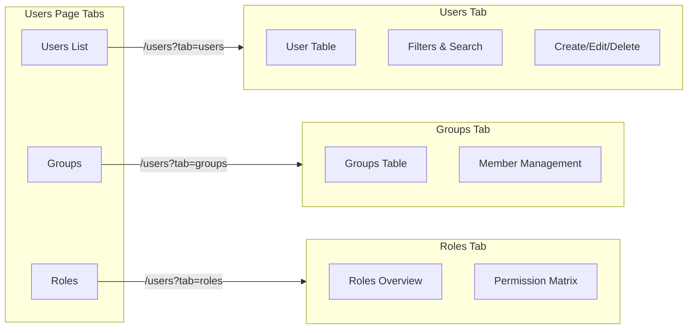
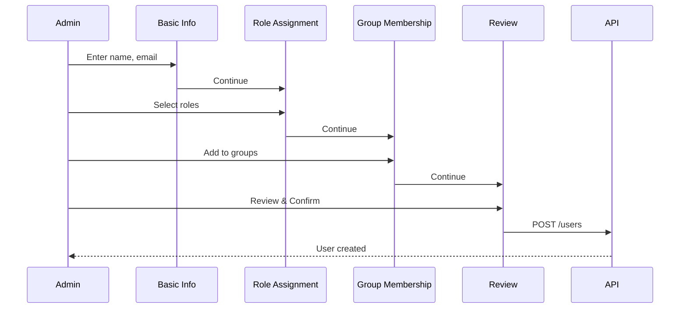
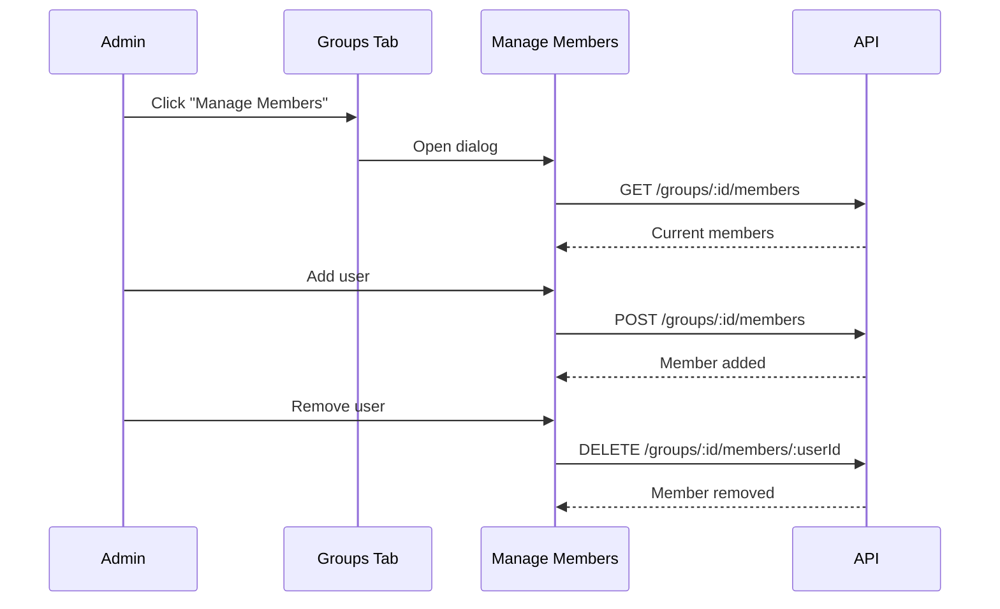
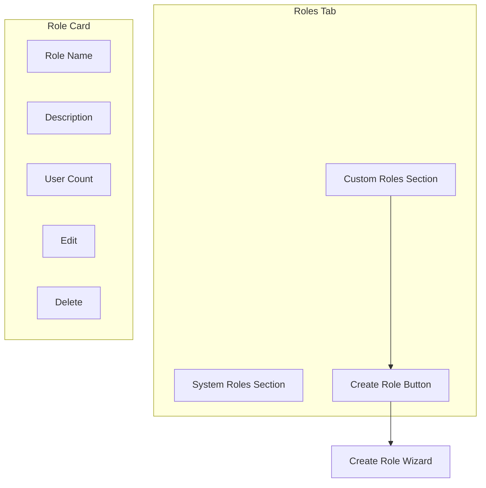
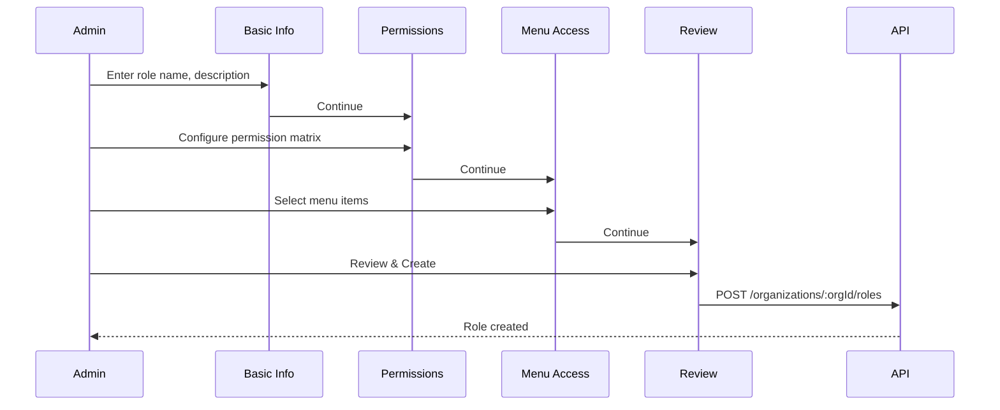

# Phase 4: RBAC System UI

> **Version:** 1.0.0
> **Last Updated:** January 2026
> **Status:** Complete

## Overview

This document describes the user interface implementation for the Role-Based Access Control (RBAC) system, including organization management with hierarchy views, user management with groups, and role management with visual permissions editor.

## Table of Contents

- [Organization Management UI](#organization-management-ui)
- [User Management UI](#user-management-ui)
- [Group Management UI](#group-management-ui)
- [Role Management UI](#role-management-ui)
- [Component Architecture](#component-architecture)
- [API Integration](#api-integration)

---

## Organization Management UI

### Organization Hierarchy View



### Organization Details Page

The organization details page (`/organizations/:orgId`) provides a comprehensive view with multiple tabs:

| Tab | Description | Components |
|-----|-------------|------------|
| **Overview** | Stats cards showing users, children, active features | `TenantOverviewTab` |
| **Details** | Edit organization name, description, profile | `TenantDetailsTab` |
| **Child Tenants** | List and manage child organizations | `ChildTenantsTab` |
| **Hierarchy** | Visual tree showing organization position | `TenantHierarchyTab` |
| **Branding** | White-label configuration (if enabled) | `TenantBrandingTab` |

### Tree Visualization



---

## User Management UI

### Users Page Structure

The users page (`/users`) uses a tabbed layout with URL parameters for state:



### User List Features

| Feature | Description |
|---------|-------------|
| Search | Filter by name, email |
| Status filter | Active, Inactive, Pending |
| Role filter | Filter by assigned role |
| Bulk actions | Activate, Deactivate, Delete |
| Quick actions | Edit, View details, Reset password |

### Create User Wizard

Multi-step wizard for creating new users:



---

## Group Management UI

### Groups Tab Features

| Feature | Component | Description |
|---------|-----------|-------------|
| Group list | `GroupsTab` | Table showing all groups with member counts |
| Create group | `CreateGroupDialog` | Modal for creating new groups |
| Edit group | `EditGroupDialog` | Modal for editing group details |
| Manage members | `ManageGroupMembersDialog` | Add/remove users from group |
| Assign roles | `AssignRoleDialog` | Assign roles to entire group |

### Group Member Management Flow



---

## Role Management UI

### Roles Tab Features



### Permission Matrix Editor

The permission matrix provides a visual way to edit role permissions:

```
┌─────────────────┬────────┬────────┬────────┬────────┐
│ Resource        │ Create │ Read   │ Update │ Delete │
├─────────────────┼────────┼────────┼────────┼────────┤
│ Organizations   │   ☑    │   ☑    │   ☑    │   ☐    │
│ Users           │   ☑    │   ☑    │   ☑    │   ☑    │
│ Groups          │   ☑    │   ☑    │   ☑    │   ☑    │
│ Roles           │   ☐    │   ☑    │   ☐    │   ☐    │
│ Assets          │   ☑    │   ☑    │   ☑    │   ☑    │
│ Audit Logs      │   ☐    │   ☑    │   ☐    │   ☐    │
│ Settings        │   ☐    │   ☑    │   ☐    │   ☐    │
└─────────────────┴────────┴────────┴────────┴────────┘
```

### Create Role Wizard



---

## Component Architecture

### File Structure

```
packages/web/src/
├── routes/
│   ├── organizations/
│   │   └── $orgId.tsx           # Organization details page
│   ├── users.tsx                # Users/Groups/Roles tabbed page
│   └── organization-profiles.tsx # Tenant profiles management
│
├── components/
│   ├── organizations/
│   │   ├── tenant-overview-tab.tsx
│   │   ├── tenant-details-tab.tsx
│   │   ├── child-tenants-tab.tsx
│   │   ├── tenant-hierarchy-tab.tsx
│   │   ├── tenant-branding-tab.tsx
│   │   ├── hierarchy-tree-node.tsx
│   │   ├── create-child-dialog.tsx
│   │   ├── edit-tenant-dialog.tsx
│   │   └── delete-tenant-dialog.tsx
│   │
│   ├── users/
│   │   ├── users-list-tab.tsx
│   │   ├── groups-tab.tsx
│   │   ├── roles-tab.tsx
│   │   ├── create-user-wizard.tsx
│   │   ├── create-group-dialog.tsx
│   │   ├── manage-group-members-dialog.tsx
│   │   ├── assign-role-dialog.tsx
│   │   └── deactivate-user-dialog.tsx
│   │
│   ├── roles/
│   │   ├── create-role-wizard.tsx
│   │   ├── role-permission-matrix.tsx
│   │   └── role-details-card.tsx
│   │
│   └── tenant-profiles/
│       ├── create-profile-dialog.tsx
│       └── profile-capabilities-form.tsx
```

### Component Patterns

All components follow these patterns:

1. **State Management**: Local state with `useState` for form data
2. **Data Fetching**: `useCallback` with `apiClient` for API calls
3. **Loading States**: Skeleton loaders during data fetch
4. **Error Handling**: Error messages with retry options
5. **Form Validation**: Client-side validation before submission

---

## API Integration

### API Client Usage

```typescript
// Example: Fetch organization hierarchy
const fetchHierarchy = useCallback(async (orgId: string) => {
  try {
    setIsLoading(true);
    const response = await apiClient.get<{ data: OrganizationHierarchy }>(
      `/organizations/${orgId}/hierarchy`
    );
    setHierarchy(response.data);
  } catch (err) {
    setError('Failed to load hierarchy');
  } finally {
    setIsLoading(false);
  }
}, []);
```

### Key API Endpoints Used

| Component | Endpoints |
|-----------|-----------|
| Organizations | `GET/POST/PATCH /organizations`, `GET /organizations/:id/hierarchy` |
| Users | `GET/POST/PATCH/DELETE /users`, `GET /users/:id/roles` |
| Groups | `GET/POST/PATCH/DELETE /organizations/:orgId/groups` |
| Roles | `GET /roles/system`, `GET/POST/PATCH/DELETE /organizations/:orgId/roles` |
| Profiles | `GET/POST/PATCH/DELETE /tenant-profiles` |

---

## Navigation Updates

The sidebar navigation includes links to all RBAC-related pages:

```typescript
// packages/web/src/lib/navigation.ts
export const mainNavigation: NavSection[] = [
  {
    title: 'Main',
    items: [
      { title: 'Home', url: '/', icon: Home },
      { title: 'Organizations', url: '/organizations', icon: Building2 },
      { title: 'Users', url: '/users', icon: Users },
    ],
  },
  {
    title: 'Administration',
    items: [
      { title: 'Organization Profiles', url: '/organization-profiles', icon: Layers },
      { title: 'Roles & Permissions', url: '/roles', icon: Shield },
      // ...
    ],
  },
];
```

---

## Testing

UI tests verify:
- Tab navigation works correctly
- Forms validate input
- API calls are made with correct parameters
- Error states display appropriately
- Loading states show during data fetch

Run tests:
```bash
cd packages/web
pnpm test
```
