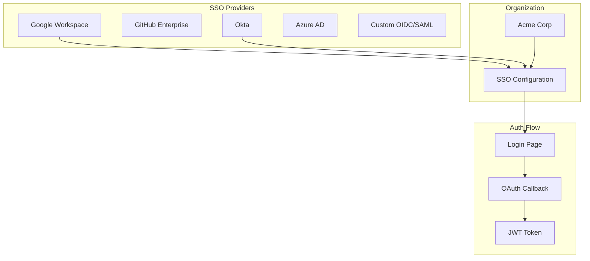
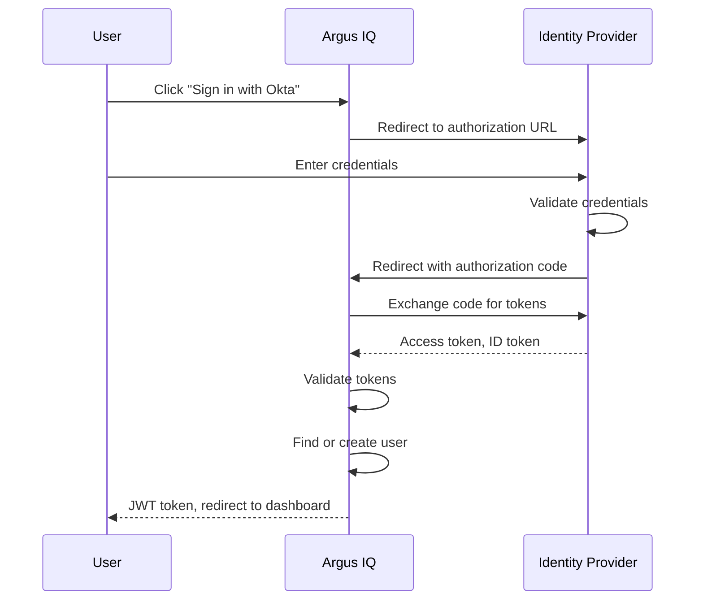
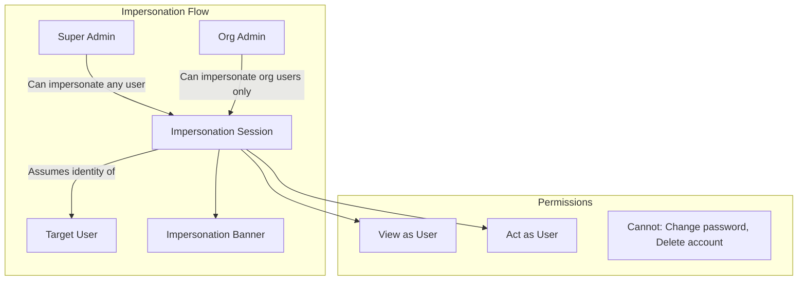
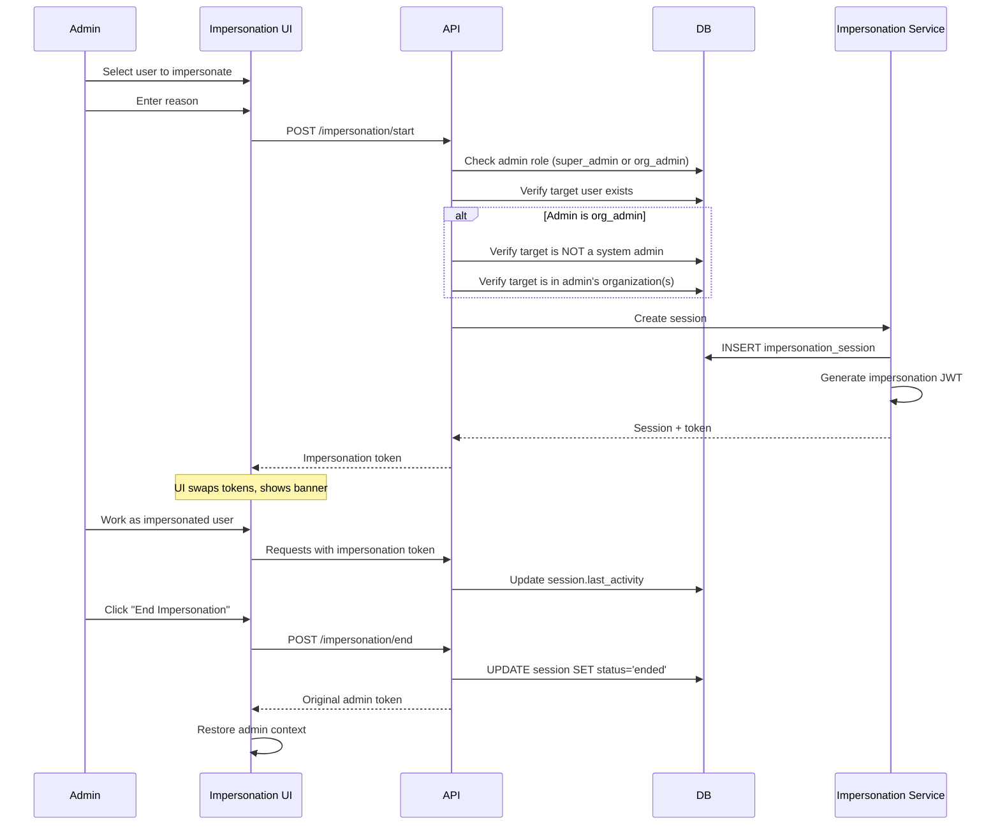
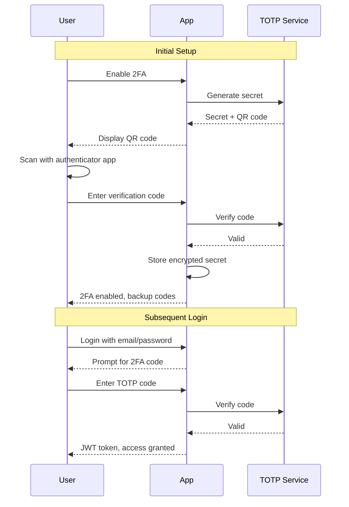
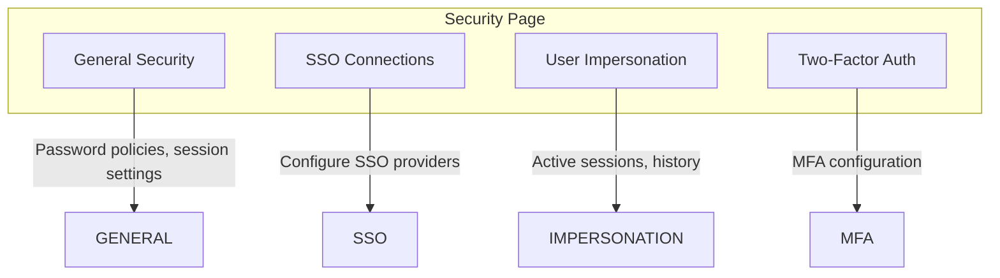

# Phase 5: Security Features

> **Version:** 1.0.0
> **Last Updated:** January 2026
> **Status:** Complete

## Overview

This document describes the security features implementation including SSO connection management, user impersonation for support, and two-factor authentication configuration.

## Table of Contents

- [SSO Connection Management](#sso-connection-management)
- [User Impersonation](#user-impersonation)
- [Two-Factor Authentication](#two-factor-authentication)
- [Security Page UI](#security-page-ui)
- [API Endpoints](#api-endpoints)
- [Implementation Details](#implementation-details)

---

## SSO Connection Management

### Overview

Organizations can configure multiple Single Sign-On (SSO) connections to allow users to authenticate via external identity providers.



### SSO Connection Configuration

| Field | Type | Description |
|-------|------|-------------|
| `name` | string | Display name for the connection |
| `providerType` | enum | `oidc`, `saml`, `google`, `github`, `azure` |
| `clientId` | string | OAuth client ID |
| `clientSecret` | string | OAuth client secret (encrypted) |
| `issuerUrl` | string | OIDC issuer URL |
| `authorizationUrl` | string | Authorization endpoint |
| `tokenUrl` | string | Token endpoint |
| `userInfoUrl` | string | User info endpoint |
| `scopes` | string[] | OAuth scopes to request |
| `isEnabled` | boolean | Whether connection is active |
| `isRequired` | boolean | If true, password login disabled |

### SSO Connection Flow



---

## User Impersonation

### Overview

User impersonation allows system administrators to access the platform as another user for support and debugging purposes. All impersonation sessions are logged and audited.

**Two types of administrators can impersonate:**
- **Super Admins** - Full platform access, can impersonate any user (except other super admins)
- **Org Admins** - Organization-scoped, can only impersonate users within their organization(s)



### Impersonation Permission Matrix

| Impersonator | Can Impersonate | Cannot Impersonate |
|--------------|-----------------|-------------------|
| **Super Admin** | Any user except other super admins | Super admins |
| **Org Admin** | Users in their organization(s) | Super admins, other org admins, users outside their org(s) |

### Admin-Level Access Controls

| Action | Super Admin | Org Admin |
|--------|-------------|-----------|
| Start impersonation | Any non-super-admin | Org users only |
| View all active sessions | ✅ | ❌ |
| Revoke any session | ✅ | ❌ |
| End own session | ✅ | ✅ |
| View own history | ✅ | ✅ |

### Impersonation Session Schema

```sql
impersonation_sessions (
    id              UUID PRIMARY KEY,
    impersonator_id UUID NOT NULL REFERENCES users,  -- Admin starting session
    target_user_id  UUID NOT NULL REFERENCES users,  -- User being impersonated
    organization_id UUID NOT NULL REFERENCES organizations,
    reason          TEXT NOT NULL,                    -- Audit: why impersonating
    status          ENUM('active','ended','expired'),
    started_at      TIMESTAMP WITH TIME ZONE,
    ended_at        TIMESTAMP WITH TIME ZONE,
    last_activity   TIMESTAMP WITH TIME ZONE,
    metadata        JSONB                             -- Additional context
)
```

### Impersonation Token Structure

When impersonation starts, a special JWT token is issued:

```typescript
interface ImpersonationToken {
  // Standard JWT claims
  sub: string;           // Target user ID
  iss: string;           // Issuer
  iat: number;           // Issued at
  exp: number;           // Expiration (30 min max)

  // Impersonation-specific claims
  impersonator: {
    id: string;          // Admin user ID
    email: string;       // Admin email
  };
  impersonationSessionId: string;
  originalToken: string; // Admin's original token (for ending)
}
```

### Impersonation Flow



### Impersonation Banner

A prominent banner is displayed during impersonation:

```
┌─────────────────────────────────────────────────────────────────┐
│ ⚠️  IMPERSONATION ACTIVE                                        │
│     You are viewing as: john.doe@acme.com                       │
│     Started: 2 minutes ago                                      │
│                                              [End Impersonation] │
└─────────────────────────────────────────────────────────────────┘
```

### Impersonation Restrictions

| Action | Allowed | Notes |
|--------|---------|-------|
| View dashboard | Yes | Full read access |
| View data | Yes | As target user would see |
| Create/edit records | Yes | Logged as impersonator |
| Change password | No | Security restriction |
| Delete account | No | Security restriction |
| Start another impersonation | No | Must end current first |
| Access admin settings | No | Scoped to target's permissions |

### Org Admin Specific Restrictions

| Restriction | Description |
|-------------|-------------|
| Organization scope | Can only impersonate users in organizations where they are admin/owner |
| Cannot impersonate system admins | Cannot impersonate super_admins or other org_admins |
| No platform-wide access | Cannot view all impersonation sessions |
| Cannot revoke others' sessions | Can only end their own impersonation session |

---

## Two-Factor Authentication

### Configuration Options

| Setting | Type | Description |
|---------|------|-------------|
| `mfaEnabled` | boolean | Whether MFA is available |
| `mfaRequired` | boolean | Whether MFA is mandatory |
| `mfaMethods` | string[] | Allowed methods: `totp`, `sms`, `email` |
| `mfaGracePeriodDays` | number | Days to enroll after enabling |

### 2FA Flow



---

## Security Page UI

### Page Structure

The security page (`/security`) uses a tabbed layout:



### Security Tabs

#### General Tab
- Password policy settings
- Session timeout configuration
- Rate limiting settings
- IP allowlist management

#### SSO Tab
- List of configured SSO connections
- Add new connection wizard
- Test connection functionality
- Enable/disable toggle
- Set as required toggle

#### Impersonation Tab
- Active impersonation sessions
- Session history with audit logs
- Start impersonation form
- End impersonation button

#### 2FA Tab
- Enable/disable MFA for organization
- Configure allowed methods
- Set grace period
- View enrollment statistics

---

## API Endpoints

### SSO Connections

| Method | Endpoint | Description |
|--------|----------|-------------|
| `GET` | `/organizations/:orgId/sso-connections` | List SSO connections |
| `POST` | `/organizations/:orgId/sso-connections` | Create connection |
| `GET` | `/organizations/:orgId/sso-connections/:id` | Get connection details |
| `PATCH` | `/organizations/:orgId/sso-connections/:id` | Update connection |
| `DELETE` | `/organizations/:orgId/sso-connections/:id` | Delete connection |
| `POST` | `/organizations/:orgId/sso-connections/:id/test` | Test connection |

### Impersonation

| Method | Endpoint | Description |
|--------|----------|-------------|
| `POST` | `/impersonation/start` | Start impersonation session |
| `POST` | `/impersonation/end` | End current impersonation |
| `GET` | `/impersonation/sessions` | List impersonation history |
| `GET` | `/impersonation/active` | Get current active session |

---

## Implementation Details

### Database Schema

```
┌─────────────────────────────────────────────────────────────────┐
│                     sso_connections                              │
├─────────────────────────────────────────────────────────────────┤
│ id                UUID PRIMARY KEY                               │
│ organization_id   UUID NOT NULL REFERENCES organizations         │
│ name              VARCHAR(100) NOT NULL                          │
│ provider_type     VARCHAR(50) NOT NULL                           │
│ client_id         VARCHAR(255)                                   │
│ client_secret     VARCHAR(500) -- encrypted                      │
│ issuer_url        VARCHAR(500)                                   │
│ authorization_url VARCHAR(500)                                   │
│ token_url         VARCHAR(500)                                   │
│ user_info_url     VARCHAR(500)                                   │
│ scopes            TEXT[]                                         │
│ is_enabled        BOOLEAN DEFAULT false                          │
│ is_required       BOOLEAN DEFAULT false                          │
│ metadata          JSONB                                          │
│ created_at        TIMESTAMP WITH TIME ZONE                       │
│ updated_at        TIMESTAMP WITH TIME ZONE                       │
└─────────────────────────────────────────────────────────────────┘

┌─────────────────────────────────────────────────────────────────┐
│                   impersonation_sessions                         │
├─────────────────────────────────────────────────────────────────┤
│ id                UUID PRIMARY KEY                               │
│ impersonator_id   UUID NOT NULL REFERENCES users                 │
│ target_user_id    UUID NOT NULL REFERENCES users                 │
│ organization_id   UUID NOT NULL REFERENCES organizations         │
│ reason            TEXT NOT NULL                                  │
│ status            ENUM('active','ended','expired')               │
│ started_at        TIMESTAMP WITH TIME ZONE DEFAULT now()         │
│ ended_at          TIMESTAMP WITH TIME ZONE                       │
│ last_activity     TIMESTAMP WITH TIME ZONE                       │
│ metadata          JSONB                                          │
└─────────────────────────────────────────────────────────────────┘
```

### File Structure

```
packages/
├── api/
│   └── src/
│       ├── db/schema/
│       │   ├── sso-connections.ts        # SSO connection schema
│       │   └── impersonation-sessions.ts # Impersonation schema
│       ├── repositories/
│       │   ├── sso-connection.repository.ts
│       │   └── impersonation.repository.ts
│       ├── services/
│       │   └── impersonation.service.ts  # JWT handling, session mgmt
│       └── routes/v1/
│           ├── sso.ts                    # SSO connection routes
│           └── impersonation.ts          # Impersonation routes
│
└── web/
    └── src/
        ├── routes/
        │   └── security.tsx              # Security page with tabs
        ├── components/
        │   ├── security/
        │   │   ├── security-general-tab.tsx
        │   │   ├── sso-tab.tsx
        │   │   ├── impersonation-tab.tsx
        │   │   ├── two-factor-tab.tsx
        │   │   └── configure-sso-modal.tsx
        │   └── impersonation/
        │       ├── impersonation-banner.tsx
        │       ├── impersonation-context.tsx
        │       └── start-impersonation-dialog.tsx
        └── lib/
            └── impersonation-context.tsx  # Global impersonation state
```

### Impersonation Context

```typescript
// packages/web/src/lib/impersonation-context.tsx
interface ImpersonationContextType {
  isImpersonating: boolean;
  targetUser: User | null;
  impersonator: { id: string; email: string } | null;
  sessionId: string | null;
  startedAt: Date | null;
  startImpersonation: (userId: string, reason: string) => Promise<void>;
  endImpersonation: () => Promise<void>;
}
```

---

## Security Considerations

### Audit Logging

All impersonation activities are logged:

| Event | Logged Data |
|-------|-------------|
| Session start | Admin ID, target ID, reason, timestamp |
| Session end | Duration, actions taken |
| Actions during session | Each API call with impersonation flag |
| Session timeout | Auto-end timestamp |

### Token Security

- Impersonation tokens have shorter expiration (30 minutes max)
- Original admin token is stored encrypted for session restoration
- Tokens include `impersonator` claim for audit trail
- Cannot refresh impersonation token, must restart session

### Permission Checks

```typescript
// Check if user can impersonate others
async canImpersonate(userId: UserId): Promise<boolean> {
  const role = await systemAdminRepository.getRole(userId);
  return role === 'super_admin' || role === 'org_admin';
}

// Before starting impersonation
async startImpersonation(options: StartImpersonationOptions): Promise<ImpersonationResult> {
  // 1. Verify impersonator can impersonate (super_admin or org_admin)
  const canImpersonate = await this.canImpersonate(options.impersonatorId);
  if (!canImpersonate) {
    throw new Error('You do not have permission to impersonate users');
  }

  // 2. Target cannot be a super_admin
  const isSuperAdminTarget = await systemAdminRepository.isSuperAdmin(options.targetUserId);
  if (isSuperAdminTarget) {
    throw new Error('Cannot impersonate Super Admin users');
  }

  // 3. Check org_admin restrictions
  const isSuperAdmin = await this.isSuperAdmin(options.impersonatorId);
  if (!isSuperAdmin) {
    // Must be org_admin - they cannot impersonate other system admins
    const targetRole = await systemAdminRepository.getRole(options.targetUserId);
    if (targetRole === 'super_admin' || targetRole === 'org_admin') {
      throw new Error('Organization admins cannot impersonate other system administrators');
    }

    // Verify target is in one of their organizations
    const adminOrgs = await this.getAdminOrganizations(options.impersonatorId);
    const targetMemberships = await memberRepo.getUserOrganizations(options.targetUserId);
    const targetOrgIds = targetMemberships.map((m) => m.organizationId);

    const hasAccess = adminOrgs.some((orgId) => targetOrgIds.includes(orgId));
    if (!hasAccess) {
      throw new Error('You can only impersonate users within your organization');
    }
  }

  // 4. No existing active session
  const active = await this.repository.findActiveSession(options.impersonatorId);
  if (active) {
    throw new Error('You already have an active impersonation session');
  }

  // ... create session and return token
}
```

---

## Testing

Tests are located in `packages/api/src/db/schema/`:

- `impersonation-sessions.test.ts` - Tests for session schema, status enum, audit fields

Run tests:
```bash
cd packages/api
pnpm test
```
