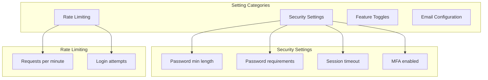
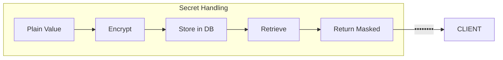
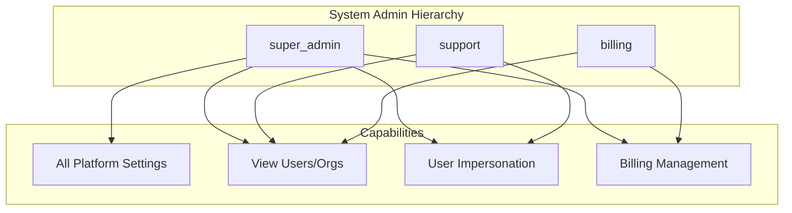
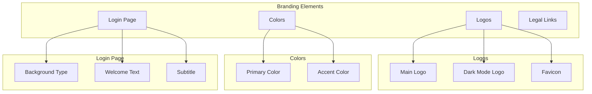
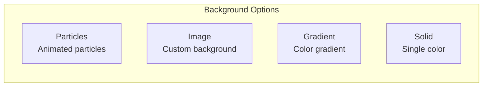
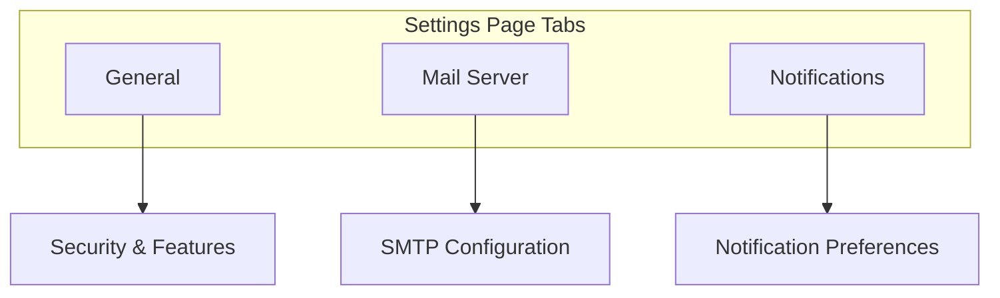
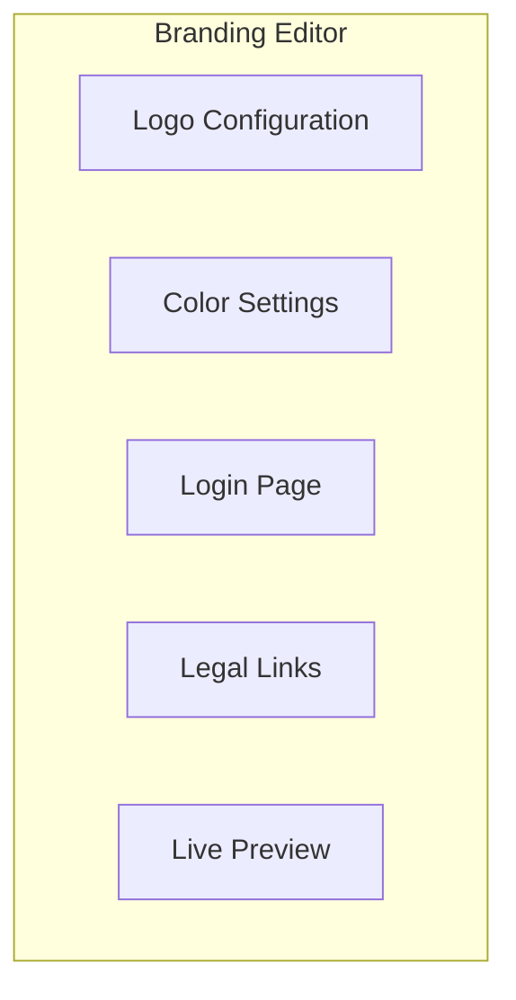

# Phase 6: Platform Settings & Branding

> **Version:** 1.0.0
> **Last Updated:** January 2026
> **Status:** Complete

## Overview

This document describes the platform settings system for system-wide configuration and the white-labeling/branding features that allow customization of the platform appearance.

## Table of Contents

- [Platform Settings](#platform-settings)
- [System Administration](#system-administration)
- [White-Labeling](#white-labeling)
- [Settings Page UI](#settings-page-ui)
- [Branding Editor UI](#branding-editor-ui)
- [API Endpoints](#api-endpoints)
- [Implementation Details](#implementation-details)

---

## Platform Settings

### Overview

Platform settings are key-value pairs that configure system-wide behavior. They are managed by system administrators and affect all organizations.



### Setting Keys

| Category | Key | Type | Description |
|----------|-----|------|-------------|
| **Security** | `security.password_min_length` | number | Minimum password length |
| | `security.password_require_uppercase` | boolean | Require uppercase letter |
| | `security.password_require_number` | boolean | Require number |
| | `security.password_require_special` | boolean | Require special character |
| | `security.session_timeout_minutes` | number | Session timeout |
| | `security.mfa_enabled` | boolean | Global MFA availability |
| **Rate Limits** | `rate_limit.requests_per_minute` | number | API rate limit |
| | `rate_limit.login_attempts` | number | Max login failures |
| **Features** | `features.self_registration_enabled` | boolean | Allow self-signup |
| | `features.social_login_enabled` | boolean | Enable social logins |
| **Email** | `email.smtp_host` | string | SMTP server host |
| | `email.smtp_port` | number | SMTP server port |
| | `email.smtp_username` | string | SMTP username |
| | `email.smtp_password` | string | SMTP password (secret) |
| | `email.smtp_tls` | string | TLS mode: none, starttls, tls |
| | `email.from_address` | string | Default sender email |
| | `email.from_name` | string | Default sender name |

### Secret Settings

Some settings contain sensitive data and are stored encrypted:



When `isSecret: true`:
- Value is encrypted before storage
- API returns masked value (`••••••••`)
- Updates only apply if value differs from masked placeholder

---

## System Administration

### System Admin Roles



### System Admin Permissions

| Role | Platform Settings | Organizations | Users | Impersonation | Billing |
|------|-------------------|---------------|-------|---------------|---------|
| `super_admin` | Full access | Full access | Full access | Yes | Yes |
| `support` | Read only | Read only | Read + assist | Yes | No |
| `billing` | No access | Read only | Read only | No | Yes |

### System Admins Table

```sql
system_admins (
    id          UUID PRIMARY KEY,
    user_id     UUID NOT NULL REFERENCES users,
    role        ENUM('super_admin', 'support', 'billing'),
    is_active   BOOLEAN DEFAULT true,
    created_at  TIMESTAMP WITH TIME ZONE,
    created_by  UUID REFERENCES users
)
```

---

## White-Labeling

### Overview

White-labeling allows customization of the platform's visual appearance. This includes logos, colors, login page styling, and legal links.



### Branding Configuration

| Field | Type | Description |
|-------|------|-------------|
| **Logos** | | |
| `logoUrl` | string | URL to main logo |
| `logoDarkUrl` | string | URL to dark mode logo |
| `faviconUrl` | string | URL to favicon |
| **Colors** | | |
| `primaryColor` | string | Primary brand color (#RRGGBB) |
| `accentColor` | string | Accent color (#RRGGBB) |
| **Login Page** | | |
| `loginBackgroundType` | enum | `particles`, `image`, `gradient`, `solid` |
| `loginBackgroundUrl` | string | URL for image background |
| `loginWelcomeText` | string | Welcome heading text |
| `loginSubtitle` | string | Subtitle text |
| **Legal** | | |
| `termsOfServiceUrl` | string | Terms of service link |
| `privacyPolicyUrl` | string | Privacy policy link |
| `supportUrl` | string | Support/help link |

### Login Background Types



| Type | Description | Required Fields |
|------|-------------|-----------------|
| `particles` | Animated particle effect | None |
| `image` | Custom background image | `loginBackgroundUrl` |
| `gradient` | Gradient using brand colors | Uses `primaryColor`, `accentColor` |
| `solid` | Single solid color | Uses `primaryColor` |

---

## Settings Page UI

### Page Structure

The settings page (`/settings`) provides system-wide configuration:



### General Settings Tab

```
┌─────────────────────────────────────────────────────────────────┐
│ Security Settings                                                │
├─────────────────────────────────────────────────────────────────┤
│ Minimum Password Length        [  12  ] characters               │
│                                                                  │
│ ☑ Require uppercase letter                                       │
│ ☑ Require number                                                 │
│ ☑ Require special character                                      │
│                                                                  │
│ Session Timeout                [  30  ] minutes                  │
│ ☑ Enable MFA                                                     │
├─────────────────────────────────────────────────────────────────┤
│ Rate Limiting                                                    │
├─────────────────────────────────────────────────────────────────┤
│ Requests per Minute            [ 100  ]                          │
│ Max Login Attempts             [   5  ]                          │
├─────────────────────────────────────────────────────────────────┤
│ Feature Toggles                                                  │
├─────────────────────────────────────────────────────────────────┤
│ ☑ Enable Self Registration                                       │
│ ☑ Enable Social Login                                            │
└─────────────────────────────────────────────────────────────────┘
```

### Mail Server Tab

```
┌─────────────────────────────────────────────────────────────────┐
│ 📧 SMTP Server Configuration                                     │
├─────────────────────────────────────────────────────────────────┤
│ SMTP Host          [ smtp.example.com    ]    Port    [ 587  ]  │
│                                                                  │
│ Username           [ apikey              ]                       │
│ Password           [ ••••••••            ] 👁                   │
│                                                                  │
│ Encryption         [ STARTTLS         ▼]                        │
│ ☑ Require secure connection                                      │
│                                                                  │
│ From Address       [ noreply@argusiq.com ]                       │
│ From Name          [ ArgusIQ Platform    ]                       │
├─────────────────────────────────────────────────────────────────┤
│ ✅ Connection test successful!                                   │
└─────────────────────────────────────────────────────────────────┘
│                     [Test Connection] [Reset] [Save Changes]     │
```

---

## Branding Editor UI

### Page Structure

The branding page (`/branding`) provides visual customization:



### Branding Editor Layout

```
┌─────────────────────────────────────────────────────────────────┐
│ 🎨 White Labeling / Branding                                     │
├─────────────────────────────────────────────────────────────────┤
│                                                                  │
│ Logo Configuration                                               │
│ ┌──────────────────┐  ┌──────────────────┐  ┌────────────┐      │
│ │   [Logo Image]   │  │  [Dark Logo]     │  │  [Favicon] │      │
│ │   Main Logo      │  │  Dark Mode Logo  │  │   Favicon  │      │
│ └──────────────────┘  └──────────────────┘  └────────────┘      │
│                                                                  │
│ Logo URL:          [ https://cdn.example.com/logo.png      ]    │
│ Dark Mode Logo:    [ https://cdn.example.com/logo-dark.png ]    │
│ Favicon URL:       [ https://cdn.example.com/favicon.ico   ]    │
│                                                                  │
├─────────────────────────────────────────────────────────────────┤
│ Colors                                                           │
│                                                                  │
│ Primary Color     [#1890FF] ████████████                        │
│ Accent Color      [#FF6B6B] ████████████                        │
│                                                                  │
├─────────────────────────────────────────────────────────────────┤
│ Login Page Customization                                         │
│                                                                  │
│ Background Type   [ Particles  ▼]                               │
│ Background URL    [ _________________________ ] (for image)      │
│                                                                  │
│ Welcome Text      [ Welcome to ArgusIQ        ]                  │
│ Subtitle          [ Sign in to your account   ]                  │
│                                                                  │
├─────────────────────────────────────────────────────────────────┤
│ Legal Links                                                      │
│                                                                  │
│ Terms of Service  [ https://example.com/terms    ]               │
│ Privacy Policy    [ https://example.com/privacy  ]               │
│ Support URL       [ https://support.example.com  ]               │
│                                                                  │
└─────────────────────────────────────────────────────────────────┘
│                                    [Reset to Defaults] [Save]    │
```

---

## API Endpoints

### Platform Settings

| Method | Endpoint | Description |
|--------|----------|-------------|
| `GET` | `/platform/settings` | Get all platform settings |
| `PUT` | `/platform/settings` | Create or update a setting |
| `DELETE` | `/platform/settings/:key` | Delete a setting |

### Platform Branding

| Method | Endpoint | Description |
|--------|----------|-------------|
| `GET` | `/platform/branding` | Get branding configuration |
| `PATCH` | `/platform/branding` | Update branding |

---

## Implementation Details

### Database Schema

```
┌─────────────────────────────────────────────────────────────────┐
│                      platform_settings                           │
├─────────────────────────────────────────────────────────────────┤
│ id              UUID PRIMARY KEY                                 │
│ key             VARCHAR(100) UNIQUE NOT NULL                     │
│ value           JSONB NOT NULL                                   │
│ description     VARCHAR(500)                                     │
│ is_secret       BOOLEAN DEFAULT false                            │
│ updated_by      UUID REFERENCES users                            │
│ updated_at      TIMESTAMP WITH TIME ZONE                         │
└─────────────────────────────────────────────────────────────────┘

┌─────────────────────────────────────────────────────────────────┐
│                       system_admins                              │
├─────────────────────────────────────────────────────────────────┤
│ id              UUID PRIMARY KEY                                 │
│ user_id         UUID UNIQUE NOT NULL REFERENCES users            │
│ role            ENUM('super_admin','support','billing')          │
│ is_active       BOOLEAN DEFAULT true                             │
│ created_at      TIMESTAMP WITH TIME ZONE                         │
│ created_by      UUID REFERENCES users                            │
└─────────────────────────────────────────────────────────────────┘

┌─────────────────────────────────────────────────────────────────┐
│                      platform_branding                           │
├─────────────────────────────────────────────────────────────────┤
│ id              UUID PRIMARY KEY DEFAULT gen_random_uuid()       │
│ logo_url        VARCHAR(500)                                     │
│ logo_dark_url   VARCHAR(500)                                     │
│ favicon_url     VARCHAR(500)                                     │
│ primary_color   VARCHAR(7)                                       │
│ accent_color    VARCHAR(7)                                       │
│ login_background_type  ENUM('particles','image','gradient','solid') │
│ login_background_url   VARCHAR(500)                              │
│ login_welcome_text     VARCHAR(200)                              │
│ login_subtitle         VARCHAR(200)                              │
│ terms_of_service_url   VARCHAR(500)                              │
│ privacy_policy_url     VARCHAR(500)                              │
│ support_url            VARCHAR(500)                              │
│ updated_at      TIMESTAMP WITH TIME ZONE                         │
│ updated_by      UUID REFERENCES users                            │
└─────────────────────────────────────────────────────────────────┘
```

### File Structure

```
packages/
├── api/
│   └── src/
│       ├── db/schema/
│       │   └── platform-settings.ts      # Settings, admins, branding
│       ├── repositories/
│       │   ├── platform-settings.repository.ts
│       │   └── system-admin.repository.ts
│       └── routes/v1/
│           └── platform-settings.ts      # Settings & branding routes
│
└── web/
    └── src/
        ├── routes/
        │   ├── settings.tsx              # Settings page with tabs
        │   └── branding.tsx              # Branding editor page
        └── components/
            ├── settings/
            │   ├── general-settings-tab.tsx
            │   ├── mail-server-tab.tsx
            │   └── index.ts
            └── branding/
                └── branding-editor.tsx
```

### Permission Checks

```typescript
// Platform settings require super_admin role
async checkSuperAdmin(userId: string): Promise<boolean> {
  const admin = await this.systemAdminRepository.findByUserId(userId);
  return admin?.role === 'super_admin' && admin.isActive;
}

// Route handler
fastify.get('/platform/settings', async (request, reply) => {
  const userId = request.user?.sub;

  if (!await checkSuperAdmin(userId)) {
    return reply.status(403).send({
      error: 'Access denied. Super Admin privileges required.'
    });
  }

  const settings = await platformSettingsRepository.findAll();
  return { data: settings };
});
```

### Setting Key Constants

```typescript
// packages/api/src/db/schema/platform-settings.ts
export const PLATFORM_SETTING_KEYS = {
  // Security
  PASSWORD_MIN_LENGTH: 'security.password_min_length',
  PASSWORD_REQUIRE_UPPERCASE: 'security.password_require_uppercase',
  PASSWORD_REQUIRE_NUMBER: 'security.password_require_number',
  PASSWORD_REQUIRE_SPECIAL: 'security.password_require_special',
  SESSION_TIMEOUT_MINUTES: 'security.session_timeout_minutes',
  MFA_ENABLED: 'security.mfa_enabled',

  // Rate Limiting
  RATE_LIMIT_REQUESTS_PER_MINUTE: 'rate_limit.requests_per_minute',
  RATE_LIMIT_LOGIN_ATTEMPTS: 'rate_limit.login_attempts',

  // Features
  SELF_REGISTRATION_ENABLED: 'features.self_registration_enabled',
  SOCIAL_LOGIN_ENABLED: 'features.social_login_enabled',

  // Email
  EMAIL_FROM_ADDRESS: 'email.from_address',
  EMAIL_FROM_NAME: 'email.from_name',
} as const;
```

---

## Testing

Tests are located in `packages/api/src/db/schema/`:

- `platform-settings.test.ts` - Tests for settings schema, setting keys, admin roles, branding types

Run tests:
```bash
cd packages/api
pnpm test
```
