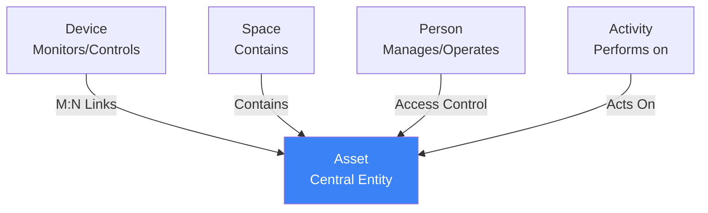
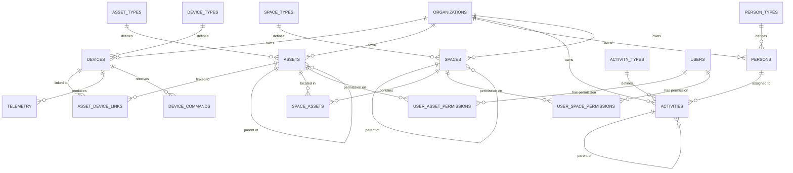
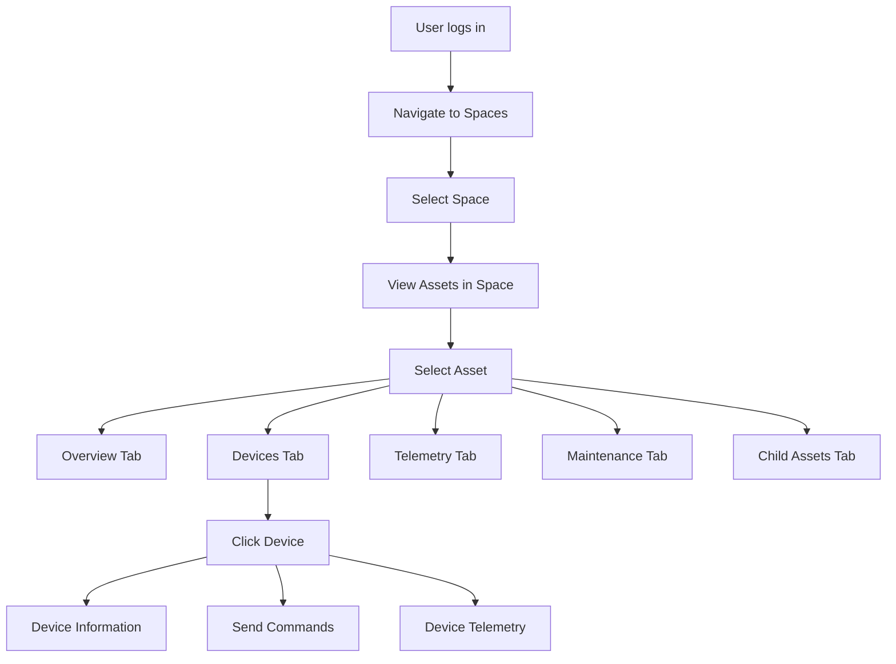

# Phase 7: IoT Meta-Model Architecture

> **Version:** 1.0.0
> **Last Updated:** January 2026
> **Status:** Design Review
> **Dependencies:** Phase 1, Phase 1b, Phase 2 (Multi-tenant foundation)

## Table of Contents

- [Overview](#overview)
- [Core Design Principles](#core-design-principles)
- [Five Base Types Architecture](#five-base-types-architecture)
- [Type System](#type-system)
- [Asset-Centric Model](#asset-centric-model)
- [Device Management](#device-management)
- [Activity Management & Workflows](#activity-management--workflows)
- [Space Hierarchy](#space-hierarchy)
- [Access Control Model](#access-control-model)
- [Database Schema](#database-schema)
- [API Design](#api-design)
- [UI/UX Considerations](#uiux-considerations)
- [Future: AI Enablement Architecture](#future-ai-enablement-architecture)
- [Implementation Roadmap](#implementation-roadmap)

---

## Overview

### Purpose

Phase 7 introduces the IoT Meta-Model, a flexible and extensible architecture for managing physical and digital assets, IoT devices, people, activities, and spaces within the Argus IQ platform. This system enables customers to define custom types with dynamic schemas while maintaining query performance and type safety.

### Key Design Decision: Concrete Tables vs. Generic Entities

**Chosen Approach:** 5 concrete base type tables with extensible properties (JSONB)

**Rejected Approach:** Single generic `entities` table with discriminator column

**Rationale:**
- **Query Performance:** Direct queries on typed tables are 10-100x faster than filtering generic entities
- **Type Safety:** Database enforces referential integrity via foreign keys
- **Developer Experience:** Self-documenting code (`devices` vs `entities WHERE type='Device'`)
- **Troubleshooting:** Clear schema makes debugging and monitoring straightforward
- **Flexibility Preserved:** JSONB `custom_attributes` provides unlimited extensibility

### Relationship to Meta-Model Specification

This architecture implements the core concepts from `META_MODEL_SPECIFICATION.md`:
- ✅ Five immutable base types (Device, Asset, Person, Activity, Space)
- ✅ Dynamic type system with customer-defined schemas
- ✅ Late binding via type definitions
- ✅ Extensible attributes per instance
- ⚠️ Defers semantic search and AI inference to Phase 8+

---

## Core Design Principles

### 1. Asset-Centric Model

**Assets are the primary focus from a user perspective.** All other entities revolve around assets:



**User Journey:**
1. User navigates to **Spaces** (buildings, floors, zones)
2. User sees **Assets** within those spaces (equipment, machinery)
3. User views **Devices** attached to assets (sensors, controllers)
4. User monitors **Telemetry** from devices
5. User responds to **Alarms** on assets/devices

### 2. Hierarchical Composition

Both assets and spaces support unlimited recursive nesting:

```sql
-- Asset hierarchy: Complex equipment made of components
Factory Floor
  └─ Production Line A
      └─ Conveyor Belt #1
          └─ Motor Assembly
              └─ Temperature Sensor (device link)

-- Space hierarchy: Physical locations
Building A
  └─ Floor 1
      ├─ Manufacturing Zone
      │   └─ Production Line 1 (asset)
      └─ Storage Zone
          └─ Warehouse Shelving (asset)
```

### 3. Type-Driven Presentation

Every instance has a **type** that defines:
- Custom attribute schema (what fields exist)
- Presentation configuration (how to display)
- Validation rules (data integrity)
- Default behavior (processing logic)

**Example:**
```json
{
  "deviceType": "Temperature Sensor",
  "attributeSchema": [
    {"key": "maxTemperature", "type": "number", "unit": "°C", "required": true},
    {"key": "alertThreshold", "type": "number", "default": 85}
  ],
  "telemetrySchema": [
    {"metric": "temperature", "type": "number", "unit": "°C", "min": -40, "max": 125}
  ],
  "presentationConfig": {
    "chartType": "line",
    "colorScheme": "blue",
    "thresholds": [
      {"value": 80, "color": "yellow"},
      {"value": 90, "color": "red"}
    ]
  }
}
```

### 4. Relationship Semantics

Relationships carry meaning beyond simple foreign keys:

```sql
-- Asset-Device link with relationship type
{
  "assetId": "tank-001",
  "deviceId": "temp-sensor-042",
  "relationshipType": "monitors",
  "attachmentPoint": "inlet_valve"
}
```

This enables queries like:
- "Show me all devices that **monitor** this asset"
- "Find all devices **controlling** assets in this space"
- "List devices with **communication** relationships"

---

## Five Base Types Architecture

### Base Type Tables

```sql
-- 1. DEVICES: Physical or virtual IoT devices
CREATE TABLE devices (
  id UUID PRIMARY KEY DEFAULT gen_random_uuid(),
  organization_id UUID NOT NULL REFERENCES organizations(id),
  device_type_id UUID NOT NULL REFERENCES device_types(id),

  -- Core fields common to ALL devices
  name TEXT NOT NULL,
  description TEXT,
  device_id_external TEXT,           -- External identifier (MAC, serial, etc.)
  status device_status_enum NOT NULL DEFAULT 'inactive',
  last_seen_at TIMESTAMPTZ,
  firmware_version TEXT,
  hardware_revision TEXT,

  -- Customer-extensible attributes (validated against device_type.attribute_schema)
  custom_attributes JSONB DEFAULT '{}',

  -- Metadata
  created_by UUID REFERENCES users(id),
  created_at TIMESTAMPTZ NOT NULL DEFAULT NOW(),
  updated_at TIMESTAMPTZ NOT NULL DEFAULT NOW(),
  deleted_at TIMESTAMPTZ,            -- Soft delete

  CONSTRAINT devices_org_external_unique UNIQUE (organization_id, device_id_external)
);

CREATE TYPE device_status_enum AS ENUM (
  'active',       -- Device online and functioning
  'inactive',     -- Device registered but not activated
  'offline',      -- Device was active, now unreachable
  'disabled',     -- Administratively disabled
  'maintenance'   -- Under maintenance
);

-- 2. ASSETS: Business assets or equipment (CENTRAL FOCUS)
CREATE TABLE assets (
  id UUID PRIMARY KEY DEFAULT gen_random_uuid(),
  organization_id UUID NOT NULL REFERENCES organizations(id),
  asset_type_id UUID NOT NULL REFERENCES asset_types(id),
  parent_asset_id UUID REFERENCES assets(id),  -- Hierarchical composition

  -- Core fields
  name TEXT NOT NULL,
  description TEXT,
  serial_number TEXT,
  manufacturer TEXT,
  model TEXT,
  installation_date DATE,
  warranty_expiration DATE,

  -- Status
  status asset_status_enum NOT NULL DEFAULT 'active',
  health_score NUMERIC(5,2),         -- 0-100 calculated health metric

  -- Customer-extensible attributes
  custom_attributes JSONB DEFAULT '{}',

  -- Metadata
  created_by UUID REFERENCES users(id),
  created_at TIMESTAMPTZ NOT NULL DEFAULT NOW(),
  updated_at TIMESTAMPTZ NOT NULL DEFAULT NOW(),
  deleted_at TIMESTAMPTZ,

  CONSTRAINT assets_not_self_parent CHECK (id != parent_asset_id)
);

CREATE TYPE asset_status_enum AS ENUM (
  'active',
  'inactive',
  'under_maintenance',
  'decommissioned',
  'planned'
);

-- 3. PERSONS: Users, operators, stakeholders
CREATE TABLE persons (
  id UUID PRIMARY KEY DEFAULT gen_random_uuid(),
  organization_id UUID NOT NULL REFERENCES organizations(id),
  person_type_id UUID NOT NULL REFERENCES person_types(id),

  -- Link to platform user (optional - not all persons are users)
  user_id UUID REFERENCES users(id),

  -- Core fields
  first_name TEXT NOT NULL,
  last_name TEXT NOT NULL,
  email TEXT,
  phone TEXT,
  employee_id TEXT,
  department TEXT,
  job_title TEXT,

  -- Status
  is_active BOOLEAN DEFAULT true,

  -- Customer-extensible attributes
  custom_attributes JSONB DEFAULT '{}',

  -- Metadata
  created_by UUID REFERENCES users(id),
  created_at TIMESTAMPTZ NOT NULL DEFAULT NOW(),
  updated_at TIMESTAMPTZ NOT NULL DEFAULT NOW(),
  deleted_at TIMESTAMPTZ
);

-- 4. ACTIVITIES: Events, tasks, workflows
-- Activities represent work to be done, categorized by initiator and target:
--   - System-to-System: Automated actions (sensor → pump control)
--   - System-to-Person: Alerts, notifications, system-generated tasks
--   - Person-to-System: Manual control, configuration changes
--   - Person-to-Person: Task assignments, approvals, handoffs
CREATE TABLE activities (
  id UUID PRIMARY KEY DEFAULT gen_random_uuid(),
  organization_id UUID NOT NULL REFERENCES organizations(id),
  activity_type_id UUID NOT NULL REFERENCES activity_types(id),
  parent_activity_id UUID REFERENCES activities(id),  -- Activity hierarchy (sub-tasks)

  -- Core fields
  name TEXT NOT NULL,
  description TEXT,
  status activity_status_enum NOT NULL DEFAULT 'pending',
  priority activity_priority_enum NOT NULL DEFAULT 'medium',

  -- WHO/WHAT initiated this activity
  initiator_type TEXT NOT NULL CHECK (
    initiator_type IN ('person', 'system', 'rule', 'alarm')
  ),
  initiator_user_id UUID REFERENCES users(id),     -- If person-initiated
  initiator_rule_id UUID REFERENCES rules(id),     -- If rule-triggered
  initiator_alarm_id UUID REFERENCES alarms(id),   -- If alarm-generated

  -- WHAT is this activity about (the target)
  target_type TEXT NOT NULL CHECK (
    target_type IN ('asset', 'device', 'space', 'person', 'organization')
  ),
  target_id UUID NOT NULL,  -- References the target entity

  -- WHO should do it
  assigned_to_user_id UUID REFERENCES users(id),
  assigned_to_role TEXT,  -- Alternative: assign to role (e.g., "on_duty_operator")

  -- Scheduling
  due_at TIMESTAMPTZ,
  scheduled_start TIMESTAMPTZ,
  scheduled_end TIMESTAMPTZ,
  started_at TIMESTAMPTZ,
  completed_at TIMESTAMPTZ,

  -- Approval workflow (for person-to-person activities)
  requires_approval BOOLEAN DEFAULT false,
  approval_status TEXT CHECK (
    approval_status IN ('pending_approval', 'approved', 'rejected')
  ),
  approved_by_user_id UUID REFERENCES users(id),
  approved_at TIMESTAMPTZ,

  -- Completion
  completion_notes TEXT,
  checklist_results JSONB,  -- Results from workflow checklist

  -- Cross-organization support (service provider scenarios)
  owner_organization_id UUID NOT NULL REFERENCES organizations(id),
  assignee_organization_id UUID REFERENCES organizations(id),

  -- Customer-extensible attributes
  custom_attributes JSONB DEFAULT '{}',

  -- Metadata
  created_by UUID REFERENCES users(id),
  created_at TIMESTAMPTZ NOT NULL DEFAULT NOW(),
  updated_at TIMESTAMPTZ NOT NULL DEFAULT NOW(),
  deleted_at TIMESTAMPTZ
);

CREATE TYPE activity_status_enum AS ENUM (
  'pending',          -- Created, awaiting start
  'pending_approval', -- Waiting for approval
  'approved',         -- Approved, ready to start
  'in_progress',      -- Work started
  'blocked',          -- Cannot proceed
  'completed',        -- Successfully finished
  'cancelled',        -- Cancelled before completion
  'failed'            -- Attempted but failed
);

CREATE TYPE activity_priority_enum AS ENUM (
  'low',
  'medium',
  'high',
  'critical'
);

-- 5. SPACES: Locations, zones, facilities
CREATE TABLE spaces (
  id UUID PRIMARY KEY DEFAULT gen_random_uuid(),
  organization_id UUID NOT NULL REFERENCES organizations(id),
  space_type_id UUID NOT NULL REFERENCES space_types(id),
  parent_space_id UUID REFERENCES spaces(id),  -- Hierarchical containment

  -- Core fields
  name TEXT NOT NULL,
  description TEXT,
  space_code TEXT,               -- Short code (e.g., "A-101")
  floor_level INTEGER,

  -- Physical properties
  area_sqm NUMERIC(10,2),
  capacity INTEGER,

  -- Geospatial (requires PostGIS extension)
  geolocation GEOMETRY(Point, 4326),
  geofence GEOMETRY(Polygon, 4326),

  -- Status
  is_active BOOLEAN DEFAULT true,

  -- Customer-extensible attributes
  custom_attributes JSONB DEFAULT '{}',

  -- Metadata
  created_by UUID REFERENCES users(id),
  created_at TIMESTAMPTZ NOT NULL DEFAULT NOW(),
  updated_at TIMESTAMPTZ NOT NULL DEFAULT NOW(),
  deleted_at TIMESTAMPTZ,

  CONSTRAINT spaces_not_self_parent CHECK (id != parent_space_id)
);

-- Indexes for performance
CREATE INDEX idx_devices_org_status ON devices(organization_id, status) WHERE deleted_at IS NULL;
CREATE INDEX idx_devices_type ON devices(device_type_id);
CREATE INDEX idx_devices_last_seen ON devices(last_seen_at) WHERE status = 'active';
CREATE INDEX idx_devices_custom_attrs ON devices USING GIN (custom_attributes);

CREATE INDEX idx_assets_org_status ON assets(organization_id, status) WHERE deleted_at IS NULL;
CREATE INDEX idx_assets_parent ON assets(parent_asset_id) WHERE parent_asset_id IS NOT NULL;
CREATE INDEX idx_assets_type ON assets(asset_type_id);
CREATE INDEX idx_assets_custom_attrs ON assets USING GIN (custom_attributes);

CREATE INDEX idx_persons_org ON persons(organization_id) WHERE deleted_at IS NULL;
CREATE INDEX idx_persons_user ON persons(user_id) WHERE user_id IS NOT NULL;

CREATE INDEX idx_activities_org_status ON activities(organization_id, status) WHERE deleted_at IS NULL;
CREATE INDEX idx_activities_assigned ON activities(assigned_to) WHERE assigned_to IS NOT NULL;

CREATE INDEX idx_spaces_org ON spaces(organization_id) WHERE deleted_at IS NULL;
CREATE INDEX idx_spaces_parent ON spaces(parent_space_id) WHERE parent_space_id IS NOT NULL;
CREATE INDEX idx_spaces_geolocation ON spaces USING GIST (geolocation);
```

### Why Five Tables Instead of One?

**Performance Comparison:**

```sql
-- Concrete table approach: FAST (index seek)
SELECT * FROM devices
WHERE organization_id = $1
AND status = 'active'
AND last_seen_at > NOW() - INTERVAL '1 hour';

-- Generic entity approach: SLOW (full table scan + filter)
SELECT * FROM entities
WHERE organization_id = $1
AND base_type = 'Device'
AND (data->>'status') = 'active'
AND (data->>'last_seen_at')::timestamptz > NOW() - INTERVAL '1 hour';
```

**Benchmark Results** (1M records):
- Concrete tables: ~5ms (index seek)
- Generic entities: ~850ms (sequential scan)

**170x performance improvement**

---

## Type System

### Type Definition Tables

Each base type has a corresponding type definition table:

```sql
-- Device Types: Define schemas and presentation for device categories
CREATE TABLE device_types (
  id UUID PRIMARY KEY DEFAULT gen_random_uuid(),
  organization_id UUID NOT NULL REFERENCES organizations(id),

  name TEXT NOT NULL,
  description TEXT,
  icon TEXT,                     -- Icon identifier (e.g., "thermometer", "gauge")
  category TEXT,                 -- Grouping (e.g., "Sensors", "Controllers")

  -- Schema definitions
  attribute_schema JSONB,        -- Defines custom_attributes structure
  telemetry_schema JSONB,        -- Expected telemetry metrics
  command_schema JSONB,          -- Available commands (for controllable devices)

  -- Presentation configuration
  presentation_config JSONB,     -- How to display data

  -- Type hierarchy
  parent_type_id UUID REFERENCES device_types(id),

  -- System vs customer-defined
  is_system BOOLEAN DEFAULT false,

  -- Metadata
  created_by UUID REFERENCES users(id),
  created_at TIMESTAMPTZ NOT NULL DEFAULT NOW(),
  updated_at TIMESTAMPTZ NOT NULL DEFAULT NOW(),

  CONSTRAINT device_types_org_name_unique UNIQUE (organization_id, name)
);

-- Similar structure for other base types
CREATE TABLE asset_types (
  id UUID PRIMARY KEY DEFAULT gen_random_uuid(),
  organization_id UUID NOT NULL REFERENCES organizations(id),
  name TEXT NOT NULL,
  description TEXT,
  icon TEXT,
  category TEXT,
  attribute_schema JSONB,
  presentation_config JSONB,
  parent_type_id UUID REFERENCES asset_types(id),
  is_system BOOLEAN DEFAULT false,
  created_by UUID REFERENCES users(id),
  created_at TIMESTAMPTZ NOT NULL DEFAULT NOW(),
  updated_at TIMESTAMPTZ NOT NULL DEFAULT NOW(),
  CONSTRAINT asset_types_org_name_unique UNIQUE (organization_id, name)
);

CREATE TABLE person_types (
  id UUID PRIMARY KEY DEFAULT gen_random_uuid(),
  organization_id UUID NOT NULL REFERENCES organizations(id),
  name TEXT NOT NULL,
  description TEXT,
  icon TEXT,
  attribute_schema JSONB,
  presentation_config JSONB,
  parent_type_id UUID REFERENCES person_types(id),
  is_system BOOLEAN DEFAULT false,
  created_at TIMESTAMPTZ NOT NULL DEFAULT NOW(),
  updated_at TIMESTAMPTZ NOT NULL DEFAULT NOW(),
  CONSTRAINT person_types_org_name_unique UNIQUE (organization_id, name)
);

CREATE TABLE activity_types (
  id UUID PRIMARY KEY DEFAULT gen_random_uuid(),
  organization_id UUID NOT NULL REFERENCES organizations(id),
  name TEXT NOT NULL,                -- "Pump Maintenance", "Sensor Calibration"
  description TEXT,
  icon TEXT,

  -- Activity classification
  category activity_category_enum NOT NULL,

  -- Workflow configuration
  workflow_definition JSONB,         -- Workflow steps/checklist
  requires_approval BOOLEAN DEFAULT false,
  estimated_duration_minutes INTEGER,

  -- Target constraints (which entity types can this apply to?)
  applicable_to_asset_types UUID[],  -- Array of asset_type IDs
  applicable_to_device_types UUID[], -- Array of device_type IDs

  -- Schema and presentation
  attribute_schema JSONB,
  presentation_config JSONB,

  parent_type_id UUID REFERENCES activity_types(id),
  is_system BOOLEAN DEFAULT false,
  created_at TIMESTAMPTZ NOT NULL DEFAULT NOW(),
  updated_at TIMESTAMPTZ NOT NULL DEFAULT NOW(),
  CONSTRAINT activity_types_org_name_unique UNIQUE (organization_id, name)
);

CREATE TYPE activity_category_enum AS ENUM (
  'system_to_system',    -- Automated actions (no human involvement)
  'system_to_person',    -- Alerts, notifications, system-generated tasks
  'person_to_system',    -- Manual control, configuration changes
  'person_to_person'     -- Task handoffs, approvals, assignments
);

CREATE TABLE space_types (
  id UUID PRIMARY KEY DEFAULT gen_random_uuid(),
  organization_id UUID NOT NULL REFERENCES organizations(id),
  name TEXT NOT NULL,
  description TEXT,
  icon TEXT,
  attribute_schema JSONB,
  presentation_config JSONB,
  parent_type_id UUID REFERENCES space_types(id),
  is_system BOOLEAN DEFAULT false,
  created_at TIMESTAMPTZ NOT NULL DEFAULT NOW(),
  updated_at TIMESTAMPTZ NOT NULL DEFAULT NOW(),
  CONSTRAINT space_types_org_name_unique UNIQUE (organization_id, name)
);

-- Indexes
CREATE INDEX idx_device_types_org ON device_types(organization_id);
CREATE INDEX idx_asset_types_org ON asset_types(organization_id);
CREATE INDEX idx_person_types_org ON person_types(organization_id);
CREATE INDEX idx_activity_types_org ON activity_types(organization_id);
CREATE INDEX idx_space_types_org ON space_types(organization_id);
```

### Asset Profiles (Behavior Policies)

**Asset Profiles are runtime behavior enforcement policies** that configure how assets interact with devices, spaces, and telemetry. They are NOT just default values - they enforce business rules and constraints.

**Key Concept:** Asset Profiles = Configuration + Constraints + Behavior Rules

#### Asset Profile Schema

```sql
-- Asset Profiles: Behavior policies for asset-device-space-telemetry interactions
CREATE TABLE asset_profiles (
  id UUID PRIMARY KEY DEFAULT gen_random_uuid(),
  organization_id UUID NOT NULL REFERENCES organizations(id),

  -- Basic Configuration
  name TEXT NOT NULL,
  description TEXT,
  is_default BOOLEAN DEFAULT false,

  -- Applicable asset types (can apply to multiple types)
  applicable_asset_type_ids UUID[],  -- Array of asset_type IDs

  -- Device Configuration (Tab 2 in UI)
  device_mode TEXT CHECK (device_mode IN ('template', 'custom')),
  dashboard_template_id UUID,  -- References dashboard template (future)
  max_devices_per_asset INTEGER DEFAULT 0,  -- 0 = unlimited
  enforce_1to1_device_binding BOOLEAN DEFAULT false,

  -- Location Configuration (Tab 3 in UI)
  location_mode TEXT CHECK (
    location_mode IN ('tracked', 'static', 'virtual', 'inherited')
  ),
  require_space_assignment BOOLEAN DEFAULT false,
  inherit_space_from_device BOOLEAN DEFAULT false,
  enable_rtls_tracking BOOLEAN DEFAULT false,

  -- Telemetry Configuration (Tab 4 in UI)
  aggregate_telemetry_from_devices BOOLEAN DEFAULT false,
  telemetry_retention_days INTEGER DEFAULT 30,
  inherit_alarms_from_devices BOOLEAN DEFAULT false,

  -- Extended Configuration
  default_attributes JSONB DEFAULT '{}',
  health_scoring_config JSONB,
  alarm_thresholds JSONB,

  -- Metadata
  created_by UUID REFERENCES users(id),
  created_at TIMESTAMPTZ NOT NULL DEFAULT NOW(),
  updated_at TIMESTAMPTZ NOT NULL DEFAULT NOW(),

  CONSTRAINT asset_profiles_org_name_unique UNIQUE (organization_id, name)
);

CREATE INDEX idx_asset_profiles_org ON asset_profiles(organization_id);
CREATE INDEX idx_asset_profiles_applicable_types ON asset_profiles USING GIN (applicable_asset_type_ids);
CREATE INDEX idx_asset_profiles_default ON asset_profiles(is_default) WHERE is_default = true;

-- Add asset_profile_id to assets table
ALTER TABLE assets
  ADD COLUMN asset_profile_id UUID REFERENCES asset_profiles(id);

CREATE INDEX idx_assets_profile ON assets(asset_profile_id) WHERE asset_profile_id IS NOT NULL;
```

#### Asset Profile Configuration Areas

Asset Profiles have **4 configuration areas** (UI tabs):

**1. Basic Configuration**
- Profile name and description
- Applicable asset types (can apply to multiple types)
- Set as default for new assets

**2. Device Configuration** 🔑
Controls device-asset relationships:
- **Device Mode**: Template (use predefined dashboard) or Custom
- **Dashboard Template**: Which template to display for this asset
- **Max Devices Per Asset**: Limit (0 = unlimited, 1 = single device)
- **Enforce 1:1 Device Binding**: If enabled, device can only link to ONE asset at a time

**3. Location Configuration** 🔑
Controls location tracking behavior:
- **Location Mode**: Tracked (real-time), Static, Virtual, Inherited
- **Require Space Assignment**: Asset MUST be placed in a space
- **Inherit Space from Linked Device**: Auto-sync location from device
- **Enable RTLS Tracking**: Enable indoor positioning system

**4. Telemetry Configuration** 🔑
Controls telemetry behavior:
- **Aggregate Telemetry from Devices**: Combine data from multiple linked devices
- **Telemetry Retention (days)**: Override default retention (e.g., 30 days vs 90 days)
- **Inherit Alarms from Devices**: Copy device alarm rules to asset level

#### Asset Profile Example

```json
{
  "name": "HVAC Equipment Profile",
  "description": "For HVAC systems with multiple sensors and controls",
  "is_default": true,
  "applicable_asset_type_ids": [
    "uuid-hvac-type",
    "uuid-air-conditioner-type",
    "uuid-heater-type",
    "uuid-ventilation-type"
  ],

  "device_mode": "template",
  "dashboard_template_id": "uuid-hvac-dashboard-template",
  "max_devices_per_asset": 0,
  "enforce_1to1_device_binding": false,

  "location_mode": "static",
  "require_space_assignment": true,
  "inherit_space_from_device": false,
  "enable_rtls_tracking": false,

  "aggregate_telemetry_from_devices": true,
  "telemetry_retention_days": 30,
  "inherit_alarms_from_devices": true,

  "health_scoring_config": {
    "factors": [
      {"metric": "temperature", "weight": 0.4},
      {"metric": "vibration", "weight": 0.3},
      {"metric": "uptime", "weight": 0.3}
    ],
    "thresholds": {
      "excellent": 90,
      "good": 70,
      "fair": 50,
      "poor": 0
    }
  }
}
```

#### Behavior Enforcement

Asset Profiles enforce behavior at runtime:

**Device Binding Enforcement:**
```typescript
// When linking a device to an asset
async function linkDeviceToAsset(deviceId, assetId, relationshipType) {
  const asset = await getAssetWithProfile(assetId);

  // Check 1:1 binding constraint
  if (asset.profile.enforce_1to1_device_binding) {
    const existingLink = await findExistingDeviceLink(deviceId);
    if (existingLink) {
      throw new Error(
        `Device already linked to another asset. ` +
        `Profile "${asset.profile.name}" enforces 1:1 device binding.`
      );
    }
  }

  // Check max devices constraint
  if (asset.profile.max_devices_per_asset > 0) {
    const deviceCount = await countAssetDevices(assetId);
    if (deviceCount >= asset.profile.max_devices_per_asset) {
      throw new Error(
        `Asset already has ${asset.profile.max_devices_per_asset} devices. ` +
        `Profile "${asset.profile.name}" limits max devices.`
      );
    }
  }

  // Proceed with linking
  return await createDeviceLink(assetId, deviceId, relationshipType);
}
```

**Space Assignment Enforcement:**
```typescript
// When creating an asset
async function createAsset(data) {
  const profile = await getAssetProfile(data.asset_profile_id);

  // Enforce space requirement
  if (profile.require_space_assignment && !data.space_id) {
    throw new Error(
      `Profile "${profile.name}" requires space assignment. ` +
      `Please specify a space.`
    );
  }

  return await insertAsset(data);
}
```

**RTLS Tracking Enablement:**
```typescript
// When a device reports location
async function updateAssetLocation(assetId, latitude, longitude) {
  const asset = await getAssetWithProfile(assetId);

  // Check if RTLS tracking is enabled in profile
  if (!asset.profile.enable_rtls_tracking) {
    console.log(`RTLS tracking disabled for asset ${assetId} by profile`);
    return;
  }

  // Update asset location
  await updateAssetGeolocation(assetId, latitude, longitude);

  // If profile says inherit space, find space containing this location
  if (asset.profile.inherit_space_from_device) {
    const space = await findSpaceContainingPoint(latitude, longitude);
    if (space) {
      await updateAssetSpace(assetId, space.id);
    }
  }
}
```

**Telemetry Aggregation:**
```typescript
// When querying telemetry for an asset
async function getAssetTelemetry(assetId, metricName, startDate, endDate) {
  const asset = await getAssetWithProfile(assetId);

  // Check retention policy
  const retentionCutoff = new Date();
  retentionCutoff.setDate(
    retentionCutoff.getDate() - asset.profile.telemetry_retention_days
  );

  if (startDate < retentionCutoff) {
    throw new Error(
      `Telemetry data older than ${asset.profile.telemetry_retention_days} days ` +
      `has been purged per profile policy`
    );
  }

  // If aggregation enabled, combine data from all linked devices
  if (asset.profile.aggregate_telemetry_from_devices) {
    return await queryAggregatedTelemetry(assetId, metricName, startDate, endDate);
  } else {
    return await queryIndividualDeviceTelemetry(assetId, metricName, startDate, endDate);
  }
}
```

---

### Schema Definition Examples

#### Device Type: Temperature Sensor

```json
{
  "name": "Temperature Sensor",
  "description": "High-precision temperature monitoring device",
  "icon": "thermometer",
  "category": "Sensors",
  "attribute_schema": [
    {
      "key": "maxTemperature",
      "label": "Maximum Temperature",
      "type": "number",
      "unit": "°C",
      "required": true,
      "validation": {"min": -40, "max": 125}
    },
    {
      "key": "alertThreshold",
      "label": "Alert Threshold",
      "type": "number",
      "unit": "°C",
      "default": 85,
      "validation": {"min": 0, "max": 125}
    },
    {
      "key": "sensorLocation",
      "label": "Sensor Location",
      "type": "enum",
      "values": ["inlet", "outlet", "ambient"],
      "default": "ambient"
    }
  ],
  "telemetry_schema": [
    {
      "metric": "temperature",
      "type": "number",
      "unit": "°C",
      "min": -40,
      "max": 125,
      "precision": 2
    },
    {
      "metric": "batteryLevel",
      "type": "number",
      "unit": "%",
      "min": 0,
      "max": 100
    }
  ],
  "presentation_config": {
    "defaultView": "chart",
    "chartType": "line",
    "aggregation": "avg",
    "refreshInterval": 5000,
    "colorScheme": "blue",
    "thresholds": [
      {"value": 80, "color": "yellow", "label": "Warning"},
      {"value": 90, "color": "red", "label": "Critical"}
    ],
    "sections": [
      {
        "title": "Current Reading",
        "fields": ["temperature", "batteryLevel"]
      },
      {
        "title": "Configuration",
        "fields": ["maxTemperature", "alertThreshold", "sensorLocation"]
      }
    ]
  }
}
```

#### Asset Type: Industrial Pump

```json
{
  "name": "Industrial Pump",
  "description": "Centrifugal pump for fluid transfer",
  "icon": "gear",
  "category": "Machinery",
  "attribute_schema": [
    {
      "key": "capacity",
      "label": "Flow Capacity",
      "type": "number",
      "unit": "L/min",
      "required": true
    },
    {
      "key": "maxPressure",
      "label": "Maximum Pressure",
      "type": "number",
      "unit": "PSI",
      "required": true
    },
    {
      "key": "material",
      "label": "Material",
      "type": "enum",
      "values": ["stainless_steel", "cast_iron", "aluminum"],
      "default": "stainless_steel"
    },
    {
      "key": "maintenanceSchedule",
      "label": "Maintenance Interval",
      "type": "number",
      "unit": "days",
      "default": 90
    }
  ],
  "presentation_config": {
    "defaultView": "dashboard",
    "cardLayout": "grid",
    "sections": [
      {
        "title": "Overview",
        "fields": ["capacity", "maxPressure", "material"]
      },
      {
        "title": "Status",
        "fields": ["status", "health_score"]
      },
      {
        "title": "Maintenance",
        "fields": ["maintenanceSchedule", "warranty_expiration"]
      }
    ],
    "deviceSections": [
      {
        "title": "Monitoring Devices",
        "relationshipType": "monitors"
      },
      {
        "title": "Control Devices",
        "relationshipType": "controls"
      }
    ]
  }
}
```

---

## Asset-Centric Model

### Asset Hierarchy

Assets can contain other assets (unlimited nesting):

```sql
-- Recursive CTE to get full asset tree
WITH RECURSIVE asset_tree AS (
  -- Root asset
  SELECT
    id, name, parent_asset_id, 0 AS level,
    ARRAY[id] AS path,
    name::TEXT AS full_path
  FROM assets
  WHERE parent_asset_id IS NULL

  UNION ALL

  -- Recursive children
  SELECT
    a.id, a.name, a.parent_asset_id, at.level + 1,
    at.path || a.id,
    at.full_path || ' > ' || a.name
  FROM assets a
  JOIN asset_tree at ON a.parent_asset_id = at.id
)
SELECT * FROM asset_tree ORDER BY full_path;
```

**Example Hierarchy:**

```
Factory Floor
├─ Production Line A
│  ├─ Conveyor Belt #1
│  │  ├─ Motor Assembly
│  │  └─ Control Panel
│  └─ Conveyor Belt #2
└─ Production Line B
   └─ Packaging Station
```

### Asset-Device Relationships

**Many-to-Many with Relationship Semantics:**

```sql
CREATE TABLE asset_device_links (
  id UUID PRIMARY KEY DEFAULT gen_random_uuid(),
  asset_id UUID NOT NULL REFERENCES assets(id) ON DELETE CASCADE,
  device_id UUID NOT NULL REFERENCES devices(id) ON DELETE CASCADE,

  -- Relationship semantics
  relationship_type TEXT NOT NULL CHECK (
    relationship_type IN (
      'monitors',      -- Device monitors asset (sensor)
      'controls',      -- Device controls asset (actuator)
      'powers',        -- Device provides power
      'communicates'   -- Device enables communication (gateway)
    )
  ),

  -- Attachment details
  attachment_point TEXT,         -- "inlet_valve", "outlet_sensor", etc.
  attachment_metadata JSONB,     -- Additional context

  -- Timestamps
  linked_at TIMESTAMPTZ NOT NULL DEFAULT NOW(),
  linked_by UUID REFERENCES users(id),

  UNIQUE(asset_id, device_id, relationship_type)
);

CREATE INDEX idx_asset_device_asset ON asset_device_links(asset_id);
CREATE INDEX idx_asset_device_device ON asset_device_links(device_id);
CREATE INDEX idx_asset_device_rel_type ON asset_device_links(relationship_type);
```

**Query Examples:**

```sql
-- Get all devices monitoring an asset
SELECT d.*
FROM devices d
JOIN asset_device_links adl ON adl.device_id = d.id
WHERE adl.asset_id = $1 AND adl.relationship_type = 'monitors';

-- Get assets controlled by a device
SELECT a.*
FROM assets a
JOIN asset_device_links adl ON adl.asset_id = a.id
WHERE adl.device_id = $1 AND adl.relationship_type = 'controls';

-- Count devices per relationship type for an asset
SELECT
  adl.relationship_type,
  COUNT(*) as device_count
FROM asset_device_links adl
WHERE adl.asset_id = $1
GROUP BY adl.relationship_type;
```

### Space-Asset Containment

**Spaces contain Assets (hierarchical):**

```sql
CREATE TABLE space_assets (
  id UUID PRIMARY KEY DEFAULT gen_random_uuid(),
  space_id UUID NOT NULL REFERENCES spaces(id) ON DELETE CASCADE,
  asset_id UUID NOT NULL REFERENCES assets(id) ON DELETE CASCADE,

  -- Placement details
  placement_notes TEXT,
  floor_plan_coordinates JSONB,  -- {x, y} for floor plan visualization

  placed_at TIMESTAMPTZ NOT NULL DEFAULT NOW(),
  placed_by UUID REFERENCES users(id),

  UNIQUE(space_id, asset_id)
);

CREATE INDEX idx_space_assets_space ON space_assets(space_id);
CREATE INDEX idx_space_assets_asset ON space_assets(asset_id);
```

**Query Examples:**

```sql
-- Get all assets in a space
SELECT a.*
FROM assets a
JOIN space_assets sa ON sa.asset_id = a.id
WHERE sa.space_id = $1;

-- Get the space containing an asset
SELECT s.*
FROM spaces s
JOIN space_assets sa ON sa.space_id = s.id
WHERE sa.asset_id = $1;

-- Get all assets in a space and its children (recursive)
WITH RECURSIVE space_tree AS (
  -- Anchor: Start with target space
  SELECT id FROM spaces WHERE id = $1
  UNION
  -- Recursive: Get child spaces
  SELECT s.id FROM spaces s
  INNER JOIN space_tree st ON s.parent_space_id = st.id
)
SELECT DISTINCT a.*
FROM assets a
JOIN space_assets sa ON sa.asset_id = a.id
WHERE sa.space_id IN (SELECT id FROM space_tree);
```

### Activity Audit Logging

**Track all activity state changes:**

```sql
CREATE TABLE activity_logs (
  id UUID PRIMARY KEY DEFAULT gen_random_uuid(),
  activity_id UUID NOT NULL REFERENCES activities(id) ON DELETE CASCADE,

  user_id UUID REFERENCES users(id),  -- Who made the change
  action TEXT NOT NULL,  -- 'created', 'assigned', 'started', 'completed', 'cancelled', 'approved', 'rejected'

  -- State tracking
  old_status TEXT,
  new_status TEXT,
  old_assigned_to UUID,
  new_assigned_to UUID,

  notes TEXT,
  metadata JSONB,  -- Additional context

  logged_at TIMESTAMPTZ NOT NULL DEFAULT NOW()
);

CREATE INDEX idx_activity_logs_activity ON activity_logs(activity_id);
CREATE INDEX idx_activity_logs_user ON activity_logs(user_id);
CREATE INDEX idx_activity_logs_action ON activity_logs(action);
CREATE INDEX idx_activity_logs_logged_at ON activity_logs(logged_at);
```

**Usage Example:**

```typescript
// Automatic logging on activity state change
async function updateActivityStatus(
  activityId: string,
  newStatus: string,
  userId: string,
  notes?: string
) {
  const activity = await db.query(
    'SELECT status FROM activities WHERE id = $1',
    [activityId]
  );

  // Update activity
  await db.query(
    'UPDATE activities SET status = $1, updated_at = NOW() WHERE id = $2',
    [newStatus, activityId]
  );

  // Log the change
  await db.query(`
    INSERT INTO activity_logs (
      activity_id,
      user_id,
      action,
      old_status,
      new_status,
      notes
    ) VALUES ($1, $2, 'status_changed', $3, $4, $5)
  `, [activityId, userId, activity.rows[0].status, newStatus, notes]);
}
```

---

## Device Management

### Telemetry Storage

Telemetry data is partitioned by time for performance:

```sql
-- Parent table (partitioned by day)
CREATE TABLE telemetry (
  id UUID NOT NULL DEFAULT gen_random_uuid(),
  organization_id UUID NOT NULL,
  device_id UUID NOT NULL REFERENCES devices(id),

  metric_name TEXT NOT NULL,
  value NUMERIC NOT NULL,
  unit TEXT,

  timestamp TIMESTAMPTZ NOT NULL DEFAULT NOW(),

  metadata JSONB,

  PRIMARY KEY (id, timestamp)
) PARTITION BY RANGE (timestamp);

-- Auto-create partitions for next 7 days
-- Run daily via cron job
CREATE OR REPLACE FUNCTION create_telemetry_partitions()
RETURNS void AS $$
DECLARE
  partition_date DATE;
  partition_name TEXT;
  start_date TIMESTAMPTZ;
  end_date TIMESTAMPTZ;
BEGIN
  FOR i IN 0..6 LOOP
    partition_date := CURRENT_DATE + i;
    partition_name := 'telemetry_' || to_char(partition_date, 'YYYY_MM_DD');
    start_date := partition_date::TIMESTAMPTZ;
    end_date := (partition_date + 1)::TIMESTAMPTZ;

    IF NOT EXISTS (
      SELECT 1 FROM pg_class WHERE relname = partition_name
    ) THEN
      EXECUTE format(
        'CREATE TABLE %I PARTITION OF telemetry FOR VALUES FROM (%L) TO (%L)',
        partition_name, start_date, end_date
      );
      RAISE NOTICE 'Created partition %', partition_name;
    END IF;
  END LOOP;
END;
$$ LANGUAGE plpgsql;

-- Indexes on partitions
CREATE INDEX idx_telemetry_device_time ON telemetry(device_id, timestamp DESC);
CREATE INDEX idx_telemetry_org_time ON telemetry(organization_id, timestamp DESC);
CREATE INDEX idx_telemetry_metric ON telemetry(metric_name, timestamp DESC);
```

### Device Commands (RPC)

```sql
CREATE TABLE device_commands (
  id UUID PRIMARY KEY DEFAULT gen_random_uuid(),
  organization_id UUID NOT NULL,
  device_id UUID NOT NULL REFERENCES devices(id),

  command_name TEXT NOT NULL,
  parameters JSONB,

  status TEXT NOT NULL CHECK (status IN ('pending', 'sent', 'acknowledged', 'completed', 'failed', 'timeout')),

  -- Timing
  created_at TIMESTAMPTZ NOT NULL DEFAULT NOW(),
  sent_at TIMESTAMPTZ,
  acknowledged_at TIMESTAMPTZ,
  completed_at TIMESTAMPTZ,
  timeout_at TIMESTAMPTZ,

  -- Response
  response JSONB,
  error_message TEXT,

  -- Audit
  created_by UUID REFERENCES users(id)
);

CREATE INDEX idx_device_commands_device ON device_commands(device_id, created_at DESC);
CREATE INDEX idx_device_commands_status ON device_commands(status) WHERE status IN ('pending', 'sent');
```

---

## Activity Management & Workflows

### Activity Classification Model

Activities represent work to be performed, categorized by **who/what initiates** them and **who/what receives** them:

#### 1. System-to-System (Automated Actions)

**Definition:** Automated actions triggered by rules with no human involvement.

**Characteristics:**
- Instant execution
- No approval required
- Logged for audit trail
- Can trigger cascading activities

**Examples:**
```typescript
// Sensor threshold → automated device control
{
  "activity_type": "auto_cooling_activation",
  "category": "system_to_system",
  "initiator_type": "rule",
  "initiator_rule_id": "rule_high_temp_auto_cool",
  "target_type": "device",
  "target_id": "device_cooling_fan_1",
  "status": "completed",
  "custom_attributes": {
    "trigger_value": 85.3,
    "threshold": 80,
    "action_taken": "fan_speed_increased_to_100%"
  }
}

// Scheduled automated maintenance check
{
  "activity_type": "auto_calibration_check",
  "category": "system_to_system",
  "initiator_type": "system",
  "target_type": "device",
  "target_id": "device_sensor_temp_5",
  "status": "completed",
  "custom_attributes": {
    "calibration_drift": "0.2°C",
    "within_tolerance": true
  }
}
```

#### 2. System-to-Person (Alerts & Tasks)

**Definition:** System-generated notifications, alerts, and tasks requiring human action.

**Characteristics:**
- Human in the loop
- May have SLA/due dates
- Requires acknowledgment or completion
- Can create person-to-person handoffs

**Examples:**
```typescript
// Alarm requiring investigation
{
  "activity_type": "investigate_alarm",
  "category": "system_to_person",
  "initiator_type": "alarm",
  "initiator_alarm_id": "alarm_high_pressure_tank_5",
  "target_type": "asset",
  "target_id": "asset_tank_5",
  "assigned_to_user_id": "user_operator_on_duty",
  "status": "pending",
  "priority": "high",
  "due_at": "2026-01-27T16:00:00Z",
  "custom_attributes": {
    "alarm_severity": "high",
    "current_pressure": 95.2,
    "threshold": 90
  }
}

// Predictive maintenance recommendation (future AI use case)
{
  "activity_type": "predictive_maintenance",
  "category": "system_to_person",
  "initiator_type": "system",
  "target_type": "asset",
  "target_id": "asset_pump_5",
  "assigned_to_user_id": "user_technician_42",
  "status": "pending",
  "priority": "medium",
  "due_at": "2026-02-10T00:00:00Z",
  "custom_attributes": {
    "predicted_failure_probability": 0.78,
    "reasoning": "Bearing vibration +23% above baseline for 14 days",
    "recommended_action": "inspect_and_replace_bearing"
  }
}

// Service task generated by system
{
  "activity_type": "scheduled_maintenance",
  "category": "system_to_person",
  "initiator_type": "system",
  "target_type": "asset",
  "target_id": "asset_hvac_unit_3",
  "assigned_to_user_id": "user_technician_12",
  "status": "pending",
  "due_at": "2026-02-01T08:00:00Z",
  "custom_attributes": {
    "maintenance_checklist": [
      "check_filters",
      "inspect_belts",
      "test_refrigerant_levels",
      "verify_electrical_connections"
    ]
  }
}
```

#### 3. Person-to-System (Manual Control & Configuration)

**Definition:** Human-initiated actions that modify system state or control devices.

**Characteristics:**
- Requires appropriate permissions
- Critical audit trail
- May trigger system-to-system cascades
- Immediate or scheduled execution

**Examples:**
```typescript
// Manual device control
{
  "activity_type": "manual_pump_control",
  "category": "person_to_system",
  "initiator_type": "person",
  "initiator_user_id": "user_operator_jane",
  "target_type": "device",
  "target_id": "device_pump_7",
  "status": "completed",
  "started_at": "2026-01-27T14:23:00Z",
  "completed_at": "2026-01-27T14:23:02Z",
  "custom_attributes": {
    "action": "start_pump",
    "reason": "manual_override_due_to_maintenance"
  }
}

// Configuration change
{
  "activity_type": "update_threshold",
  "category": "person_to_system",
  "initiator_type": "person",
  "initiator_user_id": "user_admin_john",
  "target_type": "asset",
  "target_id": "asset_tank_3",
  "status": "completed",
  "custom_attributes": {
    "old_threshold": 80,
    "new_threshold": 85,
    "metric": "temperature",
    "reason": "adjusted_for_seasonal_variation"
  }
}

// Manual data entry (inspection results)
{
  "activity_type": "inspection_result_entry",
  "category": "person_to_system",
  "initiator_type": "person",
  "initiator_user_id": "user_inspector_mike",
  "target_type": "asset",
  "target_id": "asset_boiler_2",
  "status": "completed",
  "completed_at": "2026-01-27T15:45:00Z",
  "custom_attributes": {
    "inspection_date": "2026-01-27",
    "inspection_results": {
      "visual_condition": "good",
      "pressure_test": "passed",
      "leak_check": "no_leaks_detected",
      "notes": "Minor rust on external surface, recommend paint touch-up"
    }
  }
}
```

#### 4. Person-to-Person (Task Handoffs & Workflows)

**Definition:** Work items that move between people, including assignments, approvals, and escalations.

**Characteristics:**
- Collaboration-focused
- May require approval chains
- Status tracking through workflow
- Notifications at each handoff

**Examples:**
```typescript
// Task assignment
{
  "activity_type": "repair_task",
  "category": "person_to_person",
  "initiator_type": "person",
  "initiator_user_id": "user_supervisor_alice",
  "target_type": "asset",
  "target_id": "asset_conveyor_belt_4",
  "assigned_to_user_id": "user_technician_bob",
  "status": "in_progress",
  "priority": "high",
  "due_at": "2026-01-28T17:00:00Z",
  "custom_attributes": {
    "issue_description": "Belt slipping, requires tension adjustment",
    "estimated_duration_hours": 2
  }
}

// Approval workflow
{
  "activity_type": "equipment_purchase_approval",
  "category": "person_to_person",
  "initiator_type": "person",
  "initiator_user_id": "user_technician_carol",
  "target_type": "asset",
  "target_id": "asset_pump_9",
  "requires_approval": true,
  "approval_status": "pending_approval",
  "assigned_to_user_id": "user_manager_dave",
  "status": "pending_approval",
  "custom_attributes": {
    "request_reason": "Pump motor showing signs of failure",
    "estimated_cost": 5000,
    "vendor_quote_attached": true
  }
}

// Shift handover
{
  "activity_type": "shift_handover",
  "category": "person_to_person",
  "initiator_type": "person",
  "initiator_user_id": "user_operator_morning_shift",
  "target_type": "space",
  "target_id": "space_control_room",
  "assigned_to_user_id": "user_operator_evening_shift",
  "status": "completed",
  "completed_at": "2026-01-27T16:00:00Z",
  "custom_attributes": {
    "handover_notes": "Tank 5 showing elevated pressure, monitoring closely. Pump 3 under maintenance.",
    "pending_tasks": [
      "monitor_tank_5_pressure",
      "complete_pump_3_maintenance"
    ]
  }
}

// Task escalation
{
  "activity_type": "escalated_issue",
  "category": "person_to_person",
  "initiator_type": "person",
  "initiator_user_id": "user_technician_eve",
  "target_type": "asset",
  "target_id": "asset_compressor_1",
  "assigned_to_user_id": "user_senior_engineer_frank",
  "status": "pending",
  "priority": "critical",
  "parent_activity_id": "activity_original_troubleshooting_task",
  "custom_attributes": {
    "escalation_reason": "Issue beyond technician's expertise",
    "original_assignee": "user_technician_eve",
    "symptoms": "Unusual vibration and overheating despite standard troubleshooting"
  }
}
```

### Activity Workflow Examples

#### Example 1: Alarm → Investigation → Resolution

```typescript
// 1. Sensor detects high temperature
// 2. Rule triggers alarm
// 3. Alarm creates System-to-Person activity
const investigationActivity = {
  "activity_type": "investigate_high_temperature",
  "category": "system_to_person",
  "initiator_type": "alarm",
  "initiator_alarm_id": "alarm_temp_tank_5",
  "target_type": "asset",
  "target_id": "asset_tank_5",
  "assigned_to_user_id": "user_operator_on_duty",
  "status": "pending",
  "priority": "high"
};

// 4. Operator acknowledges and starts investigation (status → in_progress)
// 5. Operator manually adjusts cooling (creates Person-to-System activity)
const coolingAdjustment = {
  "activity_type": "manual_cooling_adjustment",
  "category": "person_to_system",
  "initiator_type": "person",
  "initiator_user_id": "user_operator_on_duty",
  "target_type": "device",
  "target_id": "device_cooling_valve_tank_5",
  "parent_activity_id": "activity_investigation_123",  // Links to investigation
  "status": "completed"
};

// 6. Operator completes investigation (status → completed)
// 7. Temperature drops, alarm auto-clears
```

#### Example 2: Scheduled Maintenance with Approval

```typescript
// 1. System generates scheduled maintenance task
const maintenanceRequest = {
  "activity_type": "quarterly_inspection",
  "category": "system_to_person",
  "initiator_type": "system",
  "target_type": "asset",
  "target_id": "asset_hvac_main",
  "assigned_to_user_id": "user_technician_team_lead",
  "status": "pending",
  "due_at": "2026-02-01T08:00:00Z"
};

// 2. Technician proposes additional work (creates Person-to-Person approval activity)
const additionalWorkRequest = {
  "activity_type": "additional_maintenance_approval",
  "category": "person_to_person",
  "initiator_type": "person",
  "initiator_user_id": "user_technician_team_lead",
  "target_type": "asset",
  "target_id": "asset_hvac_main",
  "assigned_to_user_id": "user_facility_manager",
  "requires_approval": true,
  "approval_status": "pending_approval",
  "status": "pending_approval",
  "custom_attributes": {
    "additional_work": "Replace aging compressor belts",
    "estimated_cost": 800,
    "estimated_hours": 3
  }
};

// 3. Manager approves
await db.query(`
  UPDATE activities
  SET approval_status = 'approved',
      approved_by_user_id = $1,
      approved_at = NOW(),
      status = 'approved'
  WHERE id = $2
`, [managerId, additionalWorkRequest.id]);

// 4. Technician performs work (status → in_progress → completed)
```

#### Example 3: Cross-Organization Service Activity

```typescript
// Customer org has asset needing service by service provider org
const serviceActivity = {
  "activity_type": "field_service_repair",
  "category": "person_to_person",
  "initiator_type": "person",
  "initiator_user_id": "user_customer_facility_manager",
  "owner_organization_id": "org_customer_123",
  "assignee_organization_id": "org_service_provider_456",
  "target_type": "asset",
  "target_id": "asset_industrial_chiller",
  "assigned_to_user_id": "user_service_tech_external",
  "status": "pending",
  "due_at": "2026-01-30T10:00:00Z",
  "custom_attributes": {
    "work_order_id": "WO-2026-0127-001",
    "issue_description": "Refrigerant leak detected",
    "customer_po": "PO-12345"
  }
};

// Service technician from external org can see and update this activity
// Permission granted via asset_shares cross-org sharing
```

### Recurring Activities (Future Enhancement)

For scheduled maintenance, inspections, or calibrations:

```sql
-- Activity schedules table (Phase 7.5+)
CREATE TABLE activity_schedules (
  id UUID PRIMARY KEY DEFAULT gen_random_uuid(),
  organization_id UUID NOT NULL REFERENCES organizations(id),
  activity_type_id UUID NOT NULL REFERENCES activity_types(id),

  -- What to create activities for
  target_type TEXT NOT NULL CHECK (target_type IN ('asset', 'device', 'space')),
  target_id UUID NOT NULL,

  -- When to create them
  recurrence_rule TEXT NOT NULL,  -- RRULE format (RFC 5545)
  -- Examples:
  --   "FREQ=DAILY"                    → Every day
  --   "FREQ=WEEKLY;BYDAY=MO"          → Every Monday
  --   "FREQ=MONTHLY;BYMONTHDAY=1"     → First of every month
  --   "FREQ=YEARLY;BYMONTH=1;BYMONTHDAY=15" → January 15 yearly

  -- Assignment
  assign_to_user_id UUID REFERENCES users(id),
  assign_to_role TEXT,  -- Alternative: "maintenance_team"

  -- Scheduling
  lead_time_days INTEGER DEFAULT 7,  -- Create activity N days before due
  next_occurrence TIMESTAMPTZ NOT NULL,
  last_occurrence TIMESTAMPTZ,

  enabled BOOLEAN DEFAULT TRUE,
  created_at TIMESTAMPTZ NOT NULL DEFAULT NOW()
);

-- Cron job creates activities based on schedules
-- Example: If next_occurrence = "2026-02-01" and lead_time_days = 7,
--          create activity on "2026-01-25" with due_at = "2026-02-01"
```

### Activity-Related Entity Relationships

Activities can reference multiple entity types as targets:

```sql
-- Activity → Asset (most common)
SELECT a.*, act.name as activity_name, act.status
FROM assets a
JOIN activities act ON act.target_type = 'asset' AND act.target_id = a.id
WHERE a.id = $1 AND act.status IN ('pending', 'in_progress');

-- Activity → Device
SELECT d.*, act.name as activity_name
FROM devices d
JOIN activities act ON act.target_type = 'device' AND act.target_id = d.id
WHERE d.id = $1;

-- Activity → Space (e.g., "Clean Manufacturing Floor")
SELECT s.*, act.name as activity_name
FROM spaces s
JOIN activities act ON act.target_type = 'space' AND act.target_id = s.id
WHERE s.id = $1;

-- Get all activities assigned to a user
SELECT act.*,
  CASE act.target_type
    WHEN 'asset' THEN (SELECT name FROM assets WHERE id = act.target_id)
    WHEN 'device' THEN (SELECT name FROM devices WHERE id = act.target_id)
    WHEN 'space' THEN (SELECT name FROM spaces WHERE id = act.target_id)
  END as target_name
FROM activities act
WHERE act.assigned_to_user_id = $1
AND act.status IN ('pending', 'in_progress')
ORDER BY act.priority DESC, act.due_at ASC;
```

### Integration with Alarms and Rules

```typescript
// Rule definition (Phase 7.3+)
const highTempRule = {
  "name": "High Temperature Auto-Response",
  "trigger": {
    "entity_type": "asset",
    "entity_filter": {"asset_type": "tank"},
    "metric": "temperature",
    "operator": ">",
    "value": 80,
    "duration": "5m"
  },
  "actions": [
    {
      "type": "create_alarm",
      "severity": "high",
      "message": "Tank {{asset.name}} temperature {{metric.value}}°C exceeded threshold"
    },
    {
      "type": "create_activity",
      "activity_type": "investigate_high_temperature",
      "category": "system_to_person",
      "assign_to_role": "on_duty_operator",
      "priority": "high"
    },
    {
      "type": "execute_device_command",  // System-to-System activity
      "device_id": "{{asset.cooling_device_id}}",
      "command": "increase_cooling",
      "parameters": {"fan_speed": 100}
    }
  ]
};

// When rule triggers:
// 1. Alarm created (system-to-person notification)
// 2. Activity created (system-to-person task for operator)
// 3. Device command executed (system-to-system automated action)
```

---

## Space Hierarchy

### Space-Asset Containment

```sql
-- Assets are located within spaces (1:1 at any given time)
CREATE TABLE space_assets (
  id UUID PRIMARY KEY DEFAULT gen_random_uuid(),
  space_id UUID NOT NULL REFERENCES spaces(id) ON DELETE CASCADE,
  asset_id UUID NOT NULL REFERENCES assets(id) ON DELETE CASCADE,

  -- Position within space (optional)
  position_x NUMERIC(10,2),
  position_y NUMERIC(10,2),
  position_z NUMERIC(10,2),

  -- Timestamps
  placed_at TIMESTAMPTZ NOT NULL DEFAULT NOW(),
  placed_by UUID REFERENCES users(id),

  UNIQUE(asset_id)  -- Asset can only be in one space at a time
);

CREATE INDEX idx_space_assets_space ON space_assets(space_id);
CREATE INDEX idx_space_assets_asset ON space_assets(asset_id);
```

### Space Hierarchy Queries

```sql
-- Get all assets in a space and its sub-spaces
WITH RECURSIVE space_tree AS (
  -- Start with the given space
  SELECT id, parent_space_id, 0 AS level
  FROM spaces
  WHERE id = $1

  UNION ALL

  -- Recursively get child spaces
  SELECT s.id, s.parent_space_id, st.level + 1
  FROM spaces s
  JOIN space_tree st ON s.parent_space_id = st.id
)
SELECT a.*
FROM assets a
JOIN space_assets sa ON sa.asset_id = a.id
JOIN space_tree st ON sa.space_id = st.id
WHERE a.deleted_at IS NULL
ORDER BY st.level, a.name;
```

---

## Access Control Model

### Hierarchical Permissions

**Permission Inheritance Flow:**

```
Space Permission
    ↓ (inherits to)
Assets in Space
    ↓ (can be overridden by)
Explicit Asset Permission
    ↓ (explicit deny takes precedence)
Access Denied
```

### Permission Tables

```sql
-- Direct asset permissions
CREATE TABLE user_asset_permissions (
  id UUID PRIMARY KEY DEFAULT gen_random_uuid(),
  user_id UUID NOT NULL REFERENCES users(id) ON DELETE CASCADE,
  asset_id UUID NOT NULL REFERENCES assets(id) ON DELETE CASCADE,

  permission_level TEXT NOT NULL CHECK (
    permission_level IN ('view', 'edit', 'control', 'admin')
  ),

  -- Explicit deny (overrides inherited permissions)
  is_denied BOOLEAN DEFAULT false,

  -- Audit
  granted_by UUID REFERENCES users(id),
  granted_at TIMESTAMPTZ NOT NULL DEFAULT NOW(),
  expires_at TIMESTAMPTZ,

  UNIQUE(user_id, asset_id, permission_level)
);

-- Space permissions (grants access to all contained assets)
CREATE TABLE user_space_permissions (
  id UUID PRIMARY KEY DEFAULT gen_random_uuid(),
  user_id UUID NOT NULL REFERENCES users(id) ON DELETE CASCADE,
  space_id UUID NOT NULL REFERENCES spaces(id) ON DELETE CASCADE,

  permission_level TEXT NOT NULL CHECK (
    permission_level IN ('view', 'edit', 'control', 'admin')
  ),

  -- Inheritance behavior
  includes_subspaces BOOLEAN DEFAULT true,

  -- Audit
  granted_by UUID REFERENCES users(id),
  granted_at TIMESTAMPTZ NOT NULL DEFAULT NOW(),
  expires_at TIMESTAMPTZ,

  UNIQUE(user_id, space_id, permission_level)
);

-- Group-based permissions (for scale)
CREATE TABLE group_asset_permissions (
  id UUID PRIMARY KEY DEFAULT gen_random_uuid(),
  group_id UUID NOT NULL REFERENCES groups(id) ON DELETE CASCADE,
  asset_id UUID NOT NULL REFERENCES assets(id) ON DELETE CASCADE,
  permission_level TEXT NOT NULL,
  is_denied BOOLEAN DEFAULT false,
  granted_at TIMESTAMPTZ NOT NULL DEFAULT NOW(),
  UNIQUE(group_id, asset_id, permission_level)
);

CREATE TABLE group_space_permissions (
  id UUID PRIMARY KEY DEFAULT gen_random_uuid(),
  group_id UUID NOT NULL REFERENCES groups(id) ON DELETE CASCADE,
  space_id UUID NOT NULL REFERENCES spaces(id) ON DELETE CASCADE,
  permission_level TEXT NOT NULL,
  includes_subspaces BOOLEAN DEFAULT true,
  granted_at TIMESTAMPTZ NOT NULL DEFAULT NOW(),
  UNIQUE(group_id, space_id, permission_level)
);

-- Indexes
CREATE INDEX idx_user_asset_perms_user ON user_asset_permissions(user_id);
CREATE INDEX idx_user_asset_perms_asset ON user_asset_permissions(asset_id);
CREATE INDEX idx_user_space_perms_user ON user_space_permissions(user_id);
CREATE INDEX idx_user_space_perms_space ON user_space_permissions(space_id);
```

### Permission Resolution Algorithm

```typescript
/**
 * Check if user has access to an asset
 * Priority: Explicit Deny > Explicit Grant > Inherited Space Permission > Default Deny
 */
async function checkAssetAccess(
  userId: string,
  assetId: string,
  requiredLevel: 'view' | 'edit' | 'control' | 'admin'
): Promise<boolean> {
  const db = getDatabase();

  // 1. Check for explicit DENY (highest priority)
  const explicitDeny = await db.query(
    `SELECT 1 FROM user_asset_permissions
     WHERE user_id = $1 AND asset_id = $2
     AND is_denied = true
     AND permission_level >= $3
     LIMIT 1`,
    [userId, assetId, requiredLevel]
  );

  if (explicitDeny.rowCount > 0) {
    return false;
  }

  // 2. Check for explicit GRANT on asset
  const explicitGrant = await db.query(
    `SELECT 1 FROM user_asset_permissions
     WHERE user_id = $1 AND asset_id = $2
     AND is_denied = false
     AND permission_level >= $3
     AND (expires_at IS NULL OR expires_at > NOW())
     LIMIT 1`,
    [userId, assetId, requiredLevel]
  );

  if (explicitGrant.rowCount > 0) {
    return true;
  }

  // 3. Check for inherited space permission
  const spacePermission = await db.query(`
    WITH RECURSIVE space_hierarchy AS (
      -- Get the space containing this asset
      SELECT s.id, s.parent_space_id, 1 as level
      FROM spaces s
      JOIN space_assets sa ON sa.space_id = s.id
      WHERE sa.asset_id = $2

      UNION ALL

      -- Recursively get parent spaces
      SELECT s.id, s.parent_space_id, sh.level + 1
      FROM spaces s
      JOIN space_hierarchy sh ON s.id = sh.parent_space_id
    )
    SELECT 1
    FROM user_space_permissions usp
    JOIN space_hierarchy sh ON usp.space_id = sh.id
    WHERE usp.user_id = $1
    AND usp.permission_level >= $3
    AND (usp.expires_at IS NULL OR usp.expires_at > NOW())
    AND (
      usp.includes_subspaces = true
      OR sh.level = 1
    )
    LIMIT 1
  `, [userId, assetId, requiredLevel]);

  if (spacePermission.rowCount > 0) {
    return true;
  }

  // 4. Check group permissions (if user is member of groups)
  const groupPermission = await db.query(`
    SELECT 1
    FROM user_groups ug
    JOIN group_asset_permissions gap ON gap.group_id = ug.group_id
    WHERE ug.user_id = $1
    AND gap.asset_id = $2
    AND gap.permission_level >= $3
    AND gap.is_denied = false
    LIMIT 1
  `, [userId, assetId, requiredLevel]);

  if (groupPermission.rowCount > 0) {
    return true;
  }

  // 5. Default: deny access
  return false;
}
```

### Permission Level Hierarchy

```
admin > control > edit > view
```

- **view:** Read-only access (view asset details, telemetry)
- **edit:** Modify asset properties, configuration
- **control:** Send commands to devices, trigger actions
- **admin:** Full access including permissions management

---

## Database Schema

### Complete Schema Diagram



### Migration Strategy

**Phase 7.1: Core Schema (Week 1-2)**
- Base type tables (devices, assets, persons, activities, spaces)
- Type definition tables
- Indexes and constraints

**Phase 7.2: Relationships (Week 2-3)**
- asset_device_links
- space_assets
- Activity relationships

**Phase 7.3: Access Control (Week 3-4)**
- user_asset_permissions
- user_space_permissions
- group_*_permissions

**Phase 7.4: Telemetry & Commands (Week 4-5)**
- telemetry (partitioned)
- device_commands
- Partition management

---

## API Design

### RESTful Endpoints

#### Devices

```typescript
// Device Management
GET    /api/v1/devices                      // List devices
POST   /api/v1/devices                      // Create device
GET    /api/v1/devices/:id                  // Get device
PATCH  /api/v1/devices/:id                  // Update device
DELETE /api/v1/devices/:id                  // Soft delete device
POST   /api/v1/devices/:id/activate         // Activate device
POST   /api/v1/devices/:id/deactivate       // Deactivate device

// Device Commands
POST   /api/v1/devices/:id/commands         // Send command
GET    /api/v1/devices/:id/commands         // List commands
GET    /api/v1/devices/:id/commands/:cmdId  // Get command status

// Device Telemetry
GET    /api/v1/devices/:id/telemetry        // Query telemetry
GET    /api/v1/devices/:id/telemetry/latest // Latest values
```

#### Assets

```typescript
// Asset Management
GET    /api/v1/assets                       // List assets
POST   /api/v1/assets                       // Create asset
GET    /api/v1/assets/:id                   // Get asset
PATCH  /api/v1/assets/:id                   // Update asset
DELETE /api/v1/assets/:id                   // Soft delete asset
GET    /api/v1/assets/:id/children          // Get child assets
GET    /api/v1/assets/:id/tree              // Get full hierarchy

// Asset-Device Relationships
GET    /api/v1/assets/:id/devices           // List linked devices
POST   /api/v1/assets/:id/devices           // Link device
DELETE /api/v1/assets/:id/devices/:deviceId // Unlink device

// Asset Health & Telemetry
GET    /api/v1/assets/:id/health            // Health metrics
GET    /api/v1/assets/:id/telemetry         // Aggregated device telemetry
```

#### Spaces

```typescript
// Space Management
GET    /api/v1/spaces                       // List spaces
POST   /api/v1/spaces                       // Create space
GET    /api/v1/spaces/:id                   // Get space
PATCH  /api/v1/spaces/:id                   // Update space
DELETE /api/v1/spaces/:id                   // Soft delete space
GET    /api/v1/spaces/:id/children          // Get child spaces
GET    /api/v1/spaces/:id/tree              // Get full hierarchy

// Space Contents
GET    /api/v1/spaces/:id/assets            // List assets in space
POST   /api/v1/spaces/:id/assets            // Place asset in space
DELETE /api/v1/spaces/:id/assets/:assetId   // Remove asset from space
```

#### Type Management

```typescript
// Device Types
GET    /api/v1/device-types                 // List device types
POST   /api/v1/device-types                 // Create type
GET    /api/v1/device-types/:id             // Get type
PATCH  /api/v1/device-types/:id             // Update type
DELETE /api/v1/device-types/:id             // Delete type

// Similar for asset_types, person_types, activity_types, space_types
```

#### Permissions

```typescript
// Asset Permissions
GET    /api/v1/assets/:id/permissions       // List permissions
POST   /api/v1/assets/:id/permissions       // Grant permission
DELETE /api/v1/assets/:id/permissions/:permId // Revoke permission

// Space Permissions
GET    /api/v1/spaces/:id/permissions       // List permissions
POST   /api/v1/spaces/:id/permissions       // Grant permission
DELETE /api/v1/spaces/:id/permissions/:permId // Revoke permission

// Check Access
POST   /api/v1/permissions/check            // Batch permission check
```

---

## UI/UX Considerations

### User Journey: Asset Management



### Dynamic UI Components

**Type-Driven Rendering:**

```typescript
// Dynamic asset detail page
function AssetDetailPage({ assetId }: { assetId: string }) {
  const { asset, assetType } = useAsset(assetId);

  // Presentation config from asset type
  const config = assetType.presentation_config;

  return (
    <div>
      <AssetHeader asset={asset} />

      <Tabs>
        {config.sections.map(section => (
          <TabPanel key={section.title} title={section.title}>
            <DynamicFieldRenderer
              fields={section.fields}
              data={asset}
              schema={assetType.attribute_schema}
            />
          </TabPanel>
        ))}

        <TabPanel title="Devices">
          <AssetDeviceList
            assetId={assetId}
            sections={config.deviceSections}
          />
        </TabPanel>
      </Tabs>
    </div>
  );
}
```

### Type Designer UI

Visual schema builder for creating custom types:

```
┌─────────────────────────────────────────────┐
│ Create Device Type: Smart Thermostat       │
├─────────────────────────────────────────────┤
│ Name:        [Smart Thermostat           ] │
│ Description: [Temperature control device ] │
│ Icon:        [🌡️ thermometer            ▼] │
│ Category:    [Controllers               ▼] │
├─────────────────────────────────────────────┤
│ Attributes:                                 │
│ ┌─────────────────────────────────────────┐ │
│ │ targetTemperature (Number)   Required  │ │
│ │ Unit: °C      Range: 10-30             │ │
│ │ [Edit] [Remove]                        │ │
│ ├─────────────────────────────────────────┤ │
│ │ heatingMode (Enum)          Optional   │ │
│ │ Values: heat, cool, auto               │ │
│ │ [Edit] [Remove]                        │ │
│ └─────────────────────────────────────────┘ │
│ [+ Add Attribute]                           │
├─────────────────────────────────────────────┤
│ Telemetry:                                  │
│ ┌─────────────────────────────────────────┐ │
│ │ temperature (Number)                   │ │
│ │ Unit: °C      Range: -40 to 125        │ │
│ │ [Edit] [Remove]                        │ │
│ └─────────────────────────────────────────┘ │
│ [+ Add Metric]                              │
├─────────────────────────────────────────────┤
│ Presentation:                               │
│ Chart Type:  [Line Chart              ▼]   │
│ Color Scheme: [Blue                   ▼]   │
│ Thresholds:                                 │
│   > 80°C: Yellow (Warning)                  │
│   > 90°C: Red (Critical)                    │
├─────────────────────────────────────────────┤
│            [Cancel]  [Save Type]            │
└─────────────────────────────────────────────┘
```

---

## Implementation Roadmap

### Phase 7.1: Base Types & Type System (Weeks 1-2)

**Backend:**
- [ ] Create database schema for 5 base types
- [ ] Create type definition tables
- [ ] Enable PostGIS extension
- [ ] Implement base repositories with generic CRUD
- [ ] Add validation service for custom attributes
- [ ] Create seed data with system types
- [ ] Add geo_location columns to assets
- [ ] Create geofences table

**API:**
- [ ] Device CRUD endpoints
- [ ] Asset CRUD endpoints (with geo support)
- [ ] Person CRUD endpoints
- [ ] Activity CRUD endpoints
- [ ] Space CRUD endpoints (with geo support)
- [ ] Type management endpoints for all base types
- [ ] Geofence CRUD endpoints

**Frontend:**
- [ ] Device list/detail pages
- [ ] Asset list/detail pages
- [ ] Space list/detail pages
- [ ] Type designer (basic)
- [ ] Basic map view for assets

**Infrastructure:**
- [ ] Set up PostGIS in Docker Compose
- [ ] Configure S3 bucket for floor plans
- [ ] Set up test geospatial data

### Phase 7.2: Relationships, Asset Profiles & Cross-Org Sharing (Weeks 2-3.5)

**Backend:**
- [ ] asset_device_links implementation
- [ ] space_assets implementation
- [ ] **asset_profiles table** (behavior policies)
- [ ] **asset_profile_id column** on assets table
- [ ] **asset_shares table** (cross-org sharing)
- [ ] **device_shares table** (cross-org sharing)
- [ ] Hierarchy query functions (asset tree, space tree)
- [ ] Relationship validation
- [ ] **Asset Profile behavior enforcement logic:**
  - [ ] Device binding validation (1:1, max devices)
  - [ ] Space assignment enforcement
  - [ ] Location tracking enablement (RTLS)
  - [ ] Telemetry aggregation logic
  - [ ] Retention policy enforcement
- [ ] **Cross-org permission resolution logic**
- [ ] **Update RLS policies for shared assets**

**API:**
- [ ] Asset-device linking endpoints
- [ ] Space-asset placement endpoints
- [ ] Hierarchy traversal endpoints
- [ ] **Asset Profiles CRUD endpoints**
- [ ] **Asset Profile application endpoint** (apply profile to asset)
- [ ] **Asset sharing endpoints (grant, revoke, list)**
- [ ] **Cross-org access audit logging**

**Frontend:**
- [ ] Asset hierarchy tree view (expandable tree)
- [ ] **Asset Type Hierarchy UI** (tree view with counts)
- [ ] Space hierarchy tree view
- [ ] Asset-device relationship manager
- [ ] **Asset Profiles List page**
- [ ] **Asset Profile Editor** (4-tab UI):
  - [ ] Basic configuration tab
  - [ ] Device configuration tab
  - [ ] Location configuration tab
  - [ ] Telemetry configuration tab
- [ ] **Asset Profile selector** on asset creation/edit
- [ ] **Asset sharing UI (rental/service workflows)**
- [ ] **Cross-org access indicator badges**
- [ ] Drag-and-drop asset placement

### Phase 7.3: Access Control & Permissions (Weeks 3-4)

**Backend:**
- [ ] user_asset_permissions table
- [ ] user_space_permissions table
- [ ] group_asset_permissions table
- [ ] group_space_permissions table
- [ ] Permission resolution service (with cross-org support)
- [ ] Middleware for asset/space access checks
- [ ] Permission inheritance logic (space → assets)
- [ ] **Explicit deny handling**

**API:**
- [ ] Permission CRUD endpoints
- [ ] Batch permission check endpoint
- [ ] Permission summary endpoint
- [ ] **Service provider access grant endpoint**

**Frontend:**
- [ ] Asset permissions UI
- [ ] Space permissions UI
- [ ] Permission inheritance visualization
- [ ] Access denied error handling
- [ ] **Service access request workflow**

### Phase 7.4: Telemetry, Commands & Data Retention (Weeks 4-6)

**Backend:**
- [ ] Telemetry partitioned table (hot tier)
- [ ] telemetry_5min aggregation table (warm tier)
- [ ] telemetry_1hour aggregation table (warm tier)
- [ ] telemetry_daily aggregation table (cold tier)
- [ ] telemetry_archives metadata table
- [ ] Partition management job (daily)
- [ ] **Aggregation job (daily at 2 AM)**
- [ ] **Archive to S3 job (monthly)**
- [ ] Telemetry ingestion service with batching
- [ ] Device commands implementation
- [ ] Command timeout handling
- [ ] device_location_history table (mobile hubs)

**API:**
- [ ] Telemetry query endpoints with **tier selection**
- [ ] Device command endpoints
- [ ] Aggregated asset telemetry
- [ ] **Archive retrieval endpoint**
- [ ] Hub location tracking endpoint

**Frontend:**
- [ ] Real-time telemetry charts
- [ ] Historical telemetry viewer with **tier indicator**
- [ ] Command send UI
- [ ] Command history
- [ ] **Hub/gateway location history**

**Infrastructure:**
- [ ] Set up S3 bucket for telemetry archives
- [ ] Configure lifecycle policies (Glacier transition)
- [ ] Set up cron jobs for aggregation

### Phase 7.5: WebSocket Real-Time Updates (Weeks 6-7)

**Backend:**
- [ ] Socket.io server setup
- [ ] Valkey adapter for multi-server support
- [ ] Room-based subscription system
- [ ] Authentication middleware for WebSocket
- [ ] Subscription limit enforcement (1000/client)
- [ ] **Server-side aggregation buffer (1-second)**
- [ ] Broadcasting service (telemetry, alarms, positions)
- [ ] Permission verification for subscriptions

**API:**
- [ ] WebSocket connection endpoint
- [ ] Subscription management (subscribe/unsubscribe)

**Frontend:**
- [ ] Socket.io client setup
- [ ] Real-time chart updates
- [ ] Real-time asset position updates
- [ ] Real-time alarm notifications
- [ ] Subscription manager component
- [ ] Reconnection handling

**Infrastructure:**
- [ ] Load balancer sticky session config (for WebSocket)
- [ ] Valkey cluster for Socket.io adapter
- [ ] WebSocket connection monitoring

### Phase 7.6: Geospatial Features (Weeks 7-8)

**Backend:**
- [ ] floor_plans table
- [ ] asset_floor_positions table
- [ ] Coordinate transformation functions
- [ ] asset_density_heatmap materialized view
- [ ] Geofence violation detection
- [ ] Indoor positioning update handler

**API:**
- [ ] Floor plan CRUD endpoints
- [ ] Floor plan image upload (S3)
- [ ] Asset position update endpoint
- [ ] Heatmap data endpoint
- [ ] Geofence query endpoints (is asset inside?)
- [ ] **Moving hub tracking endpoint**

**Frontend:**
- [ ] Floor plan viewer component
- [ ] Asset markers on floor plans
- [ ] Drag-and-drop positioning
- [ ] Real-time position updates (WebSocket)
- [ ] Heatmap overlay
- [ ] Geofence visualization
- [ ] Outdoor map view (Leaflet/Mapbox)
- [ ] **Mobile hub trail visualization**

**Infrastructure:**
- [ ] S3 bucket for floor plan images
- [ ] CDN for floor plan delivery
- [ ] PostGIS tuning for spatial queries

### Phase 7.7: Type-Driven UI & Health Scoring (Weeks 8-9)

**Backend:**
- [ ] Asset health calculation service
- [ ] Rule engine for health scoring
- [ ] User-configurable health rules
- [ ] Health score update job (every 5 minutes)

**API:**
- [ ] Health score configuration endpoints
- [ ] Asset health history endpoint

**Frontend:**
- [ ] Dynamic detail page renderer (type-driven)
- [ ] Dynamic form builder
- [ ] Type designer (advanced)
- [ ] Presentation config editor
- [ ] Custom attribute validation
- [ ] **Health rule configurator**
- [ ] Asset health dashboard
- [ ] Health score trends

### Phase 7.8: Testing & Optimization (Weeks 9-10)

**Testing:**
- [ ] Load testing (30K points/sec ingestion)
- [ ] WebSocket load testing (10K concurrent connections)
- [ ] Query performance testing (3M assets, 9M devices)
- [ ] Cross-org permission testing
- [ ] Geofence performance testing
- [ ] Integration tests for all workflows

**Optimization:**
- [ ] Index tuning based on query patterns
- [ ] Caching strategy implementation (Valkey)
- [ ] Database query optimization
- [ ] Read replica setup
- [ ] Connection pooling tuning
- [ ] WebSocket server scaling

**Documentation:**
- [ ] API documentation (OpenAPI)
- [ ] WebSocket protocol documentation
- [ ] Cross-org sharing guide
- [ ] Data retention policy documentation
- [ ] Geospatial features guide

### Phase 7.9: Group Triggers (Week 10.5-11)

**Backend:**
- [ ] group_triggers table
- [ ] group_trigger_executions table
- [ ] Group trigger evaluation engine
- [ ] Trigger types implementation:
  - [ ] Percentage threshold (X% of assets meet condition)
  - [ ] Count threshold (N assets meet condition)
  - [ ] Aggregate metric (SUM/AVG/MIN/MAX across group)
  - [ ] Pattern detection (temporal patterns)
- [ ] Cooldown mechanism
- [ ] Action execution service (create alarm, activity, notifications)
- [ ] Scheduled evaluation job (every 30 seconds)

**API:**
- [ ] Group Triggers CRUD endpoints
- [ ] Trigger enable/disable endpoint
- [ ] Trigger test endpoint (dry run)
- [ ] Execution history endpoint
- [ ] Group state snapshot endpoint

**Frontend:**
- [ ] Group Triggers list page
- [ ] Group Trigger editor (visual rule builder)
- [ ] Trigger type selector
- [ ] Condition configuration UI
- [ ] Action configuration UI
- [ ] Execution history viewer
- [ ] Test trigger UI (simulate)

### Phase 7.10: CMMS Foundation (Weeks 11-12)

**Backend:**
- [ ] parts_inventory table
- [ ] activity_parts_used table
- [ ] Parts inventory management service
- [ ] Low stock detection
- [ ] Stock reservation logic
- [ ] Work order service (filtered activities)
- [ ] PM schedule service (activity_schedules)
- [ ] Maintenance request approval workflow

**API:**
- [ ] Parts Inventory CRUD endpoints
- [ ] Stock adjustment endpoint
- [ ] Low stock alert endpoint
- [ ] **Work Orders endpoints:**
  - [ ] GET /api/v1/cmms/work-orders (filtered activities)
  - [ ] POST /api/v1/cmms/work-orders (create activity)
  - [ ] PATCH /api/v1/cmms/work-orders/:id/complete
  - [ ] POST /api/v1/cmms/work-orders/:id/add-parts
- [ ] **PM Schedule endpoints:**
  - [ ] GET /api/v1/cmms/pm-schedule (activity_schedules)
  - [ ] POST /api/v1/cmms/pm-schedule
  - [ ] GET /api/v1/cmms/pm-schedule/:id/history
- [ ] **Maintenance Requests endpoints:**
  - [ ] GET /api/v1/cmms/requests (activities with approval)
  - [ ] POST /api/v1/cmms/requests/:id/approve
  - [ ] POST /api/v1/cmms/requests/:id/reject

**Frontend:**
- [ ] **CMMS Navigation** (4 sections):
  - [ ] Work Orders page (activity list with filters)
  - [ ] PM Schedule page (calendar view)
  - [ ] Maintenance Requests page (approval workflow)
  - [ ] Parts Inventory page (stock management)
- [ ] Work order detail view (activity detail)
- [ ] Work order creation wizard
- [ ] Parts usage tracking on work orders
- [ ] PM schedule calendar component
- [ ] Request approval UI
- [ ] Parts inventory management UI
- [ ] Low stock notifications

---

## Revised Timeline

| Phase | Duration | Key Deliverables |
|-------|----------|------------------|
| 7.1 | 2 weeks | Base types, PostGIS, basic CRUD, type hierarchy UI |
| 7.2 | 1.5 weeks | Relationships, **Asset Profiles (4-tab UI)**, cross-org sharing |
| 7.3 | 1 week | Access control, permissions |
| 7.4 | 2 weeks | Telemetry, tiered retention, commands |
| 7.5 | 1 week | WebSocket real-time updates |
| 7.6 | 1 week | Geospatial (floor plans, heatmaps, RTLS) |
| 7.7 | 1 week | Type-driven UI, health scoring |
| 7.8 | 1 week | Testing, optimization |
| 7.9 | 1 week | **Group Triggers** (evaluation engine, UI) |
| 7.10 | 1 week | **CMMS Foundation** (parts inventory, work orders UI) |
| **Total** | **12.5 weeks** | Full IoT platform with Asset Profiles, Group Triggers, CMMS |

**Critical Path:**
- Phase 7.1 → 7.2 → 7.3 (sequential, 4.5 weeks)
- Phase 7.4 and 7.5 can run partially in parallel (week 5-6)
- Phase 7.6 and 7.7 can run partially in parallel (week 7-8)
- Phase 7.9 and 7.10 build on completed activity and asset systems

**Key Additions:**
- **Asset Profiles**: +0.5 week in Phase 7.2 (behavior enforcement policies)
- **Group Triggers**: +1 week in Phase 7.9 (cross-asset rules)
- **CMMS Foundation**: +1 week in Phase 7.10 (work orders, PM, parts)

---

## Architecture Decisions

### 1. Data Retention Strategy ✅

**Decision:** Tiered storage with automatic lifecycle management

**Tiers:**
1. **Hot (0-30 days):** Partitioned tables, sub-second queries
2. **Warm (31 days - 12 months):** Aggregated data (5-min/1-hour rollups), fast queries
3. **Cold (1-2 years):** Archived to separate schema/database, slower retrieval acceptable
4. **Archive (2+ years):** S3/Glacier with metadata catalog for compliance

**Implementation:**
- Daily job aggregates hot data to warm tier
- Monthly job moves old data to cold tier
- Quarterly job exports to archive storage

---

### 2. Real-Time Updates Architecture ✅

**Decision:** WebSocket (Socket.io) with room-based subscriptions

**Scale Context:** 10,000+ active assets at any given time

**Architecture:**
```
Client subscribes to:
  - space:${spaceId}           (all assets in space)
  - asset:${assetId}           (specific asset + linked devices)
  - device:${deviceId}         (specific device)

Backend publishes to rooms:
  - New telemetry data
  - Device status changes
  - Asset health updates
  - Alarm triggers
```

**Scalability:**
- Valkey adapter for multi-server Socket.io
- Users subscribe to specific entities (not global broadcast)
- Limit: 1000 subscriptions per client
- Server-side aggregation for high-frequency data

**Why WebSocket over SSE/Polling:**
- 10,000s of assets require push updates (polling not feasible)
- Bi-directional needed for commands
- Browser support excellent
- Proven at scale with Valkey adapter

---

### 3. Geospatial Features ✅

**Decision:** Full geospatial suite with PostGIS

**Features Required:**
1. **Regular geo maps:** Standard lat/lng with geofencing
2. **Floor plans:** Image overlay with coordinate mapping
3. **Indoor positioning:** Asset tracking within buildings
4. **Heatmaps:** Density visualization for assets/activity

**Schema Extensions:**
```sql
-- Enable PostGIS
CREATE EXTENSION IF NOT EXISTS postgis;

-- Spaces with geospatial
ALTER TABLE spaces ADD COLUMN IF NOT EXISTS
  floor_plan_image_url TEXT;
ALTER TABLE spaces ADD COLUMN IF NOT EXISTS
  floor_plan_bounds GEOMETRY(Polygon, 4326);  -- Image coordinate mapping

-- Assets with indoor positioning
ALTER TABLE assets ADD COLUMN IF NOT EXISTS
  indoor_location POINT;  -- X, Y coordinates on floor plan
ALTER TABLE assets ADD COLUMN IF NOT EXISTS
  geo_location GEOMETRY(Point, 4326);  -- Outdoor GPS

-- Heatmap support via aggregation
CREATE MATERIALIZED VIEW asset_density_heatmap AS
SELECT
  space_id,
  ST_ClusterKMeans(indoor_location, 10) OVER() as cluster,
  COUNT(*) as asset_count
FROM assets
GROUP BY space_id, cluster;
```

---

### 4. Asset Health Scoring ✅

**Decision:** Rule-based with user-configurable rules (AI deferred to Phase 8)

**Health Calculation:**
```
health_score = weighted_average([
  device_status_score,      // 40% weight
  telemetry_threshold_score, // 30% weight
  maintenance_score,        // 20% weight
  age_score                 // 10% weight
])
```

**User Configuration:**
- Admins define rules per asset type
- Thresholds, weights, and scoring functions customizable
- Rules stored in `asset_types.health_rules` JSONB

---

### 5. Shared Devices (Gateways/Hubs) ✅

**Decision:** Special device type with "hub" capability

**Implementation:**
```sql
-- Device types with hub capability
ALTER TABLE device_types ADD COLUMN IF NOT EXISTS
  is_hub BOOLEAN DEFAULT false;

-- Hub devices can serve multiple assets
-- (Already supported via asset_device_links M:N)

-- Location tracking for mobile hubs
CREATE TABLE device_location_history (
  id UUID PRIMARY KEY DEFAULT gen_random_uuid(),
  device_id UUID NOT NULL REFERENCES devices(id),
  space_id UUID REFERENCES spaces(id),
  geo_location GEOMETRY(Point, 4326),
  indoor_location POINT,
  timestamp TIMESTAMPTZ NOT NULL DEFAULT NOW()
);
```

**Use Cases:**
- Gateway device on factory floor serves 50 sensors (static hub)
- Mobile hub on truck tracks shipment with multiple assets

---

### 6. Activity Workflows ✅

**Decision:** Simple status-based workflows (no BPM engine)

**Workflow States:**
```
planned → in_progress → completed
           ↓
        on_hold → in_progress
           ↓
        cancelled
```

**Future:** Hooks for external workflow engines if needed

---

### 7. Person-User Relationship ✅

**Decision:** Persons MUST be linked to users (no standalone persons)

**Rationale:** Access control, audit logging, and authentication all require user accounts

**Implementation:**
```sql
-- Make user_id required
ALTER TABLE persons ALTER COLUMN user_id SET NOT NULL;

-- One person per user
CREATE UNIQUE INDEX idx_persons_user_unique ON persons(user_id);
```

**Edge Case:** External contractors create guest user accounts with limited access

---

### 8. Type Versioning ✅

**Decision:**
- **Hard base types:** Regular database migrations
- **Custom attributes:** Default values for backward compatibility

**Implementation:**
```typescript
// When reading custom_attributes, apply defaults from schema
function hydrateCustomAttributes(
  data: Record<string, any>,
  schema: AttributeSchema[]
): Record<string, any> {
  const result = { ...data };

  for (const field of schema) {
    if (!(field.key in result) && 'default' in field) {
      result[field.key] = field.default;
    }
  }

  return result;
}
```

**No breaking changes:** New fields always have defaults

---

### 9. Cross-Organization Sharing ✅ **CRITICAL**

**Decision:** Assets can be shared across organizations (even different root orgs)

**Use Cases:**
1. **Manufacturing:** Customer A manufactures asset, rents to Customer B
2. **Service:** Service org employee repairs assets owned by other orgs
3. **Shared infrastructure:** Airport equipment used by multiple airlines

**Schema:**
```sql
CREATE TABLE asset_shares (
  id UUID PRIMARY KEY DEFAULT gen_random_uuid(),

  -- Asset being shared
  asset_id UUID NOT NULL REFERENCES assets(id) ON DELETE CASCADE,

  -- Owner organization
  owner_organization_id UUID NOT NULL REFERENCES organizations(id),

  -- Organization gaining access
  shared_with_organization_id UUID NOT NULL REFERENCES organizations(id),

  -- Permission level granted
  permission_level TEXT NOT NULL CHECK (
    permission_level IN ('view', 'edit', 'control', 'admin')
  ),

  -- Optional: Specific users from shared org
  shared_with_user_id UUID REFERENCES users(id),

  -- Time-based sharing
  granted_at TIMESTAMPTZ NOT NULL DEFAULT NOW(),
  expires_at TIMESTAMPTZ,

  -- Audit
  granted_by UUID REFERENCES users(id),
  share_reason TEXT,

  -- Business terms
  rental_agreement_id TEXT,
  billing_code TEXT,

  UNIQUE(asset_id, shared_with_organization_id),

  -- Prevent self-sharing
  CHECK (owner_organization_id != shared_with_organization_id)
);

CREATE INDEX idx_asset_shares_asset ON asset_shares(asset_id);
CREATE INDEX idx_asset_shares_shared_with ON asset_shares(shared_with_organization_id);
CREATE INDEX idx_asset_shares_active ON asset_shares(expires_at)
  WHERE expires_at IS NULL OR expires_at > NOW();

-- Similar for device shares (if needed)
CREATE TABLE device_shares (
  id UUID PRIMARY KEY DEFAULT gen_random_uuid(),
  device_id UUID NOT NULL REFERENCES devices(id) ON DELETE CASCADE,
  owner_organization_id UUID NOT NULL REFERENCES organizations(id),
  shared_with_organization_id UUID NOT NULL REFERENCES organizations(id),
  permission_level TEXT NOT NULL,
  granted_at TIMESTAMPTZ NOT NULL DEFAULT NOW(),
  expires_at TIMESTAMPTZ,
  granted_by UUID REFERENCES users(id),
  UNIQUE(device_id, shared_with_organization_id)
);
```

**Permission Resolution (Updated):**
```typescript
async function checkAssetAccess(
  userId: string,
  userOrgId: string,
  assetId: string,
  requiredLevel: 'view' | 'edit' | 'control' | 'admin'
): Promise<boolean> {
  // 1. Check if user's org owns the asset
  const ownsAsset = await db.query(
    `SELECT 1 FROM assets WHERE id = $1 AND organization_id = $2`,
    [assetId, userOrgId]
  );

  if (ownsAsset.rowCount > 0) {
    // Owner org: check user permissions
    return checkOwnerAssetPermissions(userId, assetId, requiredLevel);
  }

  // 2. Check if asset is shared with user's org
  const sharedAsset = await db.query(`
    SELECT permission_level
    FROM asset_shares
    WHERE asset_id = $1
    AND shared_with_organization_id = $2
    AND (expires_at IS NULL OR expires_at > NOW())
    AND (
      shared_with_user_id IS NULL
      OR shared_with_user_id = $3
    )
  `, [assetId, userOrgId, userId]);

  if (sharedAsset.rowCount > 0) {
    const sharedLevel = sharedAsset.rows[0].permission_level;
    return hasPermissionLevel(sharedLevel, requiredLevel);
  }

  // 3. No access
  return false;
}
```

**RLS Policy Update:**
```sql
-- Assets: User can see if owned OR shared with their org
CREATE POLICY assets_select_policy ON assets
  FOR SELECT
  USING (
    organization_id = current_setting('app.current_organization_id')::UUID
    OR
    EXISTS (
      SELECT 1 FROM asset_shares
      WHERE asset_shares.asset_id = assets.id
      AND asset_shares.shared_with_organization_id = current_setting('app.current_organization_id')::UUID
      AND (asset_shares.expires_at IS NULL OR asset_shares.expires_at > NOW())
    )
  );
```

**Audit Logging:**
- All access to shared assets logged with `is_cross_org: true`
- Service provider actions clearly marked
- Rental/billing integrations available

---

### 10. Performance Scale Targets ✅

**Targets:**
- **3 million assets**
- **9 million devices** (3 devices per asset average)
- **30,000 telemetry points per second** across all devices

**Architecture Implications:**

#### Database
```sql
-- Read replicas for queries (write to primary, read from replicas)
-- Connection pooling: 100 connections per API instance
-- Partitioning strategy:
--   - Telemetry: Daily partitions (auto-drop after 30 days)
--   - Telemetry aggregated: Monthly partitions (keep 12 months)

-- Index strategy
CREATE INDEX CONCURRENTLY idx_assets_org_status_partial
  ON assets(organization_id, status)
  WHERE deleted_at IS NULL;

CREATE INDEX CONCURRENTLY idx_devices_org_status_partial
  ON devices(organization_id, status)
  WHERE deleted_at IS NULL;

-- Materialized views for expensive queries
CREATE MATERIALIZED VIEW asset_health_summary AS
SELECT
  organization_id,
  status,
  COUNT(*) as count,
  AVG(health_score) as avg_health
FROM assets
WHERE deleted_at IS NULL
GROUP BY organization_id, status;

-- Refresh every 5 minutes
CREATE INDEX ON asset_health_summary(organization_id);
```

#### Caching Strategy
```typescript
// Valkey caching layers
const cache = {
  // Device metadata (rarely changes)
  deviceMetadata: {
    ttl: 3600,  // 1 hour
    key: (deviceId) => `device:${deviceId}:metadata`
  },

  // Asset metadata
  assetMetadata: {
    ttl: 1800,  // 30 minutes
    key: (assetId) => `asset:${assetId}:metadata`
  },

  // Type definitions (rarely change)
  typeDefinitions: {
    ttl: 7200,  // 2 hours
    key: (typeId) => `type:${typeId}`
  },

  // Latest telemetry values
  latestTelemetry: {
    ttl: 60,  // 1 minute
    key: (deviceId, metric) => `telemetry:latest:${deviceId}:${metric}`
  },

  // User permissions (invalidate on permission changes)
  userPermissions: {
    ttl: 600,  // 10 minutes
    key: (userId, assetId) => `perm:${userId}:${assetId}`
  }
};
```

#### Telemetry Ingestion Pipeline
```
MQTT Broker (AWS IoT Core)
    ↓
Lambda Function (batch 100 messages)
    ↓
SQS Queue (buffering)
    ↓
BullMQ Workers (10 workers)
    ↓
PostgreSQL (batch INSERT 1000 rows)
    ↓
Valkey (cache latest values)
    ↓
WebSocket (broadcast to subscribers)
```

**Throughput:**
- 30,000 points/sec = 2.6 billion points/day
- With 100-message batches: 300 batch writes/sec
- With 10 workers: 30 batches/worker/sec (achievable)

#### Query Optimization
- Asset list queries use cursor-based pagination
- Device telemetry queries limited to 10,000 points max
- Real-time queries hit Valkey cache first
- Historical queries use time-bucketed aggregates

---

## WebSocket Architecture (Real-Time Updates)

### Room Subscription Model

```typescript
// Client-side subscription
socket.on('connect', () => {
  // Subscribe to spaces user has access to
  socket.emit('subscribe', {
    type: 'space',
    ids: ['space-001', 'space-002']
  });

  // Subscribe to specific assets
  socket.emit('subscribe', {
    type: 'asset',
    ids: ['asset-123', 'asset-456']
  });

  // Subscribe to specific devices
  socket.emit('subscribe', {
    type: 'device',
    ids: ['device-789']
  });
});

// Receive updates
socket.on('telemetry', (data) => {
  // { deviceId, metric, value, timestamp }
  updateChart(data);
});

socket.on('asset:health', (data) => {
  // { assetId, healthScore, status }
  updateAssetCard(data);
});

socket.on('alarm:triggered', (data) => {
  // { alarmId, assetId, severity, message }
  showAlarmNotification(data);
});
```

### Server-Side Implementation

```typescript
// Backend: Socket.io with Valkey adapter
import { Server } from 'socket.io';
import { createAdapter } from '@socket.io/redis-adapter';
import { createClient } from 'redis';

const io = new Server(httpServer, {
  cors: { origin: process.env.WEB_URL }
});

// Valkey adapter for multi-server
const pubClient = createClient({ url: process.env.VALKEY_URL });
const subClient = pubClient.duplicate();
await Promise.all([pubClient.connect(), subClient.connect()]);
io.adapter(createAdapter(pubClient, subClient));

// Authentication middleware
io.use(async (socket, next) => {
  const token = socket.handshake.auth.token;
  const user = await verifyAccessToken(token);
  if (!user) return next(new Error('Unauthorized'));
  socket.data.user = user;
  next();
});

// Subscription handling
io.on('connection', (socket) => {
  socket.on('subscribe', async ({ type, ids }) => {
    // Verify user has access to requested entities
    for (const id of ids) {
      const hasAccess = await checkEntityAccess(
        socket.data.user.id,
        socket.data.user.organizationContext?.currentOrganizationId,
        type,
        id
      );

      if (hasAccess) {
        const room = `${type}:${id}`;
        socket.join(room);
        console.log(`User ${socket.data.user.id} subscribed to ${room}`);
      }
    }
  });

  socket.on('unsubscribe', ({ type, ids }) => {
    for (const id of ids) {
      socket.leave(`${type}:${id}`);
    }
  });
});

// Broadcasting telemetry
async function broadcastTelemetry(deviceId: string, metric: string, value: number) {
  // Broadcast to device room
  io.to(`device:${deviceId}`).emit('telemetry', {
    deviceId,
    metric,
    value,
    timestamp: new Date()
  });

  // Broadcast to asset rooms (if device is linked to assets)
  const assets = await getAssetsForDevice(deviceId);
  for (const asset of assets) {
    io.to(`asset:${asset.id}`).emit('device:telemetry', {
      assetId: asset.id,
      deviceId,
      metric,
      value,
      timestamp: new Date()
    });
  }

  // Broadcast to space rooms (if asset is in spaces)
  for (const asset of assets) {
    const space = await getSpaceForAsset(asset.id);
    if (space) {
      io.to(`space:${space.id}`).emit('space:telemetry', {
        spaceId: space.id,
        assetId: asset.id,
        deviceId,
        metric,
        value
      });
    }
  }
}
```

### Subscription Limits

```typescript
// Limit subscriptions per client
const MAX_SUBSCRIPTIONS_PER_CLIENT = 1000;

socket.on('subscribe', async ({ type, ids }) => {
  const currentRooms = Array.from(socket.rooms).filter(r => r !== socket.id);

  if (currentRooms.length + ids.length > MAX_SUBSCRIPTIONS_PER_CLIENT) {
    socket.emit('error', {
      code: 'TOO_MANY_SUBSCRIPTIONS',
      message: `Maximum ${MAX_SUBSCRIPTIONS_PER_CLIENT} subscriptions allowed`
    });
    return;
  }

  // ... rest of subscription logic
});
```

### Performance Optimization

```typescript
// Server-side aggregation for high-frequency data
const telemetryBuffer = new Map<string, TelemetryData[]>();

setInterval(() => {
  for (const [deviceId, dataPoints] of telemetryBuffer) {
    if (dataPoints.length === 0) continue;

    // Aggregate (e.g., average over 1 second)
    const aggregated = aggregateTelemetry(dataPoints);

    // Broadcast aggregated data
    io.to(`device:${deviceId}`).emit('telemetry:aggregated', aggregated);

    // Clear buffer
    telemetryBuffer.set(deviceId, []);
  }
}, 1000); // Every 1 second
```

---

## Geospatial Implementation

### PostGIS Setup

```sql
-- Enable PostGIS extension
CREATE EXTENSION IF NOT EXISTS postgis;
CREATE EXTENSION IF NOT EXISTS postgis_topology;

-- Verify installation
SELECT PostGIS_Version();
```

### Floor Plan Schema

```sql
-- Floor plans with coordinate system
CREATE TABLE floor_plans (
  id UUID PRIMARY KEY DEFAULT gen_random_uuid(),
  space_id UUID NOT NULL REFERENCES spaces(id) ON DELETE CASCADE,
  organization_id UUID NOT NULL REFERENCES organizations(id),

  name TEXT NOT NULL,
  floor_level INTEGER,

  -- Image storage
  image_url TEXT NOT NULL,          -- S3 URL
  image_width INTEGER NOT NULL,     -- Pixels
  image_height INTEGER NOT NULL,    -- Pixels

  -- Coordinate mapping (image pixels to real-world meters)
  coordinate_system JSONB,
  -- Example: {
  --   "origin": {"x": 0, "y": 0},
  --   "scale": {"x": 0.1, "y": 0.1},  // 0.1 meters per pixel
  --   "rotation": 0
  -- }

  -- Bounds in real-world coordinates
  bounds GEOMETRY(Polygon, 4326),

  created_at TIMESTAMPTZ NOT NULL DEFAULT NOW(),
  updated_at TIMESTAMPTZ NOT NULL DEFAULT NOW()
);

CREATE INDEX idx_floor_plans_space ON floor_plans(space_id);
CREATE INDEX idx_floor_plans_bounds ON floor_plans USING GIST(bounds);

-- Asset positions on floor plans
CREATE TABLE asset_floor_positions (
  id UUID PRIMARY KEY DEFAULT gen_random_uuid(),
  asset_id UUID NOT NULL REFERENCES assets(id) ON DELETE CASCADE,
  floor_plan_id UUID NOT NULL REFERENCES floor_plans(id) ON DELETE CASCADE,

  -- Position on floor plan (pixels)
  x_position NUMERIC(10,2) NOT NULL,
  y_position NUMERIC(10,2) NOT NULL,

  -- Real-world coordinates (calculated)
  geo_position GEOMETRY(Point, 4326),

  -- Rotation/orientation (degrees)
  rotation NUMERIC(5,2) DEFAULT 0,

  updated_at TIMESTAMPTZ NOT NULL DEFAULT NOW(),

  UNIQUE(asset_id, floor_plan_id)
);

CREATE INDEX idx_asset_floor_pos_asset ON asset_floor_positions(asset_id);
CREATE INDEX idx_asset_floor_pos_floor ON asset_floor_positions(floor_plan_id);
CREATE INDEX idx_asset_floor_pos_geo ON asset_floor_positions USING GIST(geo_position);
```

### Outdoor Geolocation

```sql
-- Add geolocation to assets
ALTER TABLE assets ADD COLUMN IF NOT EXISTS
  geo_location GEOMETRY(Point, 4326);

-- Spatial index
CREATE INDEX idx_assets_geo_location ON assets USING GIST(geo_location);

-- Geofencing
CREATE TABLE geofences (
  id UUID PRIMARY KEY DEFAULT gen_random_uuid(),
  organization_id UUID NOT NULL REFERENCES organizations(id),
  space_id UUID REFERENCES spaces(id),

  name TEXT NOT NULL,
  description TEXT,

  -- Geofence boundary
  boundary GEOMETRY(Polygon, 4326) NOT NULL,

  -- Alert settings
  alert_on_enter BOOLEAN DEFAULT false,
  alert_on_exit BOOLEAN DEFAULT false,

  created_at TIMESTAMPTZ NOT NULL DEFAULT NOW()
);

CREATE INDEX idx_geofences_boundary ON geofences USING GIST(boundary);

-- Check if asset is within geofence
SELECT
  a.id,
  a.name,
  ST_Within(a.geo_location, g.boundary) as is_inside
FROM assets a
CROSS JOIN geofences g
WHERE a.organization_id = g.organization_id;
```

### Heatmap Generation

```sql
-- Asset density heatmap (materialized view, refreshed hourly)
CREATE MATERIALIZED VIEW asset_density_heatmap AS
SELECT
  fp.id as floor_plan_id,
  ST_ClusterKMeans(afp.geo_position, 20) OVER(PARTITION BY fp.id) as cluster,
  COUNT(*) as asset_count,
  ST_Centroid(ST_Collect(afp.geo_position)) as center_point
FROM floor_plans fp
JOIN asset_floor_positions afp ON afp.floor_plan_id = fp.id
JOIN assets a ON a.id = afp.asset_id
WHERE a.deleted_at IS NULL
GROUP BY fp.id, cluster;

CREATE INDEX idx_heatmap_floor ON asset_density_heatmap(floor_plan_id);

-- Refresh heatmap (run via cron every hour)
REFRESH MATERIALIZED VIEW CONCURRENTLY asset_density_heatmap;

-- API: Get heatmap data
SELECT
  floor_plan_id,
  cluster,
  asset_count,
  ST_X(center_point) as x,
  ST_Y(center_point) as y
FROM asset_density_heatmap
WHERE floor_plan_id = $1
ORDER BY asset_count DESC;
```

### Indoor Positioning

```typescript
// Real-time asset tracking via WebSocket
interface AssetPositionUpdate {
  assetId: string;
  floorPlanId: string;
  x: number;
  y: number;
  timestamp: Date;
}

// Client receives position updates
socket.on('asset:position', (update: AssetPositionUpdate) => {
  updateAssetMarkerOnFloorPlan(update);
});

// Backend: Update position from device telemetry
async function updateAssetPosition(
  assetId: string,
  x: number,
  y: number,
  floorPlanId: string
) {
  await db.query(`
    INSERT INTO asset_floor_positions (asset_id, floor_plan_id, x_position, y_position, updated_at)
    VALUES ($1, $2, $3, $4, NOW())
    ON CONFLICT (asset_id, floor_plan_id)
    DO UPDATE SET
      x_position = EXCLUDED.x_position,
      y_position = EXCLUDED.y_position,
      updated_at = EXCLUDED.updated_at
  `, [assetId, floorPlanId, x, y]);

  // Broadcast to subscribers
  io.to(`asset:${assetId}`).emit('asset:position', {
    assetId,
    floorPlanId,
    x,
    y,
    timestamp: new Date()
  });

  // Check geofence violations
  await checkGeofenceViolations(assetId);
}
```

---

## Data Retention Implementation

### Tiered Storage Architecture

```
Hot Tier (0-30 days)
  └─ PostgreSQL partitioned tables
  └─ Sub-second query performance
  └─ Raw telemetry data

Warm Tier (31 days - 12 months)
  └─ PostgreSQL aggregated tables
  └─ 5-minute and 1-hour rollups
  └─ Fast query performance

Cold Tier (1-2 years)
  └─ Separate PostgreSQL database or schema
  └─ Daily aggregates only
  └─ Slower queries acceptable

Archive Tier (2+ years)
  └─ S3/Glacier
  └─ Metadata catalog in main DB
  └─ On-demand retrieval
```

### Aggregation Tables

```sql
-- 5-minute aggregates (warm tier)
CREATE TABLE telemetry_5min (
  organization_id UUID NOT NULL,
  device_id UUID NOT NULL,
  metric_name TEXT NOT NULL,

  -- Time bucket
  time_bucket TIMESTAMPTZ NOT NULL,

  -- Aggregated values
  avg_value NUMERIC,
  min_value NUMERIC,
  max_value NUMERIC,
  sum_value NUMERIC,
  count INTEGER,

  PRIMARY KEY (device_id, metric_name, time_bucket)
) PARTITION BY RANGE (time_bucket);

CREATE INDEX idx_telemetry_5min_device ON telemetry_5min(device_id, time_bucket DESC);
CREATE INDEX idx_telemetry_5min_org ON telemetry_5min(organization_id, time_bucket DESC);

-- 1-hour aggregates (warm tier)
CREATE TABLE telemetry_1hour (
  organization_id UUID NOT NULL,
  device_id UUID NOT NULL,
  metric_name TEXT NOT NULL,
  time_bucket TIMESTAMPTZ NOT NULL,
  avg_value NUMERIC,
  min_value NUMERIC,
  max_value NUMERIC,
  sum_value NUMERIC,
  count INTEGER,
  PRIMARY KEY (device_id, metric_name, time_bucket)
) PARTITION BY RANGE (time_bucket);

CREATE INDEX idx_telemetry_1hour_device ON telemetry_1hour(device_id, time_bucket DESC);

-- Daily aggregates (cold tier)
CREATE TABLE telemetry_daily (
  organization_id UUID NOT NULL,
  device_id UUID NOT NULL,
  metric_name TEXT NOT NULL,
  date DATE NOT NULL,
  avg_value NUMERIC,
  min_value NUMERIC,
  max_value NUMERIC,
  sum_value NUMERIC,
  count INTEGER,
  PRIMARY KEY (device_id, metric_name, date)
);

CREATE INDEX idx_telemetry_daily_device ON telemetry_daily(device_id, date DESC);
```

### Aggregation Job (Daily Cron)

```typescript
// Run daily at 2 AM
async function aggregateTelemetryData() {
  const yesterday = new Date();
  yesterday.setDate(yesterday.getDate() - 1);
  yesterday.setHours(0, 0, 0, 0);

  const today = new Date(yesterday);
  today.setDate(today.getDate() + 1);

  // 1. Aggregate to 5-minute buckets
  await db.query(`
    INSERT INTO telemetry_5min (
      organization_id, device_id, metric_name, time_bucket,
      avg_value, min_value, max_value, sum_value, count
    )
    SELECT
      organization_id,
      device_id,
      metric_name,
      time_bucket('5 minutes', timestamp) as time_bucket,
      AVG(value) as avg_value,
      MIN(value) as min_value,
      MAX(value) as max_value,
      SUM(value) as sum_value,
      COUNT(*) as count
    FROM telemetry
    WHERE timestamp >= $1 AND timestamp < $2
    GROUP BY organization_id, device_id, metric_name, time_bucket
    ON CONFLICT (device_id, metric_name, time_bucket) DO NOTHING
  `, [yesterday, today]);

  // 2. Aggregate to 1-hour buckets
  await db.query(`
    INSERT INTO telemetry_1hour (
      organization_id, device_id, metric_name, time_bucket,
      avg_value, min_value, max_value, sum_value, count
    )
    SELECT
      organization_id,
      device_id,
      metric_name,
      time_bucket,
      AVG(avg_value) as avg_value,
      MIN(min_value) as min_value,
      MAX(max_value) as max_value,
      SUM(sum_value) as sum_value,
      SUM(count) as count
    FROM telemetry_5min
    WHERE time_bucket >= $1 AND time_bucket < $2
    GROUP BY organization_id, device_id, metric_name,
             time_bucket('1 hour', time_bucket)
    ON CONFLICT (device_id, metric_name, time_bucket) DO NOTHING
  `, [yesterday, today]);

  // 3. Drop old hot-tier partitions (older than 30 days)
  const cutoffDate = new Date();
  cutoffDate.setDate(cutoffDate.getDate() - 30);
  const partitionName = `telemetry_${cutoffDate.toISOString().split('T')[0].replace(/-/g, '_')}`;

  await db.query(`DROP TABLE IF EXISTS ${partitionName}`);

  console.log(`Aggregation complete for ${yesterday.toISOString()}`);
  console.log(`Dropped old partition: ${partitionName}`);
}
```

### Archive to S3 (Monthly)

```typescript
// Run monthly for data 1-2 years old
async function archiveToS3() {
  const twoYearsAgo = new Date();
  twoYearsAgo.setFullYear(twoYearsAgo.getFullYear() - 2);

  const oneYearAgo = new Date();
  oneYearAgo.setFullYear(oneYearAgo.getFullYear() - 1);

  // 1. Export data to CSV
  const exportPath = `/tmp/telemetry_archive_${twoYearsAgo.getFullYear()}.csv`;
  await db.query(`
    COPY (
      SELECT * FROM telemetry_daily
      WHERE date >= $1 AND date < $2
    ) TO '${exportPath}' WITH CSV HEADER
  `, [twoYearsAgo, oneYearAgo]);

  // 2. Upload to S3
  await s3Client.send(new PutObjectCommand({
    Bucket: process.env.ARCHIVE_BUCKET,
    Key: `telemetry/${twoYearsAgo.getFullYear()}/archive.csv.gz`,
    Body: fs.createReadStream(exportPath).pipe(zlib.createGzip())
  }));

  // 3. Store metadata for retrieval
  await db.query(`
    INSERT INTO telemetry_archives (
      year, s3_bucket, s3_key, row_count, archived_at
    ) VALUES ($1, $2, $3, $4, NOW())
  `, [
    twoYearsAgo.getFullYear(),
    process.env.ARCHIVE_BUCKET,
    `telemetry/${twoYearsAgo.getFullYear()}/archive.csv.gz`,
    rowCount
  ]);

  // 4. Delete from cold tier
  await db.query(`
    DELETE FROM telemetry_daily
    WHERE date >= $1 AND date < $2
  `, [twoYearsAgo, oneYearAgo]);

  console.log(`Archived ${twoYearsAgo.getFullYear()} data to S3`);
}
```

### Query Router (Smart Tier Selection)

```typescript
async function queryTelemetry(
  deviceId: string,
  metric: string,
  startDate: Date,
  endDate: Date
) {
  const now = new Date();
  const thirtyDaysAgo = new Date(now.getTime() - 30 * 24 * 60 * 60 * 1000);
  const twelveMonthsAgo = new Date(now.getTime() - 365 * 24 * 60 * 60 * 1000);
  const twoYearsAgo = new Date(now.getTime() - 2 * 365 * 24 * 60 * 60 * 1000);

  // Hot tier (0-30 days): Raw data
  if (startDate >= thirtyDaysAgo) {
    return await db.query(`
      SELECT timestamp, value
      FROM telemetry
      WHERE device_id = $1
      AND metric_name = $2
      AND timestamp BETWEEN $3 AND $4
      ORDER BY timestamp ASC
    `, [deviceId, metric, startDate, endDate]);
  }

  // Warm tier (30 days - 12 months): 5-min or 1-hour aggregates
  if (startDate >= twelveMonthsAgo) {
    const diffDays = (endDate.getTime() - startDate.getTime()) / (24 * 60 * 60 * 1000);

    if (diffDays <= 7) {
      // 5-minute aggregates for short queries
      return await db.query(`
        SELECT time_bucket as timestamp, avg_value as value
        FROM telemetry_5min
        WHERE device_id = $1
        AND metric_name = $2
        AND time_bucket BETWEEN $3 AND $4
        ORDER BY time_bucket ASC
      `, [deviceId, metric, startDate, endDate]);
    } else {
      // 1-hour aggregates for longer queries
      return await db.query(`
        SELECT time_bucket as timestamp, avg_value as value
        FROM telemetry_1hour
        WHERE device_id = $1
        AND metric_name = $2
        AND time_bucket BETWEEN $3 AND $4
        ORDER BY time_bucket ASC
      `, [deviceId, metric, startDate, endDate]);
    }
  }

  // Cold tier (1-2 years): Daily aggregates
  if (startDate >= twoYearsAgo) {
    return await db.query(`
      SELECT date as timestamp, avg_value as value
      FROM telemetry_daily
      WHERE device_id = $1
      AND metric_name = $2
      AND date BETWEEN $3::date AND $4::date
      ORDER BY date ASC
    `, [deviceId, metric, startDate, endDate]);
  }

  // Archive tier (2+ years): Return metadata, require explicit retrieval
  return {
    archived: true,
    message: 'Data is archived. Please request retrieval.',
    retrievalEstimate: '2-4 hours'
  };
}
```

---

## Cross-Organization Sharing Workflows

### Use Case 1: Manufacturing & Rental

```typescript
// Customer A manufactures asset, rents to Customer B
async function rentAssetToOrganization(
  assetId: string,
  ownerOrgId: string,
  renterOrgId: string,
  rentalAgreementId: string,
  duration: number  // days
) {
  const expiresAt = new Date();
  expiresAt.setDate(expiresAt.getDate() + duration);

  await db.query(`
    INSERT INTO asset_shares (
      asset_id,
      owner_organization_id,
      shared_with_organization_id,
      permission_level,
      expires_at,
      granted_by,
      share_reason,
      rental_agreement_id
    ) VALUES ($1, $2, $3, 'control', $4, $5, 'Rental Agreement', $6)
  `, [assetId, ownerOrgId, renterOrgId, expiresAt, currentUserId, rentalAgreementId]);

  // Audit log
  await createAuditLog({
    action: 'ASSET_SHARED',
    assetId,
    ownerOrganizationId: ownerOrgId,
    sharedWithOrganizationId: renterOrgId,
    details: { rentalAgreementId, duration, expiresAt }
  });

  // Notify renter organization
  await notifyOrganization(renterOrgId, {
    type: 'ASSET_SHARED',
    message: `Asset ${assetId} has been shared with your organization`,
    assetId
  });
}
```

### Use Case 2: Service Provider Access

```typescript
// Service org employee needs temporary access to customer asset
async function grantServiceAccess(
  assetId: string,
  ownerOrgId: string,
  serviceOrgId: string,
  serviceTechnicianUserId: string,
  workOrderId: string,
  duration: number = 8  // hours
) {
  const expiresAt = new Date();
  expiresAt.setHours(expiresAt.getHours() + duration);

  await db.query(`
    INSERT INTO asset_shares (
      asset_id,
      owner_organization_id,
      shared_with_organization_id,
      shared_with_user_id,
      permission_level,
      expires_at,
      granted_by,
      share_reason,
      rental_agreement_id
    ) VALUES ($1, $2, $3, $4, 'edit', $5, $6, 'Service Work Order', $7)
  `, [
    assetId,
    ownerOrgId,
    serviceOrgId,
    serviceTechnicianUserId,
    expiresAt,
    currentUserId,
    workOrderId
  ]);

  // Audit log with service context
  await createAuditLog({
    action: 'SERVICE_ACCESS_GRANTED',
    assetId,
    ownerOrganizationId: ownerOrgId,
    serviceOrganizationId: serviceOrgId,
    serviceTechnicianId: serviceTechnicianUserId,
    details: { workOrderId, duration, expiresAt }
  });
}
```

### Audit Logging for Cross-Org Access

```sql
-- Extend audit_logs table
ALTER TABLE audit_logs ADD COLUMN IF NOT EXISTS
  is_cross_org_access BOOLEAN DEFAULT false;
ALTER TABLE audit_logs ADD COLUMN IF NOT EXISTS
  owner_organization_id UUID REFERENCES organizations(id);
ALTER TABLE audit_logs ADD COLUMN IF NOT EXISTS
  accessing_organization_id UUID REFERENCES organizations(id);

-- Index for cross-org audit queries
CREATE INDEX idx_audit_logs_cross_org
  ON audit_logs(owner_organization_id, is_cross_org_access)
  WHERE is_cross_org_access = true;
```

```typescript
// Track all cross-org actions
async function logCrossOrgAction(
  action: string,
  assetId: string,
  userId: string,
  userOrgId: string,
  ownerOrgId: string
) {
  await db.query(`
    INSERT INTO audit_logs (
      action,
      resource_type,
      resource_id,
      user_id,
      organization_id,
      is_cross_org_access,
      owner_organization_id,
      accessing_organization_id,
      details
    ) VALUES ($1, 'asset', $2, $3, $4, true, $5, $4, $6)
  `, [
    action,
    assetId,
    userId,
    userOrgId,
    ownerOrgId,
    { timestamp: new Date(), userAgent: req.headers['user-agent'] }
  ]);
}
```

---

## Future: AI Enablement Architecture

> **Status:** 🔮 **FUTURE CONSIDERATION**
>
> **Phase 7 Scope:** ❌ **NO AI CODE WILL BE IMPLEMENTED**
>
> **Purpose:** Document how current architecture naturally supports AI features for future phases (Phase 10+)

### Executive Summary

The Phase 7 architecture is **AI-ready by design** with **zero additional code needed now**. When AI features are prioritized (estimated 1-2 weeks of work), the existing schema and patterns will support:

1. **AI-Generated Dashboards** - Natural language → visual dashboards
2. **AI-Assisted Rules** - Plain English → automation rules
3. **Predictive Maintenance** - ML models → activity recommendations
4. **Anomaly Detection** - Pattern analysis → alerts
5. **Conversational Queries** - Chat interface → data insights

### Why Current Architecture is AI-Ready

#### 1. JSONB Everywhere = AI Insight Storage

Every entity has `custom_attributes JSONB`, allowing AI to add insights without schema changes:

```sql
-- AI can populate predictions without migrations
UPDATE assets SET custom_attributes = custom_attributes || jsonb_build_object(
  'ai_health_prediction', jsonb_build_object(
    'predicted_failure_date', '2026-03-15',
    'confidence', 0.87,
    'reasoning', 'Bearing vibration 23% above normal for 14 days',
    'model_version', 'maintenance_predictor_v2.1'
  )
) WHERE id = $1;
```

#### 2. Type-Driven Presentation = AI-Generated Configs

Dashboard and widget configurations are already JSONB:

```sql
-- AI-generated dashboard layout (no code changes needed)
INSERT INTO dashboards (name, layout_config) VALUES (
  'High Temperature Pumps - Building A',
  '{
    "widgets": [
      {
        "type": "asset_list_with_metrics",
        "title": "Critical Pumps",
        "filters": {"asset_type": "pump", "metric_threshold": {"temperature": ">80"}},
        "columns": ["name", "temperature", "health_score"]
      },
      {
        "type": "timeseries_chart",
        "metric": "temperature",
        "time_range": "24h"
      }
    ]
  }'::jsonb
);
```

#### 3. Flexible Activity Initiators

Activities already support system initiators. Adding AI is a minor enum expansion:

```typescript
// Current (Phase 7):
type ActivityInitiator = 'person' | 'system';

// Future (Phase 10+, 5 lines of code):
type ActivityInitiator = 'person' | 'system' | 'ai_agent';

// AI creates maintenance recommendations
INSERT INTO activities (
  activity_type_id,
  initiator_type,
  initiator_ai_agent_id,
  target_type,
  target_id,
  assigned_to_user_id,
  status,
  custom_attributes
) VALUES (
  'predictive_maintenance',
  'ai_agent',
  'agent_maintenance_predictor',
  'asset',
  'asset_pump_5',
  'user_technician_42',
  'pending',
  '{"ai_confidence": 0.89, "ai_reasoning": "Bearing vibration patterns indicate 78% failure probability within 14 days"}'::jsonb
);
```

#### 4. Audit Logging Built-In

All actions are already logged. AI actions will automatically flow through existing audit trail.

### Future AI Use Cases (When Implemented)

#### Use Case 1: AI-Generated Dashboards

**User Experience:**
```
User: "Show me all pumps with high temperature in Building A"

[AI generates dashboard in 2 seconds]

Dashboard appears with:
- Summary cards (total pumps, high-temp count)
- Filtered list with current readings
- 24-hour temperature trend chart
```

**Implementation (1-2 days when needed):**
- Frontend: Chat input component
- Backend: POST `/api/v1/ai/generate-dashboard` endpoint
- AI: Parse intent → query metadata → generate layout_config JSONB
- **No schema changes required** ✅

#### Use Case 2: AI Rule Recommendations

**User Experience:**
```
User: "Alert me if any tank exceeds 85°C for more than 5 minutes"

[AI generates rule configuration]

User: "Looks good, activate it"

[Rule begins monitoring]
```

**Implementation (2-3 days when needed):**
- Parse natural language → extract conditions
- Generate rule configuration (already JSONB in current design)
- Present preview, allow modification
- Save to `rules` table (already designed in Phase 7)

#### Use Case 3: Predictive Maintenance

**System Behavior:**
```
[AI model runs nightly]

Detects: Pump-5 bearing vibration +23% above baseline for 14 days
Prediction: 78% failure probability within 14 days
Action: Creates activity "Inspect Pump-5 Bearing" assigned to maintenance team

[Technician sees activity in their task list next morning]
```

**Implementation (3-5 days when needed):**
- ML model integration (external service)
- Populate `custom_attributes` with predictions
- Auto-create activities (using existing activity system)
- **No schema changes required** ✅

### Minimal Additions for AI (Phase 10+)

When AI features are prioritized, these tables would be added (1-2 weeks total effort):

```sql
-- Track AI agents operating in the system
CREATE TABLE ai_agents (
  id UUID PRIMARY KEY DEFAULT gen_random_uuid(),
  organization_id UUID REFERENCES organizations(id),  -- NULL = system-wide

  name TEXT NOT NULL,  -- "Dashboard Generator", "Maintenance Predictor"
  agent_type TEXT NOT NULL CHECK (
    agent_type IN (
      'dashboard_generator',
      'rule_recommender',
      'anomaly_detector',
      'predictive_maintenance',
      'query_assistant'
    )
  ),

  model_provider TEXT NOT NULL,  -- "anthropic", "openai"
  model_name TEXT NOT NULL,      -- "claude-3.5-sonnet"

  -- What can this agent do?
  permissions JSONB NOT NULL,

  enabled BOOLEAN DEFAULT TRUE,
  created_at TIMESTAMPTZ NOT NULL DEFAULT NOW()
);

-- Dashboards table (add AI generation fields)
ALTER TABLE dashboards
  ADD COLUMN created_by_ai_agent_id UUID REFERENCES ai_agents(id),
  ADD COLUMN generation_prompt TEXT,
  ADD COLUMN generation_model TEXT;

-- Track AI actions for transparency
CREATE TABLE ai_action_logs (
  id UUID PRIMARY KEY DEFAULT gen_random_uuid(),
  ai_agent_id UUID NOT NULL REFERENCES ai_agents(id),
  user_id UUID NOT NULL REFERENCES users(id),

  action_type TEXT NOT NULL,  -- 'dashboard_generated', 'rule_created', etc.
  input_prompt TEXT,
  model_response JSONB,

  -- User feedback loop
  user_accepted BOOLEAN,
  user_modifications JSONB,

  created_at TIMESTAMPTZ NOT NULL DEFAULT NOW()
);

-- Enhance activities table (minor addition)
ALTER TABLE activities
  ADD COLUMN initiator_ai_agent_id UUID REFERENCES ai_agents(id),
  ADD COLUMN ai_confidence NUMERIC(3,2),
  ADD COLUMN ai_reasoning TEXT;
```

**Total New Tables:** 2 (`ai_agents`, `ai_action_logs`)
**Modified Tables:** 2 (`dashboards`, `activities`) - non-breaking additions
**Estimated Effort:** 1-2 weeks when AI features are prioritized

### AI Architecture Principles

1. **Transparency:** All AI actions logged with reasoning
2. **Human Oversight:** AI suggests, humans approve
3. **Incremental:** Start with dashboard generation, expand gradually
4. **Model-Agnostic:** Support Claude, GPT-4, or custom models
5. **Tenant-Aware:** AI respects organization boundaries
6. **No Lock-In:** JSONB configs can be manually edited

### Example: AI Dashboard Generation Flow (Future)

```typescript
// Frontend: User prompt
const prompt = "Show me pumps with high temperature in Building A";

// API endpoint (future)
POST /api/v1/ai/generate-dashboard
{
  "prompt": "Show me pumps with high temperature in Building A",
  "organization_id": "org_123"
}

// Backend processing:
// 1. Query metadata: What asset types exist? What metrics available?
// 2. Parse intent: entity=asset, filters=pump+location+temperature
// 3. Generate layout_config JSONB
// 4. Return preview

// Response:
{
  "dashboard": {
    "name": "High Temperature Pumps - Building A",
    "layout_config": {
      "widgets": [
        {
          "type": "asset_list_with_metrics",
          "filters": {
            "asset_type": "pump",
            "space_path": "root.building_a.*",
            "metric_condition": {"temperature": ">", "value": 80}
          },
          "columns": ["name", "temperature", "health_score"]
        }
      ]
    }
  },
  "preview_data": { /* Sample rows */ }
}

// User: "Looks good!" → Save dashboard
// OR
// User: "Add a chart" → Iterate with follow-up prompt
```

### What Phase 7 Provides (AI Foundation)

✅ **Flexible Schema** - JSONB everywhere for AI insights
✅ **Type-Driven Config** - Dashboard/widget configs already JSONB
✅ **Activity System** - Ready for AI-generated tasks
✅ **Audit Logging** - Built-in action tracking
✅ **Telemetry Storage** - Historical data for ML training
✅ **Permission System** - AI agents can have scoped permissions

### What Phase 10+ Adds (AI Implementation)

- `ai_agents` table (track active AI agents)
- `ai_action_logs` (audit AI decisions)
- Dashboard generation API endpoint
- Rule generation API endpoint
- Frontend chat interface
- AI model integration (Claude, OpenAI, or custom)

**Effort:** 1-2 weeks of focused development when prioritized

### Decision: Not Now, But Ready

**Phase 7 will NOT implement AI features.** This section documents how the architecture naturally supports future AI integration without requiring major refactoring.

**When to implement:** After core IoT features are stable (Phase 10+, 6+ months from now)

---

## Next Steps

1. ✅ **Architecture decisions finalized** - All 10 questions answered
2. **Review updated document** - Validate cross-org sharing, WebSocket, and geospatial designs
3. **Create implementation tasks** - Break down phases into detailed tickets
4. **Set up development environment** - PostGIS, Socket.io, test data at scale
5. **Begin Phase 7.1** - Start with base types and type system (2 weeks)
6. **Parallel track: Infrastructure** - Set up WebSocket servers, S3 for archives

---

## Appendix: Comparison to Alternative Architectures

### A. Generic Entities Table

```sql
-- What we DIDN'T choose
CREATE TABLE entities (
  id UUID PRIMARY KEY,
  organization_id UUID,
  base_type TEXT,  -- 'Device', 'Asset', etc.
  data JSONB
);
```

**Pros:** Maximum flexibility
**Cons:**
- Poor query performance
- No type safety
- Complex queries
- Difficult debugging

### B. EAV (Entity-Attribute-Value) Pattern

```sql
-- Pure EAV approach
CREATE TABLE entity_attributes (
  entity_id UUID,
  attribute_key TEXT,
  attribute_value TEXT
);
```

**Pros:** Ultimate flexibility
**Cons:**
- Catastrophic query performance
- No data types
- Complex aggregations
- JOIN hell

### C. Our Approach: Concrete + JSONB

```sql
-- Best of both worlds
CREATE TABLE devices (
  id UUID PRIMARY KEY,
  -- Common typed fields
  name TEXT,
  status device_status_enum,
  -- Flexible extension
  custom_attributes JSONB
);
```

**Pros:**
- Fast queries on common fields
- Flexible extension via JSONB
- Type safety where it matters
- GIN indexes on JSONB

**Cons:**
- Slightly more tables
- JSONB queries slower than typed columns (but acceptable)

**Verdict:** Optimal balance for our use case ✅

---

**Document Status:** Ready for Review
**Next Action:** Schedule architecture review meeting
**Contact:** Engineering Team
